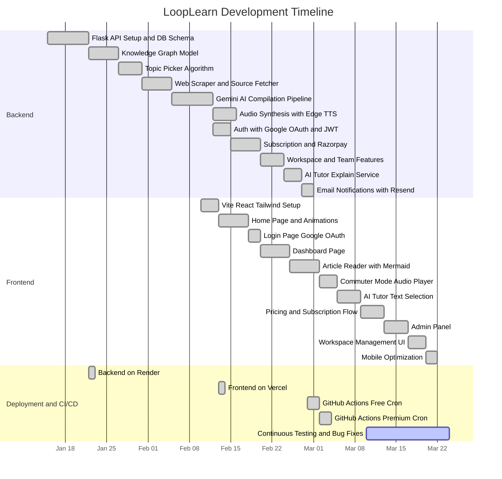
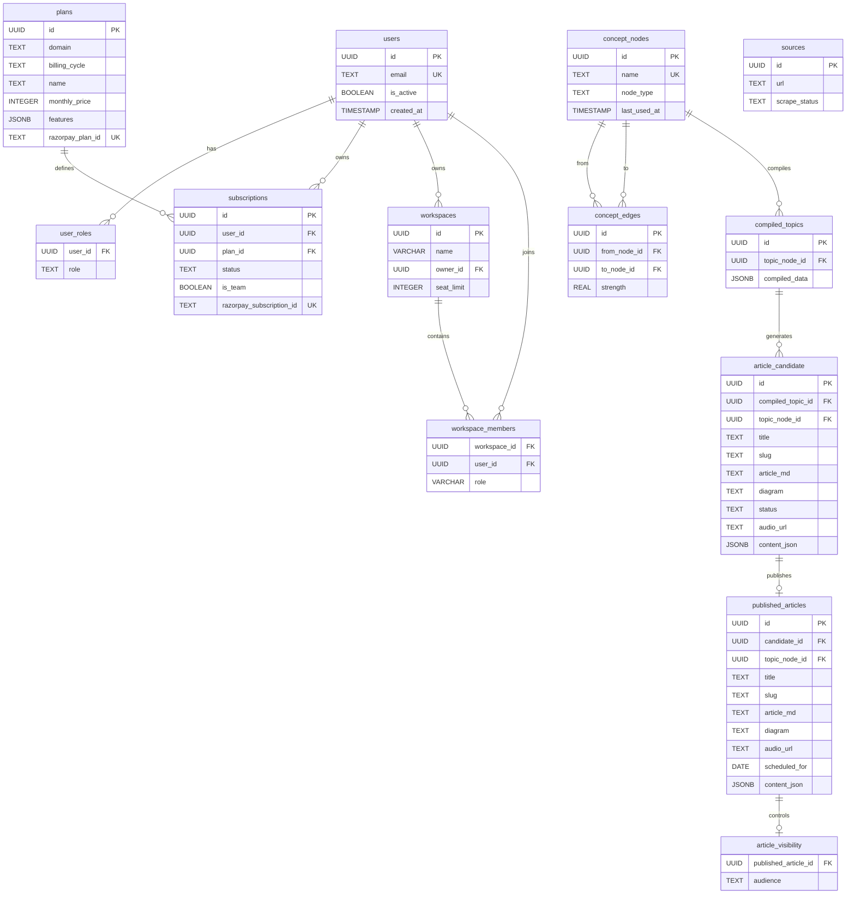
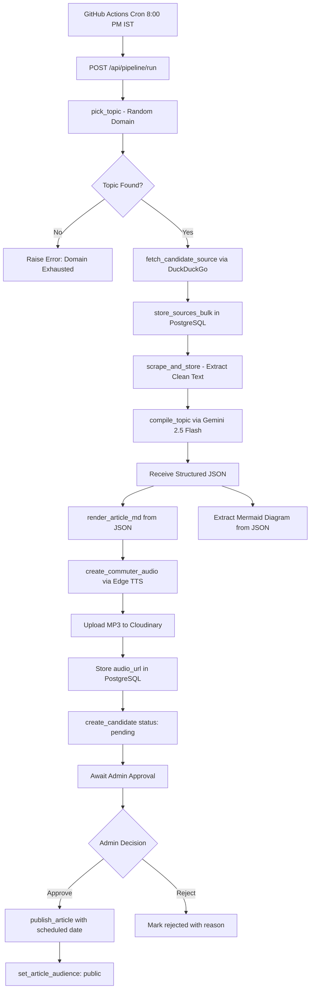
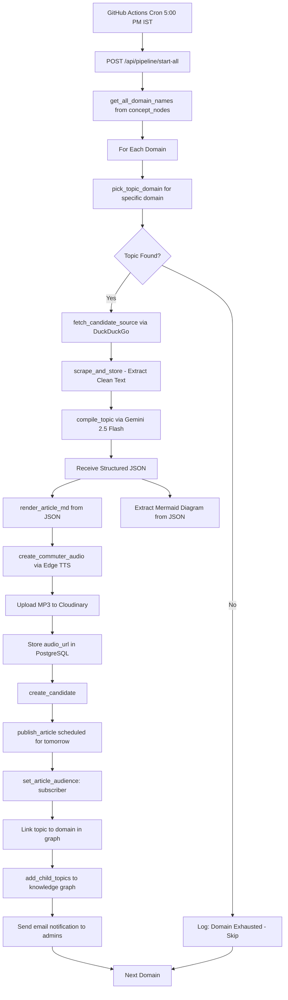
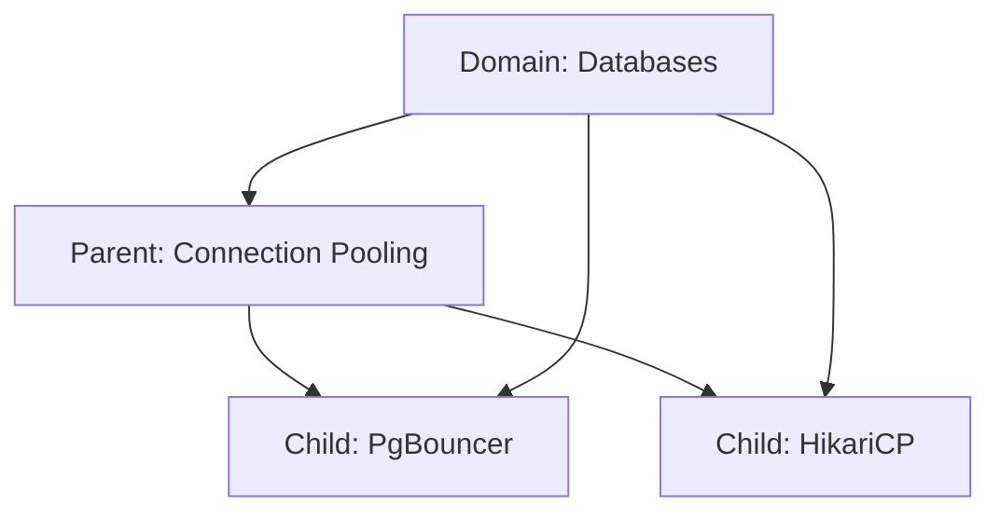
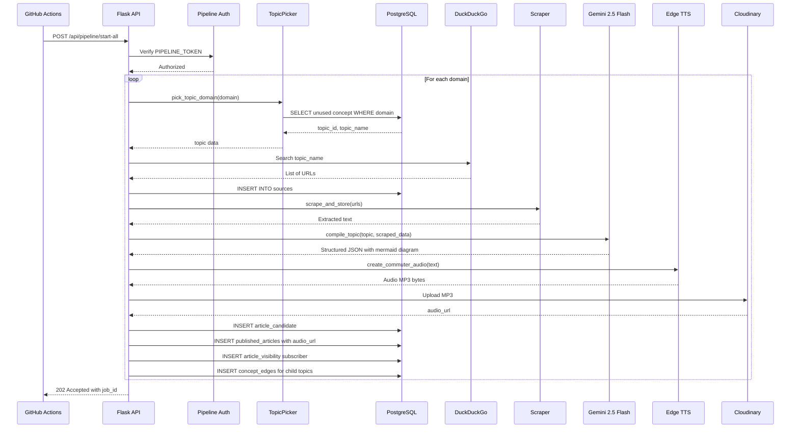
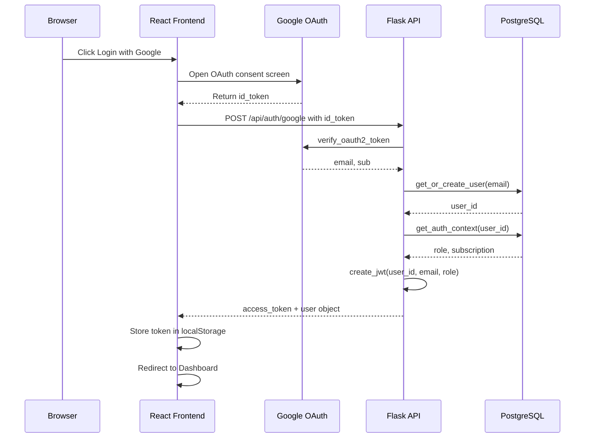
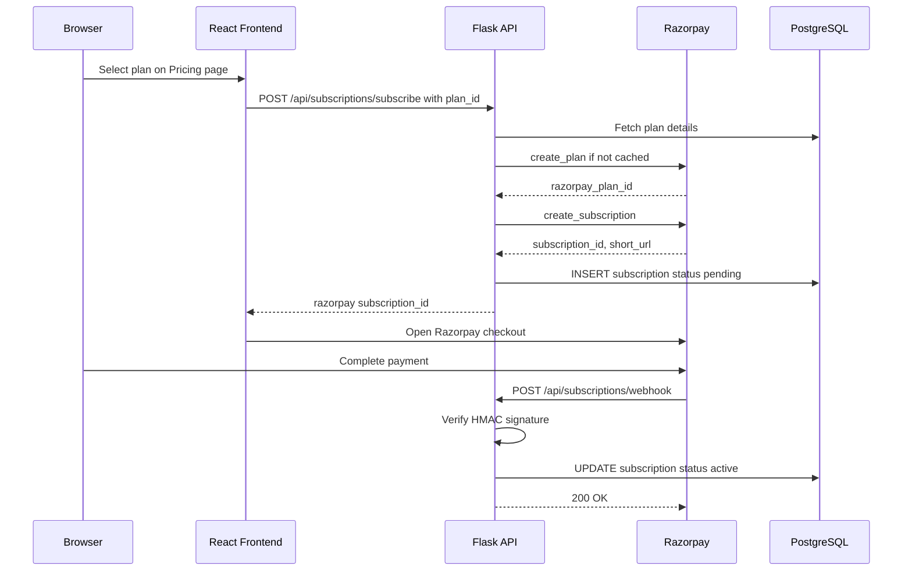
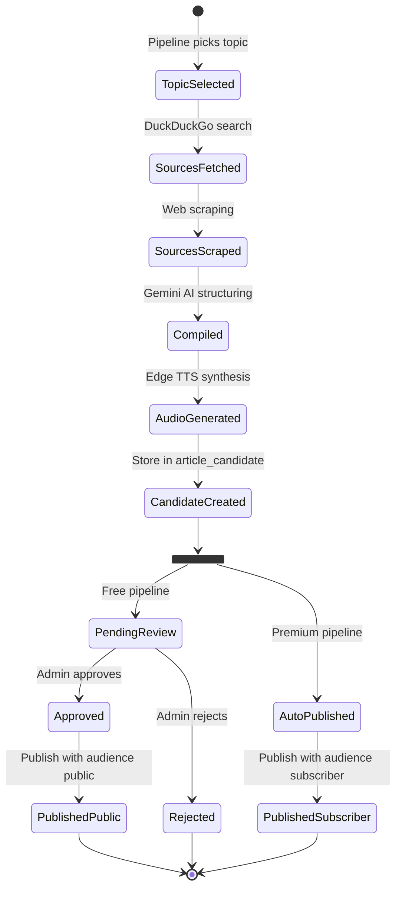

# LoopLearn — Project Blackbook

> **Project Title**: LoopLearn – AI-Assisted Daily Technical Briefing Platform  
> **Prepared By**: Pradnyesh Bhalekar  
> **Date**: March 2026

---

## Table of Contents

1. [Chapter 1: Introduction](#chapter-1-introduction)
2. [Chapter 2: Literature Survey](#chapter-2-literature-survey)
3. [Chapter 3: Methodology](#chapter-3-methodology)
4. [Chapter 4: Implementation](#chapter-4-implementation)
5. [Chapter 5: Analysis & Related Work](#chapter-5-analysis--related-work)
6. [Chapter 6: Conclusion & Future Work](#chapter-6-conclusion--future-work)

---

# Chapter 1: Introduction

## 1.1 Introduction

The modern software engineering landscape presents a significant challenge: **information overload**. Engineers are surrounded by an ever-growing volume of tutorials, blog posts, newsletters, and social media content. Most of these platforms are primarily designed for engagement and long-form consumption, rather than structured knowledge retention. Research in cognitive science suggests that passive consumption of technical content leads to poor long-term recall without active reinforcement mechanisms.

**LoopLearn** addresses this gap by delivering **one structured technical briefing per day** across a dynamically expandable set of engineering domains. The system uses AI to structure and compile content from web sources, generate architectural diagrams, and synthesize audio narrations. It is not an AI content generator in the traditional sense — it uses AI as a structuring and compilation tool to transform scraped web content into a standardized, high-fidelity learning format.

The platform follows a **"Close the Loop"** methodology — read, visualize, implement — designed to maximize retention through structured, daily exposure to a single concept.

## 1.2 Description

LoopLearn is a full-stack web application consisting of two primary components:

- **Backend (Python/Flask)**: A REST API managing a knowledge graph of engineering concepts, an autonomous content structuring pipeline, user authentication (Google OAuth), subscription management (Razorpay), workspace collaboration, and email notifications. Two GitHub Actions cron jobs automate daily content generation.
- **Frontend (React/TypeScript)**: A single-page application built with Vite, featuring premium dark/light theming, Framer Motion animations, an in-context AI Tutor, a Commuter Mode audio player, and a responsive mobile-optimized interface.

Supporting infrastructure includes PostgreSQL (Neon) for data persistence, Cloudinary for audio storage, and a graph-based data model for intelligent, non-repetitive topic selection.

## 1.3 Stakeholders

| Stakeholder | Role | Interest |
|---|---|---|
| **Free Users** | Public visitors | Access one random daily article (public audience) across any domain |
| **Subscribers** | Paying users | Access domain-specific premium articles, Commuter Mode audio, and the AI Tutor |
| **Team Admins** | Software developers / leads | Purchase team subscriptions at a reduced per-seat cost; invite junior developers or colleagues to their workspace |
| **Platform Admin** | Content moderator | Review AI-generated candidate articles (approve/reject); optionally trigger pipeline runs manually |
| **Platform Owner** | Business stakeholder | Revenue generation via individual and team subscription plans through Razorpay |

---

# Chapter 2: Literature Survey

## 2.1 Description of Existing System

Several platforms currently serve the continuous engineering education space, each with a distinct approach:

| Platform | Model | Approach |
|---|---|---|
| **YouTube / Udemy** | Long-form video courses | Primarily designed for engagement and long-form consumption. Users must commit significant time per session. |
| **Medium / Dev.to** | User-generated blog posts | Content quality varies significantly. No structured learning path or spaced repetition. Users must self-curate. |
| **Daily.dev / TLDR Newsletter** | Aggregated links and summaries | Provides breadth of coverage through link aggregation, but individual articles are shallow summaries pointing to external sources. |
| **LeetCode / HackerRank** | Problem-solving practice | Focused on data structures and algorithm interview preparation. Does not address system design, architecture, or infrastructure knowledge. |
| **O'Reilly / Manning** | Technical books and references | High-quality static content, but requires long-term commitment. Not structured for daily habit formation. |

## 2.2 Limitations of Present System

1. **Volume Over Depth**: Existing platforms deliver high volumes of content, but do not provide structured, deep-dive coverage of individual topics within a constrained daily time commitment.

2. **Manual Topic Selection**: Users are required to manually discover and select what to learn. No existing platform maintains a knowledge graph that tracks coverage across engineering domains and prevents repetition.

3. **Absence of Architectural Visualization**: Most text-based platforms do not provide auto-generated architectural diagrams. Engineers building mental models of distributed systems benefit significantly from spatial representations.

4. **Limited Audio Support**: Engineers commuting or exercising lack access to structured technical content in audio form that maintains the same fidelity as written material.

5. **No Team Learning Infrastructure**: There is no widely adopted platform that allows engineering leads to provision structured daily learning across their entire team, with shared subscriptions and workspace management.

6. **Passive Consumption Model**: Content is consumed passively. Few platforms incorporate active recall mechanisms such as flashcards, trade-off comparison tables, or structured case studies within the same learning session.

---

# Chapter 3: Methodology

## 3.1 Gantt Chart (Timeline)



> **Note**: Both backend (Render) and frontend (Vercel) were deployed early in the development cycle and updated continuously throughout. The Gantt chart reflects initial deployment dates with ongoing iteration.

## 3.2 Technologies Used and their Description

### 3.2.1 Backend Stack

| Technology | Version | Purpose | Justification |
|---|---|---|---|
| **Python** | 3.12+ | Core backend language | Extensive AI/ML ecosystem; strong library support for web scraping and API development |
| **Flask** | 3.1.2 | REST API framework | Lightweight and modular; avoids the overhead of full-stack frameworks like Django for an API-only backend |
| **PostgreSQL (Neon)** | 16 | Cloud-hosted relational database | ACID compliance for subscription data; JSONB support for flexible content storage; serverless scaling via Neon |
| **psycopg2** | 2.9.11 | PostgreSQL adapter | Industry-standard Python PostgreSQL driver with connection pooling support |
| **Google Gemini** (genai SDK) | 2.5 Flash | AI content structuring | High throughput, structured JSON output mode, cost-effective for batch content compilation |
| **GPT-4o-mini** (GitHub Models) | — | AI Tutor explanations | Low-latency inference for real-time text explanations; available via GitHub Models API |
| **Edge TTS** | — | Neural text-to-speech | High-quality neural voices; no API key required; supports word-level timestamps |
| **Cloudinary** | — | Audio file storage | CDN-backed media delivery; automatic format optimization |
| **Razorpay** | — | Payment gateway | Supports recurring subscriptions with webhook-based state management; suited for INR-based transactions |
| **Resend** | 2.23.0 | Transactional emails | Simple API for admin notifications and pipeline reports |
| **BeautifulSoup / Trafilatura** | 4.14.3 / 2.0.0 | Web scraping | Content extraction from diverse HTML structures; trafilatura handles boilerplate removal |
| **DuckDuckGo Search (ddgs)** | — | Source discovery | Privacy-preserving search; no API key required; returns authoritative URLs for topics |
| **Gunicorn** | 25.0.1 | Production WSGI server | Multi-worker process model for handling concurrent requests on Render |
| **GitHub Actions** | — | CI/CD and Cron Jobs | Automated daily pipeline execution via scheduled workflows |

### 3.2.2 Frontend Stack

| Technology | Version | Purpose | Justification |
|---|---|---|---|
| **React** | 19.2.0 | UI library | Component-based architecture; large ecosystem; concurrent rendering support |
| **TypeScript** | 5.9.3 | Type-safe JavaScript | Compile-time error detection; improved IDE support and refactoring safety |
| **Vite** | 7.2.4 | Build tool and dev server | Near-instant HMR; significantly faster than Webpack for development |
| **Tailwind CSS** | 4.2.1 | Utility-first CSS | Rapid UI development; consistent design tokens; purges unused CSS in production |
| **Framer Motion** | 12.34.3 | Animation library | Declarative animation API; supports layout animations and gesture handling |
| **Redux Toolkit** | 2.11.2 | Global state management | Centralized auth state; slice-based architecture with built-in immutability |
| **React Router** | 7.13.0 | Client-side routing | Declarative routing with nested layouts and route protection |
| **Mermaid.js** | 11.12.3 | Diagram rendering | Renders architectural diagrams from the compiled JSON directly in the browser |
| **Axios** | 1.13.5 | HTTP client | Interceptor support for JWT token injection; request/response transformation |

### 3.2.3 Typography

| Font | Type | Weights | Usage |
|---|---|---|---|
| **Inter** | Sans-serif | 400-900 | Primary UI typeface for all content |
| **JetBrains Mono** | Monospace | 400-700 | Code snippets, technical labels, status badges |

Both fonts are loaded from Google Fonts via the HTML entry point.

## 3.3 Event Table

| Event | Trigger | Actor | System Response |
|---|---|---|---|
| Visit Home Page | URL navigation | Visitor | Render landing page with typing animation, feature slideshow |
| Click "Access Briefing" | Button click | Visitor | Redirect to Google OAuth login page |
| Google OAuth callback | OAuth redirect | System | Verify token, create or fetch user, issue JWT |
| View Today's Briefing (free) | Page load | Free User | Fetch a random public article from any domain |
| View Today's Briefing (subscriber) | Page load | Subscriber | Fetch subscriber-exclusive article for the subscribed domain |
| Highlight text on article | Text selection | Subscriber | Invoke AI Tutor (GPT-4o-mini) for contextual explanation |
| Toggle Commuter Mode | Button click | Subscriber | Stream audio from Cloudinary URL stored in PostgreSQL |
| Toggle dark/light theme | Navbar button | Any User | Toggle CSS class on root element; persist to localStorage |
| Subscribe to a plan | Pricing page | User | Create Razorpay subscription; redirect to payment |
| Razorpay webhook fires | Payment event | Razorpay | Activate, renew, or cancel subscription in database |
| Free cron job executes | GitHub Actions (8:00 PM IST) | System | Run pipeline for one random domain; create candidate article awaiting admin approval |
| Premium cron job executes | GitHub Actions (5:00 PM IST) | System | Run pipeline for all domains; auto-publish subscriber articles directly |
| Admin triggers pipeline manually | Admin panel button | Admin | Start background pipeline job for specified domain(s) |
| Admin reviews candidate | Admin panel | Admin | Approve (schedule publication date) or reject (with reason) |
| Create workspace | Settings page | Team Admin | Create workspace with seat limit; add team members by email |
| Pipeline generates child topics | Automated | System | Insert child concept nodes into knowledge graph; link to parent and domain |

## 3.4 Use Case Diagram and Descriptions

```mermaid
graph TD
    subgraph Actors
        V["Visitor"]
        FU["Free User"]
        SU["Subscriber"]
        TA["Team Admin"]
        PA["Platform Admin"]
        GH["GitHub Actions Cron"]
    end

    subgraph "Use Cases"
        UC1["View Home Page"]
        UC2["Login via Google OAuth"]
        UC3["View Random Public Article"]
        UC4["Subscribe to Domain Plan"]
        UC5["View Subscriber Article"]
        UC6["Use AI Tutor"]
        UC7["Listen in Commuter Mode"]
        UC8["Create Team Workspace"]
        UC9["Invite Members to Workspace"]
        UC10["Review Candidate Articles"]
        UC11["Trigger Pipeline Manually"]
        UC12["Auto-Generate Free Article"]
        UC13["Auto-Generate All Domain Articles"]
        UC14["View Dashboard"]
        UC15["Toggle Theme"]
    end

    V --> UC1
    V --> UC2
    V --> UC15
    FU --> UC3
    FU --> UC4
    FU --> UC14
    SU --> UC5
    SU --> UC6
    SU --> UC7
    SU --> UC14
    TA --> UC8
    TA --> UC9
    TA --> UC4
    PA --> UC10
    PA --> UC11
    GH --> UC12
    GH --> UC13
```



### Use Case Descriptions

| Use Case | Actor | Precondition | Flow | Postcondition |
|---|---|---|---|---|
| **View Random Public Article** | Free User | User is logged in; no active subscription | System fetches today's public-audience article from any available domain | Article markdown and diagram rendered; audio and AI Tutor are not available |
| **View Subscriber Article** | Subscriber | User has active subscription to at least one domain | System fetches today's subscriber-exclusive article for the subscribed domain | Full article with diagram, Commuter Mode audio, and AI Tutor access |
| **Use AI Tutor** | Subscriber | User is reading a subscriber article | User highlights text; frontend sends selection + surrounding paragraph to API; GPT-4o-mini returns 3-sentence explanation | Explanation popover appears centered on screen |
| **Review Candidate Articles** | Platform Admin | Candidate exists with status "pending" | Admin views article preview; approves with scheduled date or rejects with reason | Article moves to published_articles (if approved) or is marked rejected |
| **Auto-Generate Free Article** | GitHub Actions | Cron triggers at 8:00 PM IST daily | Pipeline picks one random topic, scrapes sources, compiles via Gemini, stores as candidate | Article candidate created with status "pending"; awaits admin approval |
| **Auto-Generate All Domain Articles** | GitHub Actions | Cron triggers at 5:00 PM IST daily | Pipeline iterates all domains, picks topic per domain, compiles, generates audio, auto-publishes | Subscriber articles published for next day; visibility set to "subscriber" |
| **Create Team Workspace** | Team Admin | User is a software developer who wants team learning | Creates workspace; purchases team subscription (4x base price); invites members via email | Workspace created; invited members inherit subscription access to the domain |

## 3.5 Entity-Relationship Diagram

The database uses a **relational + graph hybrid** design. The core entity is `concept_nodes`, which represents both high-level engineering domains (e.g., "Databases", "System Design") and granular technical concepts (e.g., "Connection Pooling", "CAP Theorem"). Relationships between nodes are stored in `concept_edges` with a `strength` field that increments each time an edge is reinforced, enabling weighted topic selection.

The relational layer handles user management, subscription billing, workspace collaboration, and the article lifecycle (candidate → published). The graph layer enables intelligent, non-repetitive topic discovery.



## 3.6 Flow Diagrams

### 3.6.1 Free Article Pipeline (GitHub Actions Cron — 8:00 PM IST)



### 3.6.2 Premium Article Pipeline (GitHub Actions Cron — 5:00 PM IST)



### 3.6.3 Knowledge Graph Child Topic Linking

When the Gemini model compiles an article, it also returns a `child_topics` array of related concepts. The system inserts each child as a new `concept` node and creates two edges:

1. **Parent → Child**: Links the current topic to its subtopics (e.g., "Connection Pooling" → "PgBouncer")
2. **Domain → Child**: Links the domain directly to the child concept (e.g., "Databases" → "PgBouncer")

This ensures that child topics are reachable from their parent domain during future topic selection, preventing orphaned concepts that would never be selected.



## 3.7 Class Diagram


## 3.8 Sequence Diagrams

### 3.8.1 Premium Article Generation Pipeline



### 3.8.2 User Authentication Flow



### 3.8.3 Subscription Purchase Flow



## 3.9 State Diagram (Article Lifecycle)



## 3.10 Menu Tree

```
LoopLearn
├── Home Page (/)
│   ├── #why — The Noise vs The Signal
│   ├── #who — Target audience cards
│   └── #how — The Protocol (3-step methodology)
│
├── Login (/login) — Google OAuth sign-in
│
├── Dashboard (/dashboard) — Subscribed domains and article access
│
├── Today's Briefing (/todays)
│   ├── Article Content (Markdown rendered)
│   ├── Mermaid Diagram (extracted from compiled JSON)
│   ├── AI Tutor (subscriber only — text selection popover)
│   └── Commuter Mode (subscriber only — floating audio player)
│
├── Pricing (/pricing) — Individual and team plans with Razorpay
│
├── Subscription Success (/subscription/success)
│
├── Admin Panel (/admin) [Platform Admin only]
│   ├── Pipeline Trigger (per-domain / all-domains)
│   └── Candidate Review (approve/reject/schedule)
│
└── Navbar (Global)
    ├── Theme Toggle (Light / Dark)
    ├── Navigation Links
    └── Logout
```

---

# Chapter 4: Implementation

## 4.1 List of Tables with Attributes and Constraints

### 1. `users`
| Column | Type | Constraints |
|---|---|---|
| id | UUID | PRIMARY KEY, DEFAULT gen_random_uuid() |
| email | TEXT | UNIQUE, NOT NULL |
| is_active | BOOLEAN | DEFAULT TRUE |
| created_at | TIMESTAMP | DEFAULT NOW() |

### 2. `user_roles`
| Column | Type | Constraints |
|---|---|---|
| user_id | UUID | PRIMARY KEY, REFERENCES users(id) ON DELETE CASCADE |
| role | TEXT | NOT NULL, CHECK IN ('admin', 'editor', 'viewer') |

### 3. `plans`
| Column | Type | Constraints |
|---|---|---|
| id | UUID | PRIMARY KEY, DEFAULT gen_random_uuid() |
| domain | TEXT | — |
| billing_cycle | TEXT | — |
| name | TEXT | — |
| monthly_price | INTEGER | — |
| features | JSONB | — |
| razorpay_plan_id | TEXT | UNIQUE |

### 4. `subscriptions`
| Column | Type | Constraints |
|---|---|---|
| id | UUID | PRIMARY KEY, DEFAULT gen_random_uuid() |
| user_id | UUID | REFERENCES users(id) ON DELETE CASCADE |
| plan_id | UUID | REFERENCES plans(id) ON DELETE CASCADE |
| status | TEXT | CHECK IN ('active', 'paused', 'cancelled', 'pending') |
| started_at | TIMESTAMP | DEFAULT NOW() |
| ends_at | TIMESTAMP | — |
| razorpay_subscription_id | TEXT | UNIQUE |
| razorpay_plan_id | TEXT | — |
| is_team | BOOLEAN | DEFAULT FALSE |

### 5. `concept_nodes`
| Column | Type | Constraints |
|---|---|---|
| id | UUID | PRIMARY KEY, DEFAULT gen_random_uuid() |
| name | TEXT | UNIQUE, NOT NULL |
| node_type | TEXT | NOT NULL, CHECK IN ('domain', 'concept', 'feature') |
| last_used_at | TIMESTAMP | NULL |
| created_at | TIMESTAMP | NOT NULL, DEFAULT NOW() |

### 6. `concept_edges`
| Column | Type | Constraints |
|---|---|---|
| id | UUID | PRIMARY KEY, DEFAULT gen_random_uuid() |
| from_node_id | UUID | NOT NULL, REFERENCES concept_nodes(id) ON DELETE CASCADE |
| to_node_id | UUID | NOT NULL, REFERENCES concept_nodes(id) ON DELETE CASCADE |
| strength | REAL | NOT NULL, DEFAULT 1.0 |
| created_at | TIMESTAMP | NOT NULL, DEFAULT NOW() |
| — | — | UNIQUE(from_node_id, to_node_id) |

### 7. `sources`
| Column | Type | Constraints |
|---|---|---|
| id | UUID | PRIMARY KEY, DEFAULT gen_random_uuid() |
| url | TEXT | — |
| title | TEXT | — |
| content_text | TEXT | — |
| scrape_status | TEXT | DEFAULT 'pending' |
| scraped_at | TIMESTAMP | — |

### 8. `compiled_topics`
| Column | Type | Constraints |
|---|---|---|
| id | UUID | PRIMARY KEY, DEFAULT gen_random_uuid() |
| topic_node_id | UUID | REFERENCES concept_nodes(id) |
| compiled_data | JSONB | — |

### 9. `article_candidate`
| Column | Type | Constraints |
|---|---|---|
| id | UUID | PRIMARY KEY, DEFAULT gen_random_uuid() |
| compiled_topic_id | UUID | NOT NULL, REFERENCES compiled_topics(id) ON DELETE CASCADE |
| topic_node_id | UUID | NOT NULL, REFERENCES concept_nodes(id) ON DELETE CASCADE |
| title | TEXT | NOT NULL |
| slug | TEXT | NOT NULL |
| article_md | TEXT | NOT NULL |
| diagram | TEXT | — |
| status | TEXT | NOT NULL, CHECK ('pending', 'approved', 'rejected'), DEFAULT 'pending' |
| scheduled_for | DATE | — |
| rejection_reason | TEXT | — |
| reviewed_by | UUID | REFERENCES users(id) |
| reviewed_at | TIMESTAMP | — |
| audio_url | TEXT | — |
| content_json | JSONB | — |
| created_at | TIMESTAMP | DEFAULT NOW() |

### 10. `published_articles`
| Column | Type | Constraints |
|---|---|---|
| id | UUID | PRIMARY KEY, DEFAULT gen_random_uuid() |
| candidate_id | UUID | REFERENCES article_candidate(id) |
| topic_node_id | UUID | NOT NULL, REFERENCES concept_nodes(id) |
| title | TEXT | NOT NULL |
| slug | TEXT | NOT NULL |
| article_md | TEXT | NOT NULL |
| diagram | TEXT | — |
| published_at | TIMESTAMP | DEFAULT NOW() |
| published_by | UUID | — |
| scheduled_for | DATE | NOT NULL |
| audio_url | TEXT | — |
| content_json | JSONB | — |

### 11. `article_visibility`
| Column | Type | Constraints |
|---|---|---|
| published_article_id | UUID | PRIMARY KEY, REFERENCES published_articles(id) ON DELETE CASCADE |
| audience | TEXT | NOT NULL, CHECK IN ('public', 'subscriber') |

### 12. `workspaces`
| Column | Type | Constraints |
|---|---|---|
| id | UUID | PRIMARY KEY, DEFAULT gen_random_uuid() |
| name | VARCHAR(255) | NOT NULL |
| owner_id | UUID | REFERENCES users(id) |
| seat_limit | INTEGER | DEFAULT 5 |
| created_at | TIMESTAMP | DEFAULT CURRENT_TIMESTAMP |

### 13. `workspace_members`
| Column | Type | Constraints |
|---|---|---|
| workspace_id | UUID | REFERENCES workspaces(id) ON DELETE CASCADE |
| user_id | UUID | REFERENCES users(id) |
| role | VARCHAR(20) | CHECK IN ('admin', 'member'), DEFAULT 'member' |
| joined_at | TIMESTAMP | DEFAULT CURRENT_TIMESTAMP |
| — | — | PRIMARY KEY (workspace_id, user_id) |

### Sample Queries

**Fetch today's subscriber article for a domain:**
```sql
SELECT pa.id, pa.title, pa.slug, pa.article_md, pa.diagram, pa.audio_url,
       pa.published_at, topic.name AS topic_name, domain.name AS domain_name
FROM published_articles pa
JOIN article_visibility av ON av.published_article_id = pa.id
JOIN concept_nodes topic ON pa.topic_node_id = topic.id
JOIN concept_edges ce ON ce.to_node_id = topic.id
JOIN concept_nodes domain ON ce.from_node_id = domain.id AND domain.node_type = 'domain'
WHERE pa.scheduled_for::date = CURRENT_DATE
  AND LOWER(domain.name) = LOWER('Databases')
  AND av.audience = 'subscriber'
ORDER BY pa.published_at DESC NULLS LAST
LIMIT 1;
```

**Pick an unused topic from a domain:**
```sql
SELECT t.id, t.name, d.name
FROM concept_nodes t
INNER JOIN concept_edges e ON t.id = e.to_node_id
INNER JOIN concept_nodes d ON e.from_node_id = d.id
WHERE LOWER(TRIM(d.name)) = LOWER(TRIM('System Design'))
  AND d.node_type = 'domain'
  AND t.node_type = 'concept'
  AND t.id NOT IN (SELECT topic_node_id FROM published_articles WHERE topic_node_id IS NOT NULL)
  AND t.id NOT IN (SELECT topic_node_id FROM article_candidate WHERE topic_node_id IS NOT NULL)
ORDER BY RANDOM()
LIMIT 1;
```

## 4.2 System Coding

### 4.2.1 Backend Architecture (Complete File Listing)
```
daily/
├── run.py                              # Flask app entry, CORS, blueprint registration
├── requirements.txt                    # Python dependencies
├── seed_plans.py                       # Seed subscription plans into database
├── test.py                             # Basic test script
├── .github/
│   └── workflows/
│       ├── daily-pipeline.yml          # Free article cron (8:00 PM IST)
│       └── premium-daily-pipeline.yml  # Premium article cron (5:00 PM IST)
├── app/
│   ├── config/
│   │   ├── db.py                       # PostgreSQL connection with retry logic
│   │   └── jwt.py                      # JWT secret configuration
│   ├── models/
│   │   ├── schema.py                   # DB initialization (all table creation)
│   │   ├── graph.py                    # Knowledge graph (concept_nodes, concept_edges)
│   │   ├── user.py                     # Users, roles, subscriptions
│   │   ├── workspace.py               # Workspaces, workspace_members
│   │   ├── published_articles.py       # Published articles CRUD
│   │   ├── article_candidate.py        # Candidate articles (pending review)
│   │   ├── sources.py                  # Web sources table
│   │   ├── daily_posts.py              # Daily posts (legacy)
│   │   ├── topic_history.py            # Topic usage history
│   │   ├── topic_sources.py            # Topic-source linking
│   │   ├── compiled_topics.py          # Compiled topic storage
│   │   ├── pipeline_jobs.py            # Background job tracking
│   │   └── auth_context.py             # Auth context (role + subscription)
│   ├── routes/
│   │   ├── auth_routes.py              # Google OAuth + JWT issuance
│   │   ├── pipeline_routes.py          # Pipeline trigger endpoints
│   │   ├── subscription_routes.py      # Plans, subscriptions, Razorpay webhooks
│   │   ├── public_article_routes.py    # Public article access
│   │   ├── admin_candidate_routes.py   # Admin candidate review
│   │   ├── explain_routes.py           # AI Tutor endpoint
│   │   ├── workspace_routes.py         # Workspace CRUD
│   │   ├── topic_routes.py             # Topic management
│   │   └── source_routes.py            # Source management
│   ├── services/
│   │   ├── pipeline_service.py         # Core pipeline orchestration
│   │   ├── pick_topic.py               # Topic selection from knowledge graph
│   │   ├── topic_compiler.py           # Gemini AI content structuring
│   │   ├── audio_service.py            # Edge TTS + Cloudinary upload
│   │   ├── explain_service.py          # AI Tutor (GPT-4o-mini)
│   │   ├── fetcher.py                  # DuckDuckGo source discovery
│   │   ├── scraper.py                  # URL content extraction
│   │   ├── source_scrape_service.py    # Scrape orchestration + quality filtering
│   │   ├── text_cleaner.py             # Raw text sanitization
│   │   ├── text_structurer.py          # Text formatting utilities
│   │   ├── child_topic_service.py      # Graph child topic linking
│   │   ├── source_service.py           # Bulk source storage
│   │   ├── compiled_topic_service.py   # Compiled topic persistence
│   │   ├── publish_service.py          # Publishing logic
│   │   ├── publisher_service.py        # Publisher utilities
│   │   ├── pipeline_job_service.py     # Job lifecycle management
│   │   ├── razorpay_service.py         # Razorpay plan/subscription creation
│   │   ├── email_service.py            # Admin email notifications
│   │   └── workspace_service.py        # Workspace CRUD operations
│   ├── jobs/
│   │   ├── pipeline_worker.py          # Background pipeline worker thread
│   │   └── job_store.py                # In-memory job state store
│   └── utils/
│       ├── auth_decorators.py          # @require_auth, @require_admin, @require_pipeline_secret
│       ├── auth_middleware.py           # JWT verification middleware
│       ├── jwt_utils.py                # JWT token creation
│       ├── email_utils.py              # Admin email helper
│       └── rate_limiter.py             # Request rate limiting
```

### 4.2.2 Frontend Architecture (Complete File Listing)
```
looplearn/
├── index.html                          # Entry point (Google Fonts, OAuth script)
├── vite.config.ts                      # Vite build configuration
├── vercel.json                         # Vercel deployment config
├── package.json                        # Dependencies
├── tsconfig.json                       # TypeScript config
├── eslint.config.js                    # ESLint configuration
├── src/
│   ├── main.tsx                        # React root (Provider, ThemeProvider, Router)
│   ├── index.css                       # Global styles, Tailwind tokens, theme transitions
│   ├── App.tsx                         # App shell
│   ├── App.css                         # App-level styles
│   ├── context/
│   │   └── ThemeContext.tsx             # Light/dark theme state management
│   ├── hooks/
│   │   └── useMediaQuery.ts            # Mobile detection hook
│   ├── api/
│   │   ├── axios.ts                    # Base Axios instance with JWT interceptor
│   │   ├── subscription.ts             # Subscription API calls
│   │   ├── explain.ts                  # AI Tutor API calls
│   │   └── workspace.ts               # Workspace API calls
│   ├── app/
│   │   ├── store.ts                    # Redux store configuration
│   │   └── hook.ts                     # Typed Redux hooks
│   ├── features/
│   │   └── auth/
│   │       └── authSlice.ts            # Authentication state (Redux slice)
│   ├── pages/
│   │   ├── Home.tsx                    # Landing page
│   │   ├── Login.tsx                   # Google OAuth login
│   │   ├── Dashboard.tsx               # User dashboard
│   │   ├── Todays.tsx                  # Daily briefing reader
│   │   ├── SubscribedArticle.tsx       # Full article view (subscriber)
│   │   ├── Pricing.tsx                 # Subscription plans
│   │   ├── SubscriptionSuccess.tsx     # Post-payment success page
│   │   ├── Admin.tsx                   # Admin panel
│   │   └── AuthCallback.tsx            # OAuth callback handler
│   ├── components/
│   │   ├── layout/
│   │   │   ├── Navbar.tsx              # Global navigation bar
│   │   │   └── Footer.tsx              # Global footer
│   │   ├── article/
│   │   │   ├── TextSelectionExplainer.tsx  # AI Tutor trigger
│   │   │   ├── ExplanationPopover.tsx  # AI Tutor popover
│   │   │   └── TradeoffComparison.tsx  # Trade-off table component
│   │   ├── auth/                       # Auth-related components
│   │   ├── skeletons/                  # Loading skeleton components
│   │   ├── Logo.tsx                    # Brand logo
│   │   ├── AudioPlayer.tsx             # Commuter mode audio player
│   │   └── FloatingAudioPlayer.tsx     # Floating audio player
│   ├── routes/
│   │   └── router.tsx                  # Route definitions
│   └── types/                          # TypeScript type definitions
```

### 4.2.3 Key Code Snippets

**GitHub Actions — Free Pipeline Cron (daily-pipeline.yml):**
```yaml
name: Daily Pipeline
on:
  schedule:
    - cron: "30 14 * * *"
  workflow_dispatch:
jobs:
  run-pipeline:
    runs-on: ubuntu-latest
    steps:
      - name: Trigger daily pipeline
        run: |
          curl -X POST "${{ secrets.PIPELINE_URL}}" \
            -H "Authorization: Bearer ${{ secrets.PIPELINE_TOKEN }}" \
            -H "Content-Type: application/json"
```

**GitHub Actions — Premium Pipeline Cron (premium-daily-pipeline.yml):**
```yaml
name: Daily Premium Pipeline
on:
  schedule:
    - cron: "30 11 * * *"
  workflow_dispatch:
jobs:
  run-pipeline:
    runs-on: ubuntu-latest
    steps:
      - name: Trigger Premium Pipeline
        run: |
          curl -X POST "${{secrets.PREMIUM_PIPELINE_URL}}" \
            -H "Authorization: Bearer ${{ secrets.PIPELINE_TOKEN }}" \
            -H "Content-Type: application/json"
```

**Database Connection with Retry Logic (db.py):**
```python
@retry(stop=stop_after_attempt(3), wait=wait_fixed(2), reraise=True, retry=retry_if_exception_type(OperationalError))
def get_connection():
    db_url = os.getenv("DATABASE_URL")
    if not db_url:
        raise ValueError("DATABASE_URL not found in .env")
    db_url = _with_sslmode(db_url)
    return psycopg2.connect(
        db_url,
        connect_timeout=10,
        keepalives=1,
        keepalives_idle=30,
        keepalives_interval=10,
        keepalives_count=5
    )
```

**Knowledge Graph — Insert Node with Case Standardization (graph.py):**
```python
def insert_node(name, node_type):
    conn = get_connection()
    cursor = conn.cursor()
    processed_name = name.strip()
    if node_type == 'domain':
        if processed_name.upper() == 'APIS':
            processed_name = 'APIs'
        else:
            processed_name = processed_name.title()
    cursor.execute("""
        INSERT INTO concept_nodes (name, node_type)
        VALUES (%s, %s)
        ON CONFLICT (name)
        DO UPDATE SET 
            node_type = CASE 
                WHEN concept_nodes.node_type = 'domain' AND EXCLUDED.node_type = 'concept' THEN 'domain'
                ELSE EXCLUDED.node_type 
            END
        RETURNING id, name, node_type;
    """, (processed_name, node_type))
    node = cursor.fetchone()
    conn.commit()
    close_connection(conn)
    return node
```

**Child Topic Graph Linking (child_topic_service.py):**
```python
def add_child_topics(parent_topic_id, child_concepts, domain_name=None):
    inserted = []
    domain_id = None
    if domain_name:
        conn = get_connection()
        try:
            cursor = conn.cursor()
            cursor.execute("SELECT id FROM concept_nodes WHERE LOWER(TRIM(name)) = LOWER(TRIM(%s)) AND node_type = 'domain';", (domain_name,))
            row = cursor.fetchone()
            if row:
                domain_id = row[0]
        finally:
            close_connection(conn)
    for topic_name in child_concepts:
        node = insert_node(topic_name, "concept")
        child_node_id = node[0]
        insert_or_increment_edge(parent_topic_id, child_node_id)
        if domain_id:
            insert_or_increment_edge(domain_id, child_node_id)
        inserted.append({"child_topic": topic_name, "child_node_id": child_node_id})
    return inserted
```

**Pipeline Authentication Decorator (auth_decorators.py):**
```python
def require_pipeline_secret(fn):
    @wraps(fn)
    def wrapper(*args, **kwargs):
        header = request.headers.get("Authorization") or ""
        token = header.split("Bearer ", 1)[1].strip() if header.startswith("Bearer ") else None
        allowed = {
            v for v in [
                os.getenv("PIPELINE_SECRET"),
                os.getenv("CRON_SECRET"),
                os.getenv("PIPELINE_TOKEN")
            ] if v
        }
        if not token or (allowed and token not in allowed):
            if request.remote_addr not in ("127.0.0.1", "::1"):
                abort(401)
        return fn(*args, **kwargs)
    return wrapper
```

**Razorpay Webhook HMAC Verification (subscription_routes.py):**
```python
@subscription_routes.post("/webhook")
def razorpay_webhook():
    body = request.data
    signature = request.headers.get("X-Razorpay-Signature", "")
    secret = os.getenv("RAZORPAY_WEBHOOK_SECRET")
    if secret:
        digest = hmac.new(secret.encode(), body, hashlib.sha256).hexdigest()
        if digest != signature:
            return jsonify({"error": "invalid signature"}), 400
    data = request.get_json(silent=True) or {}
    event = data.get("event")
    entity = (data.get("payload", {}).get("subscription", {}) or {}).get("entity", {}) or {}
    rzp_sub_id = entity.get("id")
    notes = entity.get("notes", {}) or {}
    user_id = notes.get("user_id")
    plan_id = notes.get("plan_id")
    ...
```

## 4.3 Screen Layouts

| Screen | Route | Key Components | Access Level |
|---|---|---|---|
| **Home** | `/` | Typing animation, feature slideshow, protocol steps, stats, CTA | Public |
| **Login** | `/login` | Google OAuth button, dark/light theme support | Public |
| **Dashboard** | `/dashboard` | Subscribed domain cards, today's article previews, subscription status | Authenticated |
| **Today's Briefing** | `/todays` | Markdown article, Mermaid diagram (pinch-to-zoom), floating audio player | Authenticated |
| **Pricing** | `/pricing` | Plan cards with feature lists, Razorpay checkout integration | Public |
| **Admin** | `/admin` | Pipeline trigger (per-domain/all), candidate queue, approve/reject actions | Admin only |

### Key API Endpoints

| Method | Endpoint | Auth | Description |
|---|---|---|---|
| `POST` | `/api/auth/google` | — | Verify Google ID token, return JWT |
| `GET` | `/api/auth/me` | JWT | Get current user profile and subscription |
| `GET` | `/api/subscriptions/plans` | — | List all available plans |
| `POST` | `/api/subscriptions/subscribe` | JWT | Create Razorpay subscription |
| `POST` | `/api/subscriptions/webhook` | HMAC | Razorpay payment webhook |
| `GET` | `/api/subscriptions/me/today` | JWT | Get subscriber's daily article |
| `GET` | `/api/subscriptions/me/article/:slug` | JWT | Get specific article by slug |
| `POST` | `/api/pipeline/run` | Pipeline Secret | Trigger free pipeline (1 article) |
| `POST` | `/api/pipeline/start-premium` | — | Trigger premium pipeline (1 or all domains) |
| `POST` | `/api/pipeline/start-all` | Pipeline Secret | Trigger all-domains premium pipeline |
| `GET` | `/api/pipeline/status/:job_id` | — | Check pipeline job status |
| `POST` | `/api/explain` | JWT | AI Tutor text explanation |
| `POST` | `/api/workspaces` | JWT | Create workspace |
| `POST` | `/api/workspaces/:id/members` | JWT | Add member to workspace |

---

# Chapter 5: Analysis & Related Work

## 5.1 Comparison with Existing Solutions

| Feature | LoopLearn | Daily.dev | Medium | YouTube |
|---|---|---|---|---|
| AI-structured content compilation | Yes | No | No | No |
| Knowledge graph topic selection | Yes | No | No | No |
| Auto-generated architecture diagrams | Yes | No | No | No |
| Neural audio synthesis | Yes | No | No | Yes (manual recording) |
| In-context AI Tutor | Yes | No | No | No |
| Team workspaces | Yes | No | No | No |
| Anti-repeat topic algorithm | Yes | No | No | No |
| One topic per day constraint | Yes | No | No | No |
| Flashcards and trade-off analysis | Yes | No | No | No |
| Dual pipeline (free/subscriber) | Yes | No | No | No |

## 5.2 Technical Challenges Solved

### 5.2.1 Autonomous Content Structuring Pipeline
Designed an end-to-end pipeline integrating web scraping (DuckDuckGo + BeautifulSoup/Trafilatura), AI structuring (Gemini 2.5 Flash), audio synthesis (Edge TTS), and cloud storage (Cloudinary). Ensured reliability across multiple asynchronous stages using background threading, retry logic (tenacity), and job status tracking.

### 5.2.2 Knowledge Graph-Based Topic Selection
Implemented a graph-based model using `concept_nodes` and `concept_edges` to prevent topic repetition and maintain conceptual continuity across domains. The topic picker excludes already-published and already-candidated topics, then selects randomly weighted by edge strength.

### 5.2.3 Graph Connectivity — Child Topic Linking
During initial implementation, child topics generated by the AI were being inserted as concept nodes but were not being linked back to their parent domain. This caused domain exhaustion errors: the system believed a domain had no available topics because orphaned child nodes were unreachable from the domain node. The fix involved creating two edges per child topic: one from the parent topic and one directly from the domain node.

### 5.2.4 Multi-Model AI Orchestration
Integrated three AI services with consistent data flow: Gemini 2.5 Flash for structured JSON content compilation, GPT-4o-mini (via GitHub Models) for real-time text explanations, and Microsoft Edge TTS for audio narration. Each service produces output in a different format, requiring careful data transformation at each stage.

### 5.2.5 Dynamic Content Structuring
Converted unstructured scraped web content into structured JSON with defined schema (theory, trade-offs, case studies, flashcards, mermaid diagrams). The Gemini system prompt enforces strict output formatting, including rules to prevent invalid Mermaid syntax (e.g., no special characters in diagram labels).

### 5.2.6 Scalable Hybrid Database Design
Designed a relational + graph hybrid schema using PostgreSQL. The relational layer handles ACID-compliant operations (subscriptions, payments, user management), while the graph layer (concept_nodes + concept_edges with strength field) enables weighted, non-repetitive topic discovery. Domains are not fixed — any number of domains can be added by inserting a new node with `node_type = 'domain'`.

### 5.2.7 Real-Time AI Tutor Integration
Built a contextual explanation system triggered by user text selection. The selected text and its surrounding paragraph are sent to GPT-4o-mini, which returns a 3-sentence explanation displayed in a centered popover. This avoids breaking reading flow while providing on-demand depth.

### 5.2.8 Subscription and Payment Synchronization
Handled Razorpay webhooks for subscription lifecycle events (activated, charged, cancelled, halted). HMAC signature verification ensures webhook authenticity. The system supports individual and team subscriptions, with team licenses priced at 4x the base rate.

### 5.2.9 Cross-Service Deployment
Managed deployment across Render (backend), Vercel (frontend), Neon (PostgreSQL), Cloudinary (audio), and GitHub Actions (cron). Coordinated CORS policies, SSL requirements, and environment variable management across all services.

### 5.2.10 Mobile Performance Optimization
Framer Motion animations caused frame drops on lower-end Android devices during theme transitions. Implemented device-aware animation durations using a custom `useMediaQuery` hook — longer, gentler transitions on mobile to reduce CPU spikes during DOM repainting.

## 5.3 Testing

### 5.3.1 API Testing (Postman)

All backend API endpoints were tested using Postman during development. Test cases were organized by route blueprint.

| Test Case | Endpoint | Method | Input | Expected Output | Status |
|---|---|---|---|---|---|
| Valid Google login | `/api/auth/google` | POST | Valid Google id_token | 200: JWT token + user object | Pass |
| Invalid token login | `/api/auth/google` | POST | Expired/invalid id_token | 401: Invalid Google token | Pass |
| Fetch plans | `/api/subscriptions/plans` | GET | — | 200: Array of plan objects | Pass |
| Subscribe to plan | `/api/subscriptions/subscribe` | POST | plan_id + JWT | 200: Razorpay subscription_id | Pass |
| Subscribe without plan_id | `/api/subscriptions/subscribe` | POST | JWT only | 400: plan_id is required | Pass |
| Razorpay webhook (valid) | `/api/subscriptions/webhook` | POST | Valid HMAC signature | 200: ok: true | Pass |
| Razorpay webhook (invalid) | `/api/subscriptions/webhook` | POST | Invalid signature | 400: invalid signature | Pass |
| Get today's article | `/api/subscriptions/me/today` | GET | JWT + active subscription | 200: Article with audio_url | Pass |
| Get today's article (no sub) | `/api/subscriptions/me/today` | GET | JWT without subscription | 403: active subscription required | Pass |
| Trigger free pipeline | `/api/pipeline/run` | POST | Pipeline secret | 202: job_id + status started | Pass |
| Trigger without auth | `/api/pipeline/run` | POST | No auth header | 401: Unauthorized | Pass |
| Trigger all-domains pipeline | `/api/pipeline/start-all` | POST | Pipeline secret | 202: job_id | Pass |
| Check job status | `/api/pipeline/status/:id` | GET | Valid UUID | 200: Job object with status | Pass |
| AI Tutor explain | `/api/explain` | POST | highlighted_text + context | 200: Explanation text | Pass |
| Create workspace | `/api/workspaces` | POST | name + JWT | 200: Workspace object | Pass |

### 5.3.2 Manual UI Testing

| Test Case | Platform | Expected Behavior | Status |
|---|---|---|---|
| Home page animations render smoothly | Desktop Chrome | All Framer Motion animations play without jank | Pass |
| Theme toggle transitions | Mobile Android | Gradual 1000ms color transition (mobile optimization) | Pass |
| Google OAuth login flow | Desktop + Mobile | Successful login and redirect to Dashboard | Pass |
| Article markdown rendering | Desktop Chrome | Headings, code blocks, and lists render correctly | Pass |
| Mermaid diagram display | Desktop Chrome | Diagram renders from JSON; pinch-to-zoom works | Pass |
| Commuter Mode audio playback | Mobile Android | Audio streams from Cloudinary; floating player visible | Pass |
| AI Tutor text selection | Desktop Chrome | Explanation popover appears centered after text highlight | Pass |
| Responsive layout | Mobile viewport (375px) | All pages display correctly without horizontal overflow | Pass |
| Navbar mobile menu | Mobile Android | Hamburger menu opens; links navigate correctly | Pass |
| Subscription flow end-to-end | Desktop Chrome | Plan selection → Razorpay checkout → success page → Dashboard shows domain | Pass |

## 5.4 Implementation Limitations

1. **AI Output Validation**: The Gemini model occasionally generates content that requires manual review. Mermaid diagrams may contain syntactically invalid labels (e.g., parentheses in node labels), requiring strict prompt engineering to mitigate.

2. **Scraping Reliability**: Web scraping success depends heavily on source website structure. Some URLs return restricted content (paywalls, JavaScript-rendered pages), causing scrape failures. The system filters results by minimum content length (300 characters raw, 200 characters cleaned) but some low-quality sources may still pass.

3. **External API Latency**: The pipeline involves sequential calls to DuckDuckGo, Gemini, Edge TTS, and Cloudinary. A single pipeline run for all domains can take several minutes. Network timeouts or API rate limits can cause partial failures.

4. **No Automated Testing Suite**: The project currently relies on manual testing via Postman and browser testing. No automated unit or integration test suite is implemented.

5. **Single-Region Deployment**: The backend runs on a single Render instance. No horizontal scaling, load balancing, or multi-region deployment is currently configured.

6. **Edge TTS Dependency**: The audio synthesis relies on Microsoft's Edge TTS service, which does not offer an official API or SLA. Changes to the service could impact audio generation reliability.

---

# Chapter 6: Conclusion & Future Work

## 6.1 Conclusion

LoopLearn demonstrates the practical application of AI as a structuring and compilation tool for technical education. The system:

- Structures content from web sources into standardized, high-fidelity learning formats using Google Gemini 2.5 Flash, including trade-off analysis, case studies, flashcards, and Mermaid diagrams extracted directly from the compiled JSON.
- Maintains a knowledge graph of engineering concepts that grows autonomously as child topics are linked back to their parent domains, enabling non-repetitive topic selection across an expandable set of domains.
- Provides multimodal learning through text, auto-generated architectural diagrams, and neural audio synthesis, all persisted in PostgreSQL.
- Operates two automated pipelines via GitHub Actions cron jobs: a free pipeline (8:00 PM IST) that generates candidate articles awaiting admin approval, and a premium pipeline (5:00 PM IST) that auto-publishes subscriber-exclusive content across all domains.
- Supports team learning through workspace-based subscriptions where engineering leads can invite colleagues at a reduced per-seat cost.
- Delivers a responsive frontend optimized for mobile devices, with adaptive animation durations to prevent performance degradation on lower-end hardware.

## 6.2 Future Work

1. **Spaced Repetition Engine**: Implement an SM-2 based system to resurface previously read topics as quizzes for active recall.
2. **Personalized Learning Paths**: Use reading history and quiz performance to dynamically adjust topic selection priority per user.
3. **Interactive Code Playgrounds**: Embed runnable code snippets directly within articles using sandboxed execution environments.
4. **Mobile App (React Native)**: Native mobile experience with offline reading and push notification reminders.
5. **Automated Test Suite**: Implement pytest-based unit and integration tests for all backend services and API routes.
6. **Community Features**: Discussion threads, shared notes, and content quality ratings.
7. **Multi-Language Support**: Translate articles into regional languages using translation APIs.
8. **Analytics Dashboard**: Team-level learning metrics and engagement analytics for engineering managers.
9. **Horizontal Scaling**: Multi-instance deployment with load balancing and database connection pooling.

## 6.3 References

1. Google Gemini API Documentation — https://ai.google.dev/docs
2. Flask Documentation — https://flask.palletsprojects.com/
3. React Documentation — https://react.dev/
4. Tailwind CSS Documentation — https://tailwindcss.com/docs
5. Framer Motion Documentation — https://www.framer.com/motion/
6. Mermaid.js Documentation — https://mermaid.js.org/
7. Edge TTS — https://github.com/rany2/edge-tts
8. Razorpay API Documentation — https://razorpay.com/docs/api/
9. Cloudinary Documentation — https://cloudinary.com/documentation
10. PostgreSQL Documentation — https://www.postgresql.org/docs/
11. Redux Toolkit Documentation — https://redux-toolkit.js.org/
12. Neon Serverless Postgres — https://neon.tech/docs
13. GitHub Actions Documentation — https://docs.github.com/en/actions
14. DuckDuckGo Search Python Library — https://pypi.org/project/duckduckgo-search/
15. Resend Email API — https://resend.com/docs
