# LoopLearn — Project Blackbook

> **Project Title**: LoopLearn – AI-Assisted Daily Technical Briefing Platform  
> **Prepared By**: Pradnyesh Bhalekar  
> **Date**: March 2026

---

## Table of Contents

1. [Chapter 1: Introduction](#chapter-1-introduction)
   - 1.1 Introduction
   - 1.2 Description
   - 1.3 Stakeholders
2. [Chapter 2: Literature Survey](#chapter-2-literature-survey)
   - 2.1 Description of Existing System
   - 2.2 Limitations of Present System
3. [Chapter 3: Methodology](#chapter-3-methodology)
   - 2.3 Gantt Chart (Timeline)
   - 3.1 Technologies Used and their Description
   - 3.2 Event Table
   - 3.3 Use Case Diagram and Basic Scenarios & Use Case Description
   - 3.4 Entity-Relationship Diagram
   - 3.5 Flow Diagram
   - 3.6 Class Diagram
   - 3.7 Sequence Diagram
   - 3.8 State Diagram
   - 3.9 Menu Tree
4. [Chapter 4: Implementation](#chapter-4-implementation)
   - 4.1 List of Tables with Attributes and Constraints
   - 4.2 System Coding
   - 4.3 Screen Layouts and Report Layouts
5. [Chapter 5: Analysis, Related Work Done](#chapter-5-analysis-related-work-done)
6. [Chapter 6: Conclusion and Future Work](#chapter-6-conclusion-and-future-work)
   - 6.1 Conclusion
   - 6.2 Future Work
   - 6.3 References

---

# Chapter 1: Introduction

## 1.1 Introduction

### The Information Overload Problem in Modern Software Engineering

The contemporary software engineering profession is characterized by a paradox: the abundance of educational resources has not proportionally improved practitioner expertise. According to Stack Overflow's 2024 Developer Survey [7], over 90% of developers rely on self-directed online learning, yet a substantial majority report difficulty staying current with evolving technologies. The sheer volume of available content — spanning blog posts, video tutorials, online courses, newsletters, conference talks, documentation updates, and social media threads — has created an environment where the challenge is no longer access to information, but rather the effective processing and retention of it.

This phenomenon, broadly termed *information overload*, manifests in several observable patterns within the engineering community. Engineers subscribe to multiple newsletters (TLDR, Bytes, Hacker Newsletter), follow aggregation platforms (Daily.dev, Hacker News), and queue video tutorials (YouTube, Udemy) — yet consistently report feeling behind on industry trends. The root cause is structural: these platforms optimize for engagement metrics (click-through rates, watch time, page views) rather than knowledge retention. A video tutorial watched at 2x speed generates the same revenue as one watched attentively, yet the learning outcomes differ dramatically.

The cognitive load imposed by this content ecosystem is compounded by the breadth of modern software engineering itself. A backend developer is expected to maintain working knowledge across databases (relational and NoSQL), distributed systems, API design, containerization, cloud infrastructure, security practices, and observability tooling. Each of these domains evolves independently, generating its own stream of new tools, patterns, and best practices. Without a structured system to manage this knowledge intake, engineers default to reactive learning — studying a technology only when a project demands it — which produces fragmented, shallow understanding.

Furthermore, the format of most available content encourages passive consumption. Reading a blog post about Kubernetes networking or watching a video about database sharding creates an illusion of understanding without genuine knowledge transfer. The learner can follow the logic as it is presented but cannot reconstruct it independently, a phenomenon psychologists term the *illusion of competence*. This gap between perceived and actual understanding only becomes apparent when the engineer attempts to implement the concept in a production system and discovers critical gaps.

### The "Close the Loop" Methodology

LoopLearn is built upon a pedagogical framework called **"Close the Loop"**, which draws from established principles in cognitive science and instructional design. The methodology is structured around three sequential phases of engagement with each technical concept:

**Phase 1 — Read (Comprehension)**: The learner encounters a structured article that introduces a technical concept through a multi-layered format: an introductory hook that establishes relevance, followed by a clear technical explanation, practical implementation examples with line-by-line breakdowns, and trade-off analysis comparing alternative approaches. This structured format ensures that the concept is presented with sufficient context to ground initial understanding.

**Phase 2 — Visualize (Mental Model Construction)**: Each article is accompanied by an auto-generated Mermaid diagram — typically an architecture flowchart, sequence diagram, or system interaction diagram. Visualization serves a specific cognitive function: it forces the learner to map abstract concepts onto spatial relationships. Research in multimedia learning [3] demonstrates that combining textual and visual representations significantly improves information retention compared to text alone, because the learner constructs dual mental representations that reinforce each other.

**Phase 3 — Implement (Active Recall and Application)**: The article includes practical implementation artifacts (code snippets, configuration files, CLI commands) with explanatory breakdowns, flashcards for active recall, and common anti-patterns with consequences. This phase transitions the learner from passive reception to active engagement. The testing effect — the finding that attempting to retrieve information from memory strengthens long-term retention more effectively than re-reading — is the core principle at work.

The rationale for constraining content to **one topic per day** is rooted in the spacing effect [2], which demonstrates that distributed practice over time produces stronger long-term retention than massed practice. By presenting a single concept daily, LoopLearn avoids the cognitive overload associated with binge learning while building a consistent habit of structured knowledge acquisition. Over the course of a month, a subscriber receiving content across a domain such as "System Design" accumulates 30 deep-dive articles, each reinforcing and extending the knowledge graph built by previous readings.

This approach stands in contrast to the prevailing model of self-directed learning, where engineers spend hours on a weekend consuming tutorials and then retain little of the material by the following week. LoopLearn's design assumes that sustainable learning requires both structural constraints (one topic, one format, one time per day) and active engagement mechanisms (flashcards, diagrams, case studies) to overcome the natural decay of memory.

## 1.2 Description

LoopLearn is a full-stack web application composed of four distinct architectural tiers: a React-based frontend, a Flask-based backend API, an AI orchestration layer, and a relational-graph hybrid database. Each tier is designed to operate independently while maintaining well-defined interfaces with adjacent tiers.

### Frontend (React / TypeScript / Vite)

The frontend is a single-page application built with React 19, TypeScript, and bundled using Vite 7.2. It serves as the user-facing interface for all platform interactions: landing page presentation, authentication, article reading, audio playback, subscription management, and administrative operations.

The application employs a component-based architecture with clear separation between presentational and container components. Global state management is handled by Redux Toolkit, specifically for authentication state (JWT tokens, user roles, subscription status), while local component state manages UI concerns such as theme toggling, animation states, and form inputs. Client-side routing is managed by React Router 7, with route-level protection ensuring that subscriber-only and admin-only routes are inaccessible to unauthorized users.

The design system is built on Tailwind CSS 4 with custom theme tokens for both light and dark modes. Typography uses Inter (sans-serif) for body content and JetBrains Mono (monospace) for code snippets. Animations are powered by Framer Motion, with adaptive durations based on a custom `useMediaQuery` hook that detects mobile devices and increases animation durations to prevent frame drops on lower-powered hardware.

### Backend (Python / Flask)

The backend is a Python 3.12 REST API built with Flask 3.1.2, deployed on Render as a Gunicorn-managed WSGI application. It follows a layered architecture: routes (HTTP request handling and response formatting), services (business logic), and models (database access using raw SQL via psycopg2).

The routing layer is organized into Blueprint modules, each handling a specific resource: authentication, subscriptions, pipelines, articles, workspaces, and explanations. Authentication is implemented through Google OAuth 2.0 for identity verification, with JWT tokens issued by the backend for subsequent authenticated requests. Authorization is enforced through Python decorators (`@require_auth`, `@require_admin`, `@require_pipeline_secret`) that validate JWT claims and user roles before route handler execution.

The service layer encapsulates all business logic, including the content generation pipeline, topic selection algorithms, web scraping, AI model invocation, audio synthesis, and email notifications. This separation ensures that route handlers remain thin and testable, delegating complex operations to dedicated service modules.

### AI Orchestration Layer

The AI orchestration layer is the distinguishing technical feature of LoopLearn. It coordinates three distinct AI services, each serving a specific function within the platform:

**Google Gemini 2.5 Flash** serves as the primary content structuring engine. It receives a topic name, associated concept keywords, and scraped web content as input. Its system prompt defines a strict JSON output schema that includes structured fields: `intro_hook`, `what_is_it`, `why_is_it_important`, `practical_implementation` (with code and line-by-line breakdown), `theory` (with key principles and trade-offs), `case_study`, `flashcards`, `mermaid` (diagram code), and `child_topics`. The model's response is configured with `response_mime_type="application/json"` to enforce structured output, and a temperature of 0.2 to minimize creative deviation. Retry logic with exponential backoff (up to 5 attempts) ensures resilience against transient API failures.

It is important to note that Gemini does not generate content from scratch. It structures and compiles the scraped web content into a standardized format. The scraped data provides the factual foundation, while Gemini organizes this information into the predefined schema, adds relevant case studies and flashcards, and generates Mermaid diagram code representing the architectural relationships within the topic.

**GPT-4o-mini** (accessed via the GitHub Models API) powers the AI Tutor feature. When a subscriber highlights text within an article, the selected text and its surrounding paragraph are sent to GPT-4o-mini with a system prompt that constrains the output to a maximum of three sentences of plain text. The model is instructed to explain the highlighted term strictly in the context of the surrounding paragraph, avoiding generic dictionary definitions. A low temperature (0.2) ensures consistent, factual responses.

**Microsoft Edge TTS** handles audio synthesis. The `create_commuter_audio` function strips markdown syntax from article content, prepends a standardized introduction (including the domain name and topic title), and streams the text through Edge TTS using the `en-US-AriaNeural` voice. During streaming, the service captures word-level boundary events (word text, offset in 100-nanosecond units, duration) to generate precise timestamps that enable the frontend to synchronize text highlighting with audio playback. The generated MP3 file is uploaded to Cloudinary, and the resulting CDN URL is stored in PostgreSQL alongside the article record.

### Relational-Graph Hybrid Database

The database layer uses PostgreSQL 16, hosted on Neon's serverless platform, and combines traditional relational tables with a graph data model implemented through two tables: `concept_nodes` and `concept_edges`.

The relational component manages structured, transactional data: user accounts, subscription billing states, workspace memberships, article content, and audit trails (review timestamps, rejection reasons). These tables enforce referential integrity through foreign key constraints and use UUIDs as primary keys rather than auto-incrementing integers. UUIDs are preferred because they are globally unique, eliminating collision risks across distributed systems or data migrations, and they prevent information leakage (sequential IDs reveal record counts and creation order to external observers).

The graph component models the engineering knowledge domain. Each node in `concept_nodes` has a `node_type` field that classifies it as either a `domain` (e.g., "Databases", "System Design"), a `concept` (e.g., "Connection Pooling", "CAP Theorem"), or a `feature` (e.g., "PgBouncer", "HikariCP"). Edges in `concept_edges` represent relationships between nodes, with a `strength` field (REAL, default 1.0) that increments each time the relationship is reinforced — for example, when the same two concepts appear together in multiple scraped sources. The `UNIQUE(from_node_id, to_node_id)` constraint prevents duplicate edges, while the `ON CONFLICT ... DO UPDATE` pattern atomically increments strength on re-insertion.

This hybrid design enables the topic selection algorithm to traverse the graph from domain nodes to their connected concepts, filter out already-published and already-candidated topics, and select from the remaining pool with random weighting influenced by edge strength. The result is a topic selection process that is both non-repetitive and bias-aware, favoring concepts with stronger empirical connections to their parent domains.

The number of domains is not fixed. Any number of domains can be added at any time by inserting a new `concept_nodes` record with `node_type = 'domain'`. The system's topic selection, article generation, and subscription pipelines dynamically discover available domains by querying the `concept_nodes` table.

## 1.3 Stakeholders

### Free Users (Unsubscribed Registered Users)

Free users represent the largest segment of LoopLearn's user base. These are software engineers, computer science students, and technology enthusiasts who create an account through Google OAuth but have not purchased a subscription plan.

**Pain Points**: Free users face the same information overload problem described in Section 1.1. They lack a structured daily learning routine, and most of their technical reading is reactive — driven by immediate project needs rather than systematic knowledge building. They may be early-career engineers who have completed their formal education but find that the breadth of modern software engineering exceeds what was covered in their degree programs.

**User Journey**: A free user discovers LoopLearn through search, social media, or word of mouth. They visit the landing page, which presents the platform's value proposition through an animated feature slideshow and the three-step "Close the Loop" methodology. Upon clicking "Access Briefing," they are redirected to the Google OAuth login page. After authentication, they are directed to the Dashboard, where they can access a single daily article. This article is drawn from the public pool — it is not domain-specific, and the domain is determined by whichever article the free pipeline generated that day.

**Technical Value**: Free users receive a structured Markdown article with headings, code examples, and a Mermaid diagram. However, they do not have access to the Commuter Mode audio player or the AI Tutor text-explanation feature. The free tier serves as a demonstration of the platform's structured learning format, providing enough value to establish the daily reading habit while incentivizing subscription for the full experience.

### Subscribers (Individual Paid Users)

Subscribers are software engineers who have purchased a domain-specific subscription plan through Razorpay. Each subscription is tied to a specific engineering domain (e.g., "Databases", "System Design", "Backend Engineering"), and the subscriber receives a daily article exclusively within that domain.

**Pain Points**: Subscribers are typically mid-level or senior engineers who have identified specific knowledge gaps in their expertise. A backend developer who is strong in API design but weak in database internals might subscribe to the "Databases" domain to systematically build that competency. Their primary frustration with existing learning platforms is inconsistency — blog post quality varies wildly, and there is no guarantee that tomorrow's content will be relevant to the same domain they are trying to deepen.

**User Journey**: After logging in, the subscriber sees their Dashboard populated with cards representing their subscribed domains. Each card displays the title and preview of today's article for that domain. Clicking a card navigates to the full article reader, where the subscriber has access to the complete suite of premium features: the rendered Markdown article with all sections (theory, implementation, trade-offs, case study, flashcards), the Mermaid architecture diagram, the Commuter Mode floating audio player (which streams from a Cloudinary CDN URL stored in PostgreSQL), and the AI Tutor (highlighting any text triggers a GPT-4o-mini explanation in a centered popover).

**Technical Value**: Subscribers receive domain-specific articles that are auto-published daily at 5:00 PM IST via the premium GitHub Actions cron job. These articles are generated from scraped web sources specific to the subscribed domain, compiled through the full Gemini pipeline, and include audio synthesis. The subscriber's article is set to `audience = 'subscriber'` in the `article_visibility` table, ensuring it is not accessible to free users. Over time, the knowledge graph's anti-repeat algorithm ensures that the subscriber encounters every concept within their domain without redundancy.

### Team Admins (Workspace Owners)

Team Admins are a distinct identity from Platform Admins. A Team Admin is any software developer, engineering lead, or team manager who wishes to provide structured daily learning for their team. They are not moderators of the platform — they are users who have purchased a team subscription and manage a workspace.

**Pain Points**: Engineering leads responsible for onboarding junior developers or upskilling a team often struggle to find a consistent, structured learning resource that can be shared across the team. Assigning individual blog posts or video courses results in inconsistent coverage, and tracking whether team members have actually engaged with the material is impractical. Team Admins need a turnkey solution: subscribe once, invite team members, and everyone receives the same daily briefing for the chosen domain.

**User Journey**: A Team Admin navigates to the Pricing page and selects a domain plan with the "Team" option. Team subscriptions are priced at 4x the individual rate, which covers a default seat limit of 5 members. After completing payment through Razorpay, the Team Admin creates a workspace from their Dashboard, gives it a name, and invites team members by email. Invited members who accept the invitation are added to the `workspace_members` table with `role = 'member'`, and they inherit access to the subscribed domain's premium articles without needing their own individual subscription.

**Technical Value**: The workspace model enables a single subscription payment to cover multiple users. The system verifies team membership at article access time by checking `workspace_members` and resolving the workspace owner's active team subscription via a JOIN through the `workspaces` and `subscriptions` tables. The `seat_limit` field on the `workspaces` table provides a configurable cap on team size, defaulting to 5.

### Platform Admin (Content Moderator)

The Platform Admin is the individual responsible for reviewing AI-generated content before it reaches free users. This role is specifically focused on two operations: reviewing candidate articles and optionally triggering pipeline runs manually.

**Pain Points**: AI-structured content, while generally high quality, can occasionally produce output that requires human review. Mermaid diagram syntax may contain invalid characters despite strict prompt engineering. Scraped source content may introduce inaccuracies if the source itself contains outdated information. The Platform Admin serves as a quality gate to ensure that published content meets the platform's standards.

**User Journey**: The Platform Admin accesses the Admin Panel, which is protected by the `@require_admin` decorator verifying that the authenticated user's role in `user_roles` is 'admin'. The panel displays two primary sections: a Pipeline Trigger section (with buttons to run the free pipeline for a single random domain or the premium pipeline for all domains) and a Candidate Review section. The candidate queue shows all articles with `status = 'pending'`, each displaying a preview of the title, generated article, and Mermaid diagram. The Admin can approve an article (setting a `scheduled_for` date and moving it to `published_articles`) or reject it (providing a `rejection_reason`).

**Technical Value**: The Admin's review is primarily relevant to the free pipeline. The free pipeline (triggered by the GitHub Actions cron at 8:00 PM IST) generates exactly one article and stores it as a candidate with `status = 'pending'`. The article is not visible to users until the Admin approves it. In contrast, the premium pipeline (5:00 PM IST) auto-publishes content directly to `published_articles` with `audience = 'subscriber'`, bypassing the approval queue. This design reflects a deliberate trade-off: free content, which is visible to the widest audience, receives manual review, while subscriber content, which serves a more invested user base, is published automatically to ensure daily consistency.

---

# Chapter 2: Literature Survey

## 2.1 Description of Existing System

### YouTube and Udemy

YouTube and Udemy represent the dominant platforms for video-based technical education. YouTube operates on an advertising-supported model where creators publish content freely, and revenue is generated through pre-roll, mid-roll, and display advertisements. Udemy operates on a marketplace model where instructors create courses and sell them at variable price points, with the platform taking a commission on each sale.

**Architecture**: YouTube's content delivery infrastructure is built on Google's proprietary CDN, serving billions of hours of video daily across a globally distributed network of edge servers. Content is transcoded into multiple resolutions and adaptive bitrate profiles upon upload, enabling smooth playback across varying network conditions. Udemy's architecture follows a more traditional SaaS pattern: a monolithic web application (reportedly built on Django in its early years) with a PostgreSQL database, backed by AWS infrastructure for media storage (S3) and delivery (CloudFront).

**User Flow**: On YouTube, a developer searching for "Kubernetes networking tutorial" receives a ranked list of results influenced by the platform's recommendation algorithm, which optimizes for watch time and click-through rate. The user selects a video, watches it (often at 1.5x or 2x speed), and may leave a comment or subscribe to the channel. There is no structured follow-up: no quiz, no flashcard, no practical exercise. The next recommended video may be on an entirely unrelated topic, driven by the algorithm's assessment of what will maximize continued engagement.

On Udemy, the user flow is more structured: courses are organized into sections and lectures, with occasional quizzes. However, courses range from 2 hours to 60+ hours in length, and completion rates are notoriously low. The user purchases a course, watches the first few lectures with enthusiasm, and often abandons it as competing priorities intervene.

**Target Audience**: Both platforms serve a broad audience, from absolute beginners to advanced practitioners. This breadth is a strength in terms of market reach but a weakness in terms of content calibration. A video titled "Advanced System Design" may spend its first 20 minutes covering fundamentals that an experienced engineer would skip, creating frustration and encouraging further speed-up of playback.

**Fundamental Limitation for LoopLearn's Use Case**: These platforms are primarily designed for engagement and long-form consumption. The content format (video) requires dedicated screen time and sustained attention. There is no mechanism for daily micro-learning, no knowledge graph tracking what the user has already covered, and no structured format that separates theory from implementation from active recall.

### Medium and Dev.to

Medium and Dev.to are the leading platforms for written technical content created by the developer community. Medium operates on a freemium model with a membership program that unlocks access to paywalled articles and compensates authors based on reading time. Dev.to is an open-source, community-driven platform that is entirely free, funded primarily by sponsorships and its parent company, Forem.

**Architecture**: Medium's technical architecture has evolved significantly since its founding. It originally ran on a Node.js backend, later migrated to a microservices architecture using Go and GraphQL. The platform uses a custom rich-text editor that stores content in a proprietary format, renders it server-side, and delivers it with aggressive caching. Dev.to is built on Ruby on Rails with a PostgreSQL database, deployed on AWS infrastructure, and uses Preact for its frontend to minimize JavaScript bundle size.

**User Flow**: On Medium, a developer discovers an article through Google Search, social media sharing, or Medium's internal recommendation engine ("Daily Digest" emails). The article may be behind a paywall, requiring a $5/month membership. If the user is not a member, they can read a limited number of free articles per month. The reading experience is clean and focused, but there is no structured follow-up — no diagram, no flashcard, no implementation exercise. The next article recommended by the platform may be from an entirely different domain (politics, self-help, technology), depending on the user's browsing history.

On Dev.to, the user flow is similar but entirely free. Articles are tagged by topic, and the platform surfaces content through a combination of recency, reactions, and algorithmic ranking. The community features (comments, bookmarks, series) encourage engagement, but the content quality is highly inconsistent. A search for "load balancing" may return articles ranging from a well-researched deep-dive to a superficial overview rephrased from documentation.

**Target Audience**: Both platforms target developers at all levels, with content quality acting as the primary differentiator rather than platform curation. Medium's paywall model incentivizes authors to write longer articles (since compensation is based on reading time), which can inflate content without proportional value. Dev.to's open model incentivizes volume — frequent posting increases visibility — which can dilute the average quality of technical content.

**Fundamental Limitation**: Neither platform provides structured, daily, domain-specific content delivery. Users must self-curate, and there is no mechanism to track what topics have been covered or to prevent redundant reading across articles from different authors covering the same subject.

### Daily.dev and TLDR Newsletter

Daily.dev is a browser-based content aggregation platform that surfaces developer-relevant articles from hundreds of sources. TLDR is an email newsletter that delivers a daily summary of links to technology news and articles. Both operate on a curation model rather than original content creation.

**Architecture**: Daily.dev runs as a browser extension and progressive web application that aggregates content from configured sources (blogs, documentation sites, tech news sites) using RSS feeds and web crawlers. It applies ranking algorithms that consider factors such as source reputation, engagement metrics, and topic relevance. The backend is built on Node.js with a PostgreSQL database, deployed on Google Cloud. TLDR operates primarily as an email-delivery platform, with editorial staff manually curating links daily and distributing them through email service providers.

**User Flow**: A Daily.dev user opens their browser to a personalized feed of aggregated articles. Each item shows a title, source, and engagement metrics. Clicking an item opens the original source article in a new tab. The user potentially reads the article (or, more commonly, skims the title and moves on), and returns to the feed. The experience optimizes for breadth: the user is exposed to a high volume of titles across domains, but depth on any individual topic is limited to whatever the original source provides.

TLDR subscribers receive a daily email with 5-10 linked items organized under categories (web development, DevOps, science, miscellaneous). Each item includes a brief 2-3 sentence summary. The user clicks through to the original article for full content.

**Target Audience**: Both platforms target working developers who want to stay informed about industry trends without spending significant time on content discovery. They serve the "I want to know what's happening" need rather than the "I want to deeply understand this topic" need.

**Fundamental Limitation**: These platforms are aggregators, not educators. They solve the content discovery problem but not the content absorption problem. A user who reads 10 Daily.dev titles per morning has been exposed to 10 topics but has deeply understood none of them. There is no structured format, no active recall mechanism, and no audio option for hands-free consumption.

### LeetCode and HackerRank

LeetCode and HackerRank are the dominant platforms for algorithmic problem-solving practice, primarily used for technical interview preparation. LeetCode operates on a freemium model (free access to a subset of problems, premium for full access and company-specific question sets), while HackerRank offers both individual practice and enterprise hiring solutions.

**Architecture**: LeetCode's architecture must support real-time code compilation and execution across multiple languages. The platform uses a microservices backend (reportedly built on Java/Spring) with sandboxed code execution environments (likely Docker containers or similar isolation) that compile and run user-submitted code against test cases. Results are returned within seconds, requiring efficient queue management and resource allocation. HackerRank employs a similar architecture with containerized code execution, extended to support additional assessment types (multiple choice, system design drawings, front-end challenges).

**User Flow**: A LeetCode user navigates to the problem list, filters by topic (arrays, trees, dynamic programming, etc.) and difficulty (Easy, Medium, Hard), selects a problem, reads the description and constraints, and writes a solution in their preferred language. The platform runs the solution against test cases and reports pass/fail status, execution time, and memory usage. The user may then view community solutions and explanations.

**Target Audience**: These platforms primarily serve engineers preparing for coding interviews at technology companies. The problems are designed to test algorithmic thinking and data structure manipulation, which are specific competencies assessed in the hiring process. They do not address the broader set of engineering knowledge required for daily work — system design, database management, API architecture, DevOps practices, security, and observability.

**Fundamental Limitation**: LeetCode and HackerRank occupy a narrow niche within engineering education. An engineer who can efficiently implement a balanced binary search tree may still lack the knowledge to design a database schema, configure a Kubernetes deployment, or debug a distributed system's consistency issue. LoopLearn addresses the broader set of engineering domains that these platforms do not cover.

## 2.2 Limitations of Present System

### Limitation 1: Volume Over Depth

The prevailing model in developer education is to maximize content volume — more articles, more videos, more courses — under the assumption that greater availability leads to better learning outcomes. This assumption is not supported by evidence from educational psychology. The capacity of working memory is limited [5] (estimated approximately 7 ± 2 items), and information transfer from working memory to long-term memory requires focused attention, elaboration, and spaced practice.

Platforms that deliver 50+ articles per day (Daily.dev), 20+ video recommendations per session (YouTube), or courses spanning 40+ hours (Udemy) overwhelm working memory and encourage shallow processing. The learner skims, bookmarks, and moves on — accumulating a growing backlog of "content to review" that is never actually reviewed. LoopLearn addresses this by constraining delivery to one topic per day per domain, ensuring that the learner's attention is focused on a single concept with sufficient depth to support transfer to long-term memory.

### Limitation 2: Manual Topic Selection and Discovery Burden

On existing platforms, the learner is entirely responsible for deciding what to learn next. This requires metacognitive skill — the ability to accurately assess one's own knowledge gaps — which is itself a skill that develops with experience. Junior engineers, who stand to benefit most from structured learning, are least equipped to identify their knowledge gaps.

Furthermore, the content discovery process on aggregation platforms is influenced by popularity biases. Articles on trending topics (the latest JavaScript framework, a high-profile system outage) receive disproportionate visibility, while foundational topics (operating system memory management, database indexing strategies) are underrepresented in algorithmic feeds. LoopLearn eliminates the discovery burden entirely through its knowledge graph, which maintains a comprehensive map of engineering concepts and systematically selects underrepresented topics.

### Limitation 3: Absence of Architectural Visualization

Software architecture is inherently spatial: services communicate across networks, data flows through pipelines, state machines transition between states. Yet the dominant medium for technical content — text — is linear. A written description of a microservice architecture requires the reader to mentally construct the spatial arrangement of components, their connections, and data flow directions.

Research in multimedia learning [3] demonstrates that presenting information through both verbal and visual channels simultaneously produces significantly better learning outcomes than either channel alone. This is the basis of the Dual Coding Theory [4], which posits that information processed through both verbal and visual cognitive subsystems is stored more durably. Despite this evidence, fewer than 10% of technical blog posts include architectural diagrams, and those that do typically use static images that cannot be dynamically generated or adapted to the specific topic being discussed. LoopLearn addresses this by including a Mermaid diagram in every article, generated from the compiled JSON and rendered interactively in the browser.

### Limitation 4: Limited Audio Support for Passive Learning Contexts

A significant portion of an engineer's day is spent in contexts where reading is impractical: commuting (driving, public transit), exercising, cooking, or performing routine tasks. Podcasts serve this niche to some extent, but technical podcasts typically cover broad industry topics in a conversational format rather than providing structured, concept-by-concept educational content. There is no existing platform that synthesizes a structured audio narration of an individual technical concept — complete with an introduction, explanation, and key takeaways — and delivers it alongside the written article.

LoopLearn's Commuter Mode addresses this gap through neural text-to-speech synthesis (Edge TTS), which converts article content into natural-sounding audio with word-level timestamp synchronization. The audio URL is stored in PostgreSQL alongside the article record, ensuring persistence and efficient CDN delivery through Cloudinary.

### Limitation 5: No Team Learning Infrastructure

Engineering teams rarely share structured learning experiences. Individual engineers consume content independently, leading to fragmented knowledge across the team. An engineer who has deeply studied database sharding cannot easily transfer that knowledge to a colleague who has focused on API gateway patterns. The lack of shared vocabulary and shared conceptual foundations makes team-level technical discussions less productive.

Existing platforms do not support team-level subscriptions with shared content delivery. An engineering lead who wants their team of five to study the same system design topic each day has no platform that supports this use case. LoopLearn's workspace model addresses this directly: a Team Admin creates a workspace, purchases a team subscription, and invites members. All members receive the same daily article for the subscribed domain, creating shared context for team discussions and knowledge transfer.

### Limitation 6: Passive Consumption Without Active Recall Mechanisms

The majority of technical content is designed for one-time consumption: read the article, watch the video, close the tab. There is no mechanism to test whether the learner actually retained the information. Active recall — the process of retrieving information from memory without re-reading the source — is one of the most robust findings in learning science [6]. Flashcards, practice tests, and retrieval exercises produce significantly stronger long-term retention than repeated reading.

LoopLearn integrates active recall mechanisms directly into each article: flashcards (question-answer pairs), trade-off comparison tables (forcing the learner to reason about pros and cons of alternative approaches), and anti-pattern analysis (requiring the learner to identify why a common mistake leads to specific consequences). These components are not separate exercises — they are part of the structured JSON compiled by Gemini and rendered within the same article interface.

## 2.3 Objectives of the Thesis

Based on the literature survey conducted above and the identified limitations of existing platforms, the following objectives are defined for this thesis work:

1. To design and develop a full-stack web application (LoopLearn) that delivers structured, AI-compiled technical articles on a daily basis, addressing the information overload problem faced by software engineers.
2. To implement a knowledge graph-based topic selection algorithm that ensures non-repetitive, domain-specific content delivery by traversing concept relationships stored in a relational-graph hybrid database.
3. To integrate multiple AI models (Google Gemini 2.5 Flash for content structuring, GPT-4o-mini for real-time contextual explanations, and Microsoft Edge TTS for audio synthesis) into a unified content generation pipeline.
4. To implement the "Close the Loop" pedagogical methodology — combining structured reading, architectural visualization through auto-generated Mermaid diagrams, and active recall through flashcards — to improve knowledge retention over passive consumption models.
5. To build a subscription-based monetization system with Razorpay integration, supporting both individual and team subscriptions with workspace-based collaboration.
6. To automate content generation and publication through scheduled CI/CD pipelines (GitHub Actions), with a dual-pipeline architecture providing admin-reviewed content for free users and auto-published content for subscribers.
7. To validate the system through end-to-end testing of all pipelines, addressing real challenges such as knowledge graph connectivity, Mermaid diagram syntax errors, multi-model orchestration timeouts, and mobile performance optimization.

---

# Chapter 3: Methodology

## 2.3 Gantt Chart (Timeline)

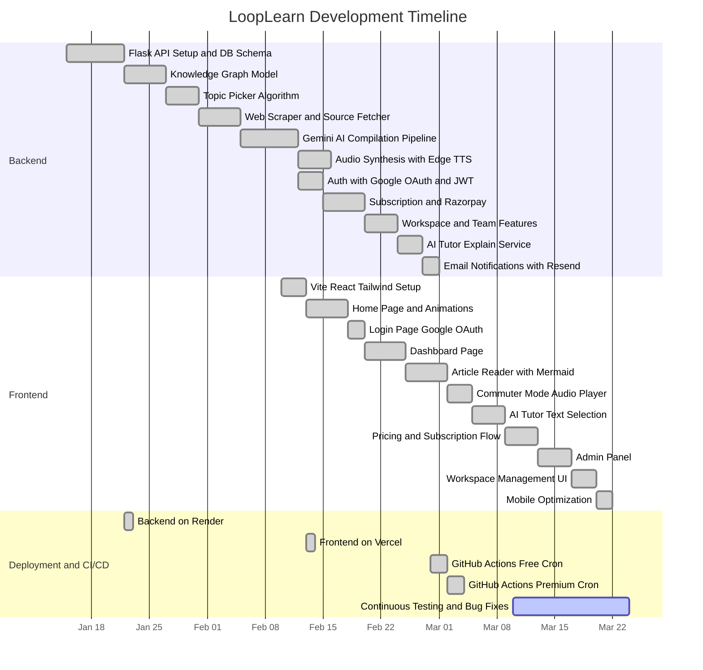

### Phase Breakdown

**Phase 1 — Backend Foundation (Jan 15 – Feb 7)**: Development began with the Flask API skeleton, PostgreSQL schema design, and basic CRUD operations. The knowledge graph model (`concept_nodes` and `concept_edges`) was implemented early to serve as the foundation for topic selection. The topic picker algorithm was developed and tested against seeded domain data. The web scraper and source fetcher were implemented using DuckDuckGo search and BeautifulSoup/Trafilatura, with quality filtering based on minimum content length thresholds. The Gemini AI compilation pipeline was the longest single task in this phase, requiring extensive prompt engineering to achieve consistent structured JSON output. Audio synthesis via Edge TTS and Cloudinary upload were added as the final pipeline stage. Google OAuth and JWT authentication were implemented in parallel with the audio service.

**Phase 2 — Monetization and Collaboration (Feb 7 – Feb 20)**: Razorpay integration required implementing plan creation, subscription creation, and webhook handling for lifecycle events (activation, charging, cancellation). The webhook endpoint includes HMAC signature verification to prevent spoofed requests. The workspace model was designed and implemented, enabling team subscriptions with seat limits. The AI Tutor (GPT-4o-mini) was added as a subscriber-only feature. Email notifications via Resend were configured for admin alerts and pipeline reports.

**Phase 3 — Frontend Development (Feb 10 – Mar 10)**: The Vite + React + Tailwind project was scaffolded and deployed to Vercel early, enabling continuous preview deployments. Pages were built iteratively: Home (landing), Login (OAuth), Dashboard (subscribed domains), Article Reader (Markdown + Mermaid + Audio), Pricing (Razorpay checkout), and Admin Panel (pipeline trigger + candidate review). Mobile optimization — including the custom `useMediaQuery` hook for adaptive animation durations — was one of the final frontend tasks.

**Phase 4 — CI/CD and Deployment (Continuous)**: Both the backend (Render) and frontend (Vercel) were deployed early in the development cycle and updated continuously. The two GitHub Actions cron workflows were configured in late February: `daily-pipeline.yml` (free pipeline, 8:00 PM IST) and `premium-daily-pipeline.yml` (all-domains premium pipeline, 5:00 PM IST). Testing and bug fixing have been ongoing since March 10.

## 3.1 Technologies Used and their Description

### 3.1.1 Python 3.12

Python serves as the backend programming language for LoopLearn. The choice of Python over alternatives such as Node.js, Go, or Java was driven by three primary factors: ecosystem compatibility with AI/ML libraries, developer productivity, and the availability of mature web scraping libraries.

Python's ecosystem for AI integration is unmatched. The `google-genai` SDK for Gemini, the `requests` library for GitHub Models API calls, and the `edge-tts` library for audio synthesis are all Python-native. Implementing the same pipeline in Node.js would require either using lower-level HTTP clients for API calls or working with less mature SDK wrappers. Go, while offering superior performance characteristics, lacks the breadth of AI/ML library support that Python provides.

Python 3.12 introduced performance improvements through the PEP 684 per-interpreter GIL and PEP 709 comprehension inlining, resulting in approximately 5% faster execution compared to Python 3.11 for typical web workloads. While the GIL remains a limiting factor for CPU-bound multithreading, LoopLearn's backend is I/O-bound (database queries, HTTP API calls, file uploads), making this constraint largely irrelevant. The pipeline service uses Python's `threading` module for background job execution, which is sufficient for I/O-bound workloads under the GIL.

LoopLearn uses raw SQL via psycopg2 rather than an ORM (such as SQLAlchemy or Django ORM). This decision was made to maintain full control over query construction, avoid the performance overhead of ORM query translation, and leverage PostgreSQL-specific features (UUIDs, JSONB, ON CONFLICT clauses) that are sometimes abstracted away by ORMs.

### 3.1.2 Flask 3.1.2

Flask is a lightweight WSGI web application framework that follows a microframework philosophy: it provides the essentials (routing, request/response handling, templating) and defers everything else to extensions and libraries chosen by the developer. This stands in contrast to full-stack frameworks like Django, which include an ORM, admin panel, authentication system, and form handling out of the box.

LoopLearn chose Flask over Django because the backend serves exclusively as a REST API — there is no server-rendered HTML, no admin panel (the admin functionality is built into the React frontend), and no form processing. Django's included batteries would be unused, adding unnecessary dependency weight and architectural constraints. Flask's Blueprint system enables modular route organization: each resource (auth, subscriptions, pipeline, articles, workspaces, explanations) is registered as a separate Blueprint with its own URL prefix, keeping route files focused and maintainable.

Flask's request context model deserves particular mention. Each incoming HTTP request creates an isolated context in which `request`, `g`, and `session` objects are accessible. This model simplifies request-scoped operations (such as database connection management) without requiring explicit dependency injection. LoopLearn's authentication decorators (`@require_auth`, `@require_admin`) operate within this context, extracting JWT tokens from the `Authorization` header via `request.headers` and injecting the decoded user payload into the route handler's function arguments.

In production, Flask runs behind Gunicorn 25.0.1, a WSGI HTTP server that manages a pool of worker processes. Gunicorn's pre-fork model spawns multiple Python processes, each running an independent copy of the Flask application. This enables concurrent request handling despite Python's GIL, as each worker process has its own GIL. The Render deployment is configured with 2-4 workers, balancing memory usage against concurrent request capacity.

### 3.1.3 PostgreSQL 16 (Neon Serverless)

PostgreSQL was chosen as the database engine for three reasons: ACID compliance for transactional operations (subscription billing, payment state tracking), native JSONB support for semi-structured data (article content, plan features), and the ability to implement a graph data model using standard relational tables without requiring a dedicated graph database.

**ACID Compliance**: Subscription management requires strong consistency guarantees. When a Razorpay webhook fires to activate a subscription, the operation must atomically update the subscription status, set the `ends_at` timestamp, and potentially create workspace member records. PostgreSQL's transaction model ensures that these operations either complete entirely or are rolled back, preventing inconsistent states such as a paid subscription that appears inactive in the database.

**JSONB Support**: The `compiled_data` column in `compiled_topics`, the `content_json` column in `article_candidate` and `published_articles`, and the `features` column in `plans` all use the JSONB data type. JSONB stores JSON data in a decomposed binary format that supports indexing, efficient querying (using operators like `->`, `->>`, `@>`), and in-place updates. This eliminates the need for a separate NoSQL database for semi-structured content while maintaining a single transactional database for all application data.

**Neon Serverless**: Neon provides PostgreSQL as a serverless managed service, separating compute from storage. The database scales automatically based on query load, with compute instances spinning down during idle periods and scaling up within seconds when requests arrive. This eliminates the need to manage database server provisioning, patching, and capacity planning. Neon's connection string requires SSL (`sslmode=require`), which LoopLearn's `db.py` module automatically appends if not present in the configured `DATABASE_URL`.

**Connection Management**: LoopLearn's `get_connection()` function uses the `tenacity` library for retry logic: if a connection attempt fails due to a transient `OperationalError` (network timeout, connection pool exhaustion), the function retries up to 3 times with a 2-second fixed wait between attempts. The connection is configured with TCP keepalive parameters (`keepalives_idle=30`, `keepalives_interval=10`, `keepalives_count=5`) to detect and recover from stale connections to Neon's serverless infrastructure.

### 3.1.4 Google Gemini 2.5 Flash

Gemini 2.5 Flash is Google's optimized model for high-throughput, structured output generation. It is the primary AI engine in LoopLearn's content structuring pipeline.

**JSON Structured Output**: Gemini 2.5 Flash supports a `response_mime_type` configuration that constrains the model's output to valid JSON. When set to `"application/json"`, the model's decoding process ensures that every generated token contributes to a syntactically valid JSON object. This is critical for LoopLearn's pipeline, which relies on parsing the model's output into a predefined schema containing fields for `topic`, `intro_hook`, `what_is_it`, `practical_implementation`, `theory`, `flashcards`, `mermaid`, and `child_topics`. Without structured output mode, the model might embed JSON within markdown code fences or prepend conversational commentary, requiring fragile post-processing.

**Context Window and Input Construction**: Gemini 2.5 Flash has a context window of 1 million tokens, enabling it to process substantial volumes of scraped web content alongside the system prompt. LoopLearn's topic compiler constructs the input by concatenating the topic name, extracted concept keywords, and the full text of up to 20 scraped sources. Even with verbose scraped content, this typically uses fewer than 50,000 tokens, well within the model's capacity.

**System Prompt Engineering**: The system prompt defines the AI's role ("senior software engineer, system architect, and technical educator") and specifies the exact JSON schema it must produce. The prompt includes explicit rules for Mermaid diagram formatting (no special characters in labels, all labels wrapped in double quotes, simple alphanumeric node IDs) to prevent parsing failures in the frontend's Mermaid.js renderer. The temperature is set to 0.2, producing deterministic and factual output rather than creative variations.

**Retry Logic**: The `compile_topic` function uses `tenacity`'s `@retry` decorator with exponential backoff: up to 5 attempts, with wait times starting at 5 seconds and doubling up to a maximum of 60 seconds between retries. This handles transient API errors (rate limiting, server overload) without manual intervention.

### 3.1.5 GPT-4o-mini (via GitHub Models)

GPT-4o-mini is a compact, low-latency model from OpenAI, accessed through the GitHub Models inference API. It powers LoopLearn's AI Tutor feature.

The AI Tutor requires a different set of characteristics than the content compilation pipeline. It must respond in real-time (under 2 seconds) to a user's text selection, produce concise output (3 sentences maximum), and tailor its explanation to the specific paragraph context rather than providing generic definitions. GPT-4o-mini's small size and low latency make it well-suited for this interactive use case, where response speed directly impacts user experience.

The system prompt for the AI Tutor instructs the model to "explain the highlighted text strictly based on the surrounding paragraph involved," constraining the output to contextually relevant explanations. The prompt explicitly prohibits markdown formatting, bolding, and bullet points, ensuring the response renders cleanly in the frontend's explanation popover without additional parsing.

The model is accessed via the GitHub Models API (`https://models.inference.ai.azure.com/chat/completions`), authenticated with a GitHub personal access token. This API provides free-tier access to several models, making it a cost-effective choice for the high-frequency, low-compute AI Tutor feature.

### 3.1.6 React 19 and Virtual DOM

React 19 serves as the frontend UI library. React's component-based architecture enables the construction of complex UIs from small, reusable building blocks. Each page in LoopLearn (Home, Login, Dashboard, Article Reader, Pricing, Admin) is a React component that composes smaller components (Navbar, Footer, AudioPlayer, TextSelectionExplainer, skeleton loaders).

**Virtual DOM**: React's core architectural innovation is the Virtual DOM — a lightweight, in-memory representation of the actual browser DOM. When a component's state changes (e.g., an article is fetched, a theme is toggled, a subscription status is updated), React creates a new Virtual DOM tree, computes the minimal set of differences (diffing algorithm) between the new and previous trees, and applies only those specific changes to the actual browser DOM (reconciliation). This approach is significantly more efficient than directly manipulating the DOM for every state change, particularly for complex UIs with many interactive elements.

**Concurrent Rendering (React 19)**: React 19 introduces improvements to the concurrent rendering model introduced in React 18. Concurrent features allow React to prepare new UI states in the background without blocking the main thread, enabling smoother transitions when navigating between pages or loading article content. LoopLearn benefits from this when transitioning between the Dashboard (which fetches subscription data) and the Article Reader (which fetches and renders Markdown content and Mermaid diagrams).

### 3.1.7 Vite 7.2

Vite is the frontend build tool and development server. It was chosen over Webpack (the incumbent standard) for its dramatically faster development experience.

**Development Server Architecture**: Webpack bundles all application source code into a single JavaScript bundle before serving it, resulting in cold start times that grow linearly with project size (often 30-60 seconds for medium projects). Vite takes a fundamentally different approach: it serves source files directly to the browser as native ES modules during development. The browser's built-in module system handles dependency resolution, and Vite only transforms individual files on demand using `esbuild` (a Go-based JavaScript compiler that is 10-100x faster than traditional JavaScript-based compilers). This results in near-instant cold starts regardless of project size.

**Hot Module Replacement (HMR)**: When a developer saves a file, Vite's HMR system identifies the specific module that changed and sends an update to the browser over a WebSocket connection. Only the changed module is replaced, preserving application state (Redux store, component state) across edits. In practice, this means that editing a component's styling or logic is reflected in the browser within milliseconds, compared to Webpack's typical 2-5 second full-page reload cycle.

**Production Build**: For production deployment on Vercel, Vite uses Rollup as its bundler, producing optimized, tree-shaken JavaScript bundles with code splitting based on route boundaries. This means that a user visiting the Home page does not download the JavaScript for the Admin Panel, reducing initial load time.

### 3.1.8 Tailwind CSS 4

Tailwind CSS is a utility-first CSS framework that provides low-level utility classes (e.g., `p-4` for padding, `text-lg` for font size, `bg-zinc-900` for background color) that compose directly in HTML/JSX to build designs without writing custom CSS.

**Utility-First Philosophy**: Traditional CSS approaches (BEM, CSS Modules, Styled Components) require the developer to invent class names, manage a separate stylesheet, and maintain a mapping between component markup and styles. Tailwind eliminates this indirection: the visual appearance of a component is declared inline through utility classes, making the styling immediately visible alongside the component structure.

**Theme Configuration**: LoopLearn defines custom theme tokens for both light and dark modes through Tailwind's configuration. Colors, font families (Inter, JetBrains Mono), border radii, and transition durations are defined as design tokens and referenced consistently across all components. The dark/light theme toggle is managed by a ThemeContext that adds or removes a `dark` class on the root HTML element, which Tailwind's `dark:` variant prefix detects to apply alternate styles.

**Production Optimization**: Tailwind 4's JIT (Just-In-Time) compiler generates CSS only for utility classes that are actually used in the project's source files. This produces production CSS files that are typically 10-15 KB gzipped, compared to the 3+ MB uncompressed size of the full Tailwind utility set. The result is a negligible CSS payload that does not impact page load time.

### 3.1.9 Framer Motion

Framer Motion is a production-ready animation library for React. It provides a declarative API for creating animations through component props rather than imperative animation code.

LoopLearn uses Framer Motion extensively on the Home page for scroll-triggered reveal animations, the feature slideshow carousel, the typing animation ("Read. Visualize. Mastered."), and page transition effects. The `motion.div` wrapper component accepts `initial`, `animate`, and `exit` props that define the start state, end state, and exit state of an animation, with `transition` controlling duration, easing, and delay.

**Mobile Optimization**: During testing, Framer Motion animations caused noticeable frame drops on lower-end Android devices during theme transitions. The root cause was that theme transitions trigger a full DOM repaint (changing background colors, text colors, border colors across all elements), and overlapping Framer Motion animations during this repaint exceeded the GPU budget. LoopLearn addresses this with a custom `useMediaQuery` hook that detects viewport widths below 768px. On mobile devices, animation durations are increased (e.g., from 0.3s to 0.6s) and stagger delays are reduced, spreading the animation workload over a longer period and reducing per-frame GPU load.

### 3.1.10 Redux Toolkit

Redux Toolkit is the official Redux library for state management. LoopLearn uses it specifically for authentication state: the JWT token, user ID, email, role, and subscription status are stored in a Redux slice and accessed across components via typed hooks (`useAppSelector`, `useAppDispatch`).

**Slice Architecture**: Redux Toolkit's `createSlice` API defines a slice of application state with its initial state, reducer functions, and automatically generated action creators within a single file. LoopLearn's `authSlice.ts` manages the login/logout lifecycle: setting credentials on successful OAuth, clearing them on logout, and providing selectors for components to determine the current authentication state.

**Why Redux over Context API**: React's built-in Context API could theoretically manage authentication state. However, Context re-renders every consuming component when any part of the context value changes, which can cause unnecessary re-renders in large component trees. Redux Toolkit's `useSelector` hook uses reference equality checks to skip re-renders when the selected slice of state hasn't changed, providing better performance for frequently accessed global state.

### 3.1.11 Edge TTS (Text-to-Speech)

Microsoft Edge TTS is a neural text-to-speech service that synthesizes human-quality speech without requiring an API key or paid subscription. It leverages the same TTS engine that powers speech synthesis in Microsoft Edge browser and Windows narrator.

LoopLearn uses the `en-US-AriaNeural` voice, which produces natural-sounding female speech with appropriate intonation and pacing for technical content. The `edge-tts` Python library provides a streaming interface: audio chunks and word boundary events are emitted asynchronously, allowing LoopLearn to capture both the audio data (written to a local MP3 file) and word-level timestamps (offset and duration in 100-nanosecond units, converted to seconds) in a single pass.

The word-level timestamps enable a feature in the frontend audio player: as the audio plays, the corresponding text in the article can be highlighted, providing a karaoke-style reading experience. The timestamps are stored as a JSON array in the `content_json` field of the published article record in PostgreSQL.

After synthesis, the local MP3 file is uploaded to Cloudinary, and the returned CDN URL is stored in the `audio_url` column of both `article_candidate` and `published_articles`. The local file is deleted after upload to avoid disk accumulation on the Render deployment.

### 3.1.12 Cloudinary

Cloudinary is a cloud-based media management platform that provides storage, transformation, optimization, and CDN delivery for images, videos, and audio files. LoopLearn uses Cloudinary exclusively for storing and serving generated audio files.

When Edge TTS produces an MP3 file, it is uploaded to Cloudinary using the Python SDK with `resource_type="video"` (Cloudinary categorizes audio files under the "video" resource type). The file is stored in a `looplearn_audio` folder within the Cloudinary account. The returned `secure_url` is an HTTPS CDN endpoint that enables efficient global delivery with automatic format negotiation and caching.

The choice of Cloudinary over alternatives (AWS S3 + CloudFront, Google Cloud Storage) was driven by simplicity: Cloudinary's Python SDK handles upload, storage, and CDN delivery in a single API call, without requiring separate configuration of storage buckets, CDN distributions, and access policies.

### 3.1.13 Razorpay

Razorpay is an Indian payment gateway that supports recurring subscriptions through its Subscription API. LoopLearn uses Razorpay for all monetization operations: one-time plan creation, subscription creation with customer checkout, and webhook-based lifecycle management.

**Subscription Flow**: When a user subscribes, the backend creates a Razorpay plan (if one does not already exist for that LoopLearn plan) with the amount in paise (INR), period (monthly/yearly/weekly/daily), and interval. It then creates a Razorpay subscription against that plan, receiving a `subscription_id` and `short_url`. The frontend uses the Razorpay checkout widget to collect payment details.

**Webhook State Management**: Razorpay sends webhook events for subscription lifecycle changes: `subscription.activated`, `subscription.charged`, `subscription.cancelled`, `subscription.halted`. Each webhook payload includes an HMAC-SHA256 signature that the backend verifies against the `RAZORPAY_WEBHOOK_SECRET` to prevent spoofed requests. The webhook handler updates the subscription's `status` and `ends_at` fields in PostgreSQL based on the event type and billing cycle.

**Team Subscriptions**: Team subscriptions are priced at 4x the individual rate to cover a default seat limit of 5. The `is_team` flag is passed through Razorpay's `notes` metadata, allowing the webhook handler to set the `is_team` column on the subscription record accordingly.

### 3.1.14 DuckDuckGo Search and BeautifulSoup/Trafilatura

The content structuring pipeline begins with source discovery. LoopLearn uses the `duckduckgo-search` Python library to programmatically search for authoritative web content on a given topic. DuckDuckGo was chosen over Google Custom Search or Bing Search because it does not require an API key, has no per-query billing, and provides privacy-preserving search results.

The `fetch_candidate_source` function constructs a search query by appending "explained" to the topic name (e.g., "Connection Pooling explained"), deduplicates results by URL, and returns up to 20 sources with their URL, title, and snippet.

Web content is then extracted using a two-library approach. **Trafilatura** is the primary extractor, designed specifically for boilerplate removal from web articles. It identifies and extracts the main textual content of a page while discarding navigation menus, advertisements, sidebars, and footer content. For pages where Trafilatura fails, **BeautifulSoup** serves as a fallback, parsing the raw HTML and extracting text from paragraph and heading tags.

The `source_scrape_service` applies quality filtering: scraped content must exceed 300 characters in raw form and 200 characters after cleaning (removing excessive whitespace, HTML entities, and non-textual artifacts). Sources that fail these thresholds are marked as `status = 'failed'` in the `sources` table and excluded from the Gemini compilation step.

### 3.1.15 GitHub Actions

GitHub Actions provides the CI/CD automation for LoopLearn's daily content generation. Two workflow files define scheduled cron jobs that trigger the backend pipeline endpoints:

**`daily-pipeline.yml`** (Free Pipeline): Scheduled at `cron: "30 14 * * *"` (2:30 PM UTC = 8:00 PM IST). This workflow runs a single `curl` command that sends a POST request to the backend's `/api/pipeline/run` endpoint with a Bearer token for authentication. The backend picks one random topic, runs the full pipeline (scrape, compile, generate audio), and stores the result as a candidate article awaiting admin approval.

**`premium-daily-pipeline.yml`** (Premium Pipeline): Scheduled at `cron: "30 11 * * *"` (11:30 AM UTC = 5:00 PM IST). This workflow triggers the `/api/pipeline/start-all` endpoint, which iterates through all available domains, generates an article for each, and auto-publishes them with `audience = 'subscriber'` in the `article_visibility` table.

Both workflows include the `workflow_dispatch` trigger, enabling manual execution from the GitHub Actions UI for testing and debugging purposes. Authentication is handled through GitHub Actions secrets (`PIPELINE_URL`, `PREMIUM_PIPELINE_URL`, `PIPELINE_TOKEN`), which are injected into the curl commands at runtime.

### 3.1.16 Mermaid.js

Mermaid.js is a JavaScript library for generating diagrams and visualizations from text-based definitions. LoopLearn uses it on the frontend to render architectural diagrams that are generated by the Gemini model as part of the compiled article JSON.

The compiled JSON includes a `mermaid` field with `diagram_type` (typically "graph" for flowcharts) and `code` (the raw Mermaid syntax). The frontend's article renderer passes this string to Mermaid.js, which parses it and generates an SVG diagram inline within the article view. This approach means diagrams are rendered client-side without requiring server-side image generation, and they scale cleanly to any screen size.

Mermaid diagram generation was one of the more challenging aspects of the project. The Gemini model occasionally generates Mermaid syntax with invalid characters in node labels (parentheses, brackets, apostrophes), causing Mermaid.js to throw parsing errors. This was addressed through extensive prompt engineering: the Gemini system prompt includes explicit rules prohibiting special characters in Mermaid labels and requiring all labels to be wrapped in double quotes.

### 3.1.17 Resend

Resend is a modern email API designed for transactional emails. LoopLearn uses it to send admin notifications when the pipeline completes, including a summary report of which domains were processed, which succeeded, and which encountered errors.

Resend was chosen over alternatives (SendGrid, Mailgun, AWS SES) for its simplicity: the API requires a single API key and a single function call to send an email with HTML content. There is no need to configure domains, verify sender identities, or manage reputation scores for the low volume of transactional emails that LoopLearn generates (typically 1-2 per day).

## 3.2 Event Table

| Event | Trigger | Actor | Pre-condition | System Response | Post-condition |
|---|---|---|---|---|---|
| Visit Home Page | URL navigation to `/` | Visitor | None | Render landing page with typing animation, feature slideshow, protocol steps, and stats | Home page displayed; no authentication required |
| Click "Access Briefing" | Button click on Home page | Visitor | Home page rendered | Redirect to Google OAuth consent screen | OAuth consent screen displayed |
| Google OAuth callback | OAuth redirect from Google | System | User granted OAuth consent | Verify `id_token` via Google API; create or fetch user in `users` table; generate JWT with user_id, email, and role | JWT issued; user record exists in database; redirect to Dashboard |
| View Today's Briefing (free) | Page load on `/todays` | Free User | User authenticated via JWT; no active subscription | Fetch random public-audience article from `published_articles` joined with `article_visibility` where `audience = 'public'` | Article markdown and Mermaid diagram rendered; audio player and AI Tutor not available |
| View Today's Briefing (subscriber) | Page load on Dashboard card click | Subscriber | User authenticated; active subscription for at least one domain | Fetch subscriber-exclusive article for subscribed domain from `published_articles` joined with `article_visibility` where `audience = 'subscriber'` | Full article rendered with Mermaid diagram, Commuter Mode audio player, and AI Tutor access |
| Highlight text on article | Text selection via mouse or touch | Subscriber | User is viewing a subscriber article; text is selected | Capture selected text and surrounding paragraph; send POST to `/api/explain`; GPT-4o-mini returns 3-sentence explanation | Explanation popover appears centered on screen |
| Toggle Commuter Mode | Button click on floating player | Subscriber | Subscriber article loaded; `audio_url` exists in article record | Stream MP3 audio from Cloudinary CDN URL; display floating audio player with play/pause controls | Audio plays; word-level timestamps available for text synchronization |
| Toggle dark/light theme | Navbar theme button click | Any User | Application loaded | Toggle `dark` class on root HTML element; persist preference to localStorage; Tailwind `dark:` variants activate | Theme persisted; all components re-render with new color scheme |
| Subscribe to a plan | Plan card click on `/pricing` | User | User authenticated; viewing Pricing page | Create Razorpay plan (if not cached); create Razorpay subscription; return `subscription_id` to frontend | Razorpay checkout widget opens; subscription record created with `status = 'pending'` |
| Razorpay webhook fires | HTTP POST from Razorpay servers | Razorpay | Subscription exists in database | Verify HMAC-SHA256 signature; parse event type; update subscription `status` and `ends_at` in PostgreSQL | Subscription activated, renewed, or cancelled based on event type |
| Free cron job executes | GitHub Actions schedule (8:00 PM IST) | GitHub Actions | Workflow file exists; secrets configured | POST `/api/pipeline/run` with Bearer token; pipeline picks random topic, scrapes, compiles, generates audio | Candidate article created with `status = 'pending'`; awaits admin approval |
| Premium cron job executes | GitHub Actions schedule (5:00 PM IST) | GitHub Actions | Workflow file exists; secrets configured | POST `/api/pipeline/start-all` with Bearer token; pipeline iterates all domains, picks topic per domain, compiles, generates audio | Subscriber articles auto-published for all domains; `article_visibility` set to `subscriber` |
| Admin triggers pipeline manually | Admin panel button click | Platform Admin | Admin authenticated; Admin Panel accessible | Start background pipeline job via `/api/pipeline/run` or `/api/pipeline/start-premium`; return `job_id` | Pipeline job started in background thread; status trackable via `/api/pipeline/status/:job_id` |
| Admin reviews candidate | Approve/reject button in Admin Panel | Platform Admin | Candidate article exists with `status = 'pending'` | If approved: set `scheduled_for` date, copy to `published_articles`, set `article_visibility` to `public`. If rejected: set `status = 'rejected'`, store `rejection_reason` | Article either published (public audience) or permanently rejected with documented reason |
| Create workspace | Settings page form submission | Team Admin | User authenticated; team subscription active | INSERT into `workspaces` with owner_id, name, seat_limit; INSERT owner into `workspace_members` with `role = 'admin'` | Workspace created; Team Admin is first member |
| Invite member to workspace | Email invitation from workspace settings | Team Admin | Workspace exists; seat limit not exceeded | INSERT into `workspace_members` with `role = 'member'`; invited user inherits domain access | New member can access subscriber articles for workspace's subscribed domain |
| Pipeline generates child topics | Automated post-compilation | System | Gemini compilation returns `child_topics` array | For each child: INSERT into `concept_nodes` as `concept`; INSERT edge from parent topic to child; INSERT edge from domain to child | Knowledge graph expanded; child topics available for future selection |

## 3.3 Use Case Diagram and Basic Scenarios & Use Case Description

### Use Case Diagram

```mermaid
graph TD
    subgraph Actors
        V["Visitor"]
        FU["Free User"]
        SU["Subscriber"]
        TA["Team Admin"]
        PA["Platform Admin"]
        GH["GitHub Actions Cron"]
    end

    subgraph "Use Cases"
        UC1["UC-01: View Home Page"]
        UC2["UC-02: Login via Google OAuth"]
        UC3["UC-03: View Random Public Article"]
        UC4["UC-04: Subscribe to Domain Plan"]
        UC5["UC-05: View Subscriber Article"]
        UC6["UC-06: Use AI Tutor"]
        UC7["UC-07: Listen in Commuter Mode"]
        UC8["UC-08: Create Team Workspace"]
        UC9["UC-09: Invite Members to Workspace"]
        UC10["UC-10: Review Candidate Articles"]
        UC11["UC-11: Trigger Pipeline Manually"]
        UC12["UC-12: Auto-Generate Free Article"]
        UC13["UC-13: Auto-Generate All Domain Articles"]
        UC14["UC-14: View Dashboard"]
        UC15["UC-15: Toggle Theme"]
    end

    V --> UC1
    V --> UC2
    V --> UC15
    FU --> UC3
    FU --> UC4
    FU --> UC14
    SU --> UC5
    SU --> UC6
    SU --> UC7
    SU --> UC14
    TA --> UC8
    TA --> UC9
    TA --> UC4
    PA --> UC10
    PA --> UC11
    GH --> UC12
    GH --> UC13
```

### UC-01: View Home Page

| Field | Description |
|---|---|
| **Use Case ID** | UC-01 |
| **Name** | View Home Page |
| **Actor** | Visitor |
| **Pre-conditions** | None. The home page is publicly accessible without authentication. |
| **Main Success Scenario** | 1. Visitor navigates to the root URL (`/`). 2. The React application loads and renders `Home.tsx`. 3. The typing animation initiates, cycling through "Read. Visualize. Mastered." 4. Framer Motion scroll-triggered animations reveal the feature slideshow, the "The Noise vs The Signal" comparison section, the target audience cards, and the "Close the Loop" protocol steps. 5. A call-to-action button ("Access Briefing") is displayed. |
| **Alternate Flows** | A1: Visitor is on a mobile device (viewport < 768px). The `useMediaQuery` hook detects this and increases animation durations to prevent frame drops. |
| **Exceptions** | E1: JavaScript is disabled. The page renders as static HTML without animations. |
| **Post-conditions** | Home page fully rendered. No server-side API calls are made. |

### UC-02: Login via Google OAuth

| Field | Description |
|---|---|
| **Use Case ID** | UC-02 |
| **Name** | Login via Google OAuth |
| **Actor** | Visitor |
| **Pre-conditions** | Visitor has a Google account. The application's Google OAuth Client ID is configured. |
| **Main Success Scenario** | 1. Visitor clicks "Access Briefing" or "Login" button. 2. Frontend opens Google OAuth consent screen. 3. Visitor authenticates with Google and grants consent. 4. Google returns an `id_token` to the frontend. 5. Frontend sends POST `/api/auth/google` with the `id_token`. 6. Backend calls `google.oauth2.id_token.verify_oauth2_token()` to validate the token. 7. Backend extracts `email` and `sub` (Google user ID) from the decoded token. 8. Backend calls `get_or_create_user(email)` — if the user exists, their record is returned; if not, a new user is inserted into the `users` table. 9. Backend retrieves the user's auth context (role from `user_roles`, active subscriptions). 10. Backend generates a JWT containing `user_id`, `email`, `role`, and `subscription` data. 11. Backend returns the JWT and user object to the frontend. 12. Frontend stores the JWT in localStorage and Redux auth slice. 13. Frontend redirects to the Dashboard page. |
| **Alternate Flows** | A1: User already has an active session (valid JWT in localStorage). Frontend skips OAuth and redirects directly to Dashboard. |
| **Exceptions** | E1: Google returns an invalid or expired `id_token`. Backend returns 401. Frontend displays an error message. E2: Database connection fails during `get_or_create_user`. Backend retries up to 3 times (tenacity). If all retries fail, returns 500. |
| **Post-conditions** | User is authenticated. JWT is stored in localStorage. Redux auth slice is populated. User is redirected to Dashboard. |

### UC-03: View Random Public Article

| Field | Description |
|---|---|
| **Use Case ID** | UC-03 |
| **Name** | View Random Public Article |
| **Actor** | Free User |
| **Pre-conditions** | User is authenticated (valid JWT). User does not have an active subscription. A public-audience article exists for today's date. |
| **Main Success Scenario** | 1. Free User navigates to `/todays`. 2. Frontend sends GET request with JWT to fetch today's public article. 3. Backend queries `published_articles` joined with `article_visibility` where `audience = 'public'` and `scheduled_for = CURRENT_DATE`. 4. Backend returns the article object (title, slug, article_md, diagram, content_json). 5. Frontend renders the article markdown using a Markdown renderer. 6. Frontend renders the Mermaid diagram from the `diagram` field using Mermaid.js. 7. Audio player and AI Tutor are not rendered (subscriber-only features). |
| **Alternate Flows** | A1: No public article exists for today. Backend returns 404. Frontend displays "No article available today" message. |
| **Exceptions** | E1: JWT is expired. Axios interceptor detects 401 response. Frontend clears auth state and redirects to Login. |
| **Post-conditions** | Free User has read today's public article. Mermaid diagram is visible. Premium features are not accessible. |

### UC-04: Subscribe to Domain Plan

| Field | Description |
|---|---|
| **Use Case ID** | UC-04 |
| **Name** | Subscribe to Domain Plan |
| **Actor** | Free User or Team Admin |
| **Pre-conditions** | User is authenticated. User is viewing the Pricing page (`/pricing`). At least one plan exists in the `plans` table. |
| **Main Success Scenario** | 1. User views available plans on the Pricing page (fetched via GET `/api/subscriptions/plans`). 2. User selects a domain plan (e.g., "Databases — Monthly"). 3. Frontend sends POST `/api/subscriptions/subscribe` with `plan_id` and optional `is_team` flag. 4. Backend fetches plan details from `plans` table. 5. Backend creates a Razorpay plan (if `razorpay_plan_id` is null for this plan). 6. Backend creates a Razorpay subscription with `notes` containing `user_id` and `plan_id`. 7. Backend inserts a subscription record with `status = 'pending'` into `subscriptions` table. 8. Backend returns the `razorpay_subscription_id` to the frontend. 9. Frontend opens the Razorpay checkout widget. 10. User completes payment. 11. Razorpay sends a webhook event (`subscription.activated`) to POST `/api/subscriptions/webhook`. 12. Backend verifies HMAC signature, updates subscription `status` to `active`, sets `ends_at`. 13. User is redirected to the Subscription Success page. |
| **Alternate Flows** | A1: User selects a Team subscription. The `is_team` flag is set to `true`, and the price is 4x the individual rate. After payment, the Team Admin can create a workspace. |
| **Exceptions** | E1: Payment fails at Razorpay checkout. Subscription remains `pending`. No webhook is fired. User can retry. E2: Webhook signature verification fails. Backend returns 400. Subscription is not activated. |
| **Post-conditions** | Subscription is active. User can access subscriber articles for the subscribed domain. Dashboard shows the subscribed domain card. |

### UC-05: View Subscriber Article

| Field | Description |
|---|---|
| **Use Case ID** | UC-05 |
| **Name** | View Subscriber Article |
| **Actor** | Subscriber |
| **Pre-conditions** | User is authenticated. User has an active subscription for at least one domain. A subscriber-audience article exists for today's date in the subscribed domain. |
| **Main Success Scenario** | 1. Subscriber views their Dashboard, which displays cards for each subscribed domain. 2. Subscriber clicks a domain card. 3. Frontend sends GET `/api/subscriptions/me/today` with JWT. 4. Backend verifies JWT, retrieves active subscriptions, queries `published_articles` joined with `article_visibility` where `audience = 'subscriber'` and domain matches. 5. Backend returns full article object including `audio_url`, `content_json`, `diagram`. 6. Frontend renders article markdown, Mermaid diagram, floating audio player (Commuter Mode), and enables text selection for AI Tutor. |
| **Alternate Flows** | A1: Subscriber is a workspace member (not the workspace owner). Backend resolves the workspace owner's team subscription to verify domain access. |
| **Exceptions** | E1: No article exists for the subscribed domain today. Backend returns 404. Frontend displays fallback message. E2: Subscription has expired (`ends_at` < current date). Backend returns 403. |
| **Post-conditions** | Subscriber has full access to article content, audio, diagram, and AI Tutor. |

### UC-06: Use AI Tutor

| Field | Description |
|---|---|
| **Use Case ID** | UC-06 |
| **Name** | Use AI Tutor |
| **Actor** | Subscriber |
| **Pre-conditions** | Subscriber is viewing a subscriber article. Text is selected within the article body. |
| **Main Success Scenario** | 1. Subscriber selects (highlights) a word, phrase, or sentence within the article. 2. A floating "Explain" button appears near the selection. 3. Subscriber clicks "Explain." 4. Frontend captures the selected text and the surrounding paragraph as context. 5. Frontend sends POST `/api/explain` with `highlighted_text` and `context`. 6. Backend sends both to GPT-4o-mini via GitHub Models API with system prompt constraining output to 3 sentences of plain text. 7. GPT-4o-mini returns contextual explanation. 8. Backend returns the explanation text. 9. Frontend displays the explanation in a centered popover (`ExplanationPopover.tsx`). |
| **Alternate Flows** | A1: Subscriber deselects text before clicking Explain. The Explain button disappears. No API call is made. |
| **Exceptions** | E1: GitHub Models API is unavailable. Backend returns 502. Frontend displays "Explanation unavailable" in the popover. E2: Selected text is too short (less than 3 characters). Frontend does not show the Explain button. |
| **Post-conditions** | Explanation popover is visible. Subscriber can close it and continue reading. |

### UC-07: Listen in Commuter Mode

| Field | Description |
|---|---|
| **Use Case ID** | UC-07 |
| **Name** | Listen in Commuter Mode |
| **Actor** | Subscriber |
| **Pre-conditions** | Subscriber is viewing a subscriber article. The article record contains a non-null `audio_url`. |
| **Main Success Scenario** | 1. Subscriber clicks the Commuter Mode toggle/play button. 2. `FloatingAudioPlayer.tsx` component renders with play/pause controls. 3. Audio is streamed from the Cloudinary CDN URL stored in the article's `audio_url` field. 4. Word-level timestamps from `content_json` are used to synchronize text highlighting with audio playback. 5. Subscriber can pause, resume, and scrub through the audio. |
| **Alternate Flows** | A1: `audio_url` is null (audio generation failed for this article). Commuter Mode button is disabled. |
| **Exceptions** | E1: Cloudinary CDN is unreachable. Audio player shows error state. |
| **Post-conditions** | Audio plays. Subscriber can listen while multitasking. |

### UC-08: Create Team Workspace

| Field | Description |
|---|---|
| **Use Case ID** | UC-08 |
| **Name** | Create Team Workspace |
| **Actor** | Team Admin |
| **Pre-conditions** | User is authenticated. User has an active team subscription (`is_team = true`). |
| **Main Success Scenario** | 1. Team Admin navigates to workspace settings. 2. Team Admin enters a workspace name. 3. Frontend sends POST `/api/workspaces` with workspace name and JWT. 4. Backend inserts a new record into `workspaces` with the user as `owner_id` and `seat_limit = 5`. 5. Backend inserts the owner into `workspace_members` with `role = 'admin'`. 6. Backend returns the workspace object. 7. Frontend displays the created workspace with an option to invite members. |
| **Alternate Flows** | A1: User already owns a workspace. Frontend shows existing workspace instead of creation form. |
| **Exceptions** | E1: User does not have a team subscription. Backend returns 403. |
| **Post-conditions** | Workspace exists. Owner is the first member with admin role. |

### UC-09: Invite Members to Workspace

| Field | Description |
|---|---|
| **Use Case ID** | UC-09 |
| **Name** | Invite Members to Workspace |
| **Actor** | Team Admin |
| **Pre-conditions** | Workspace exists. Current member count is below `seat_limit`. |
| **Main Success Scenario** | 1. Team Admin enters the email of the person to invite. 2. Frontend sends POST `/api/workspaces/:id/members` with email. 3. Backend looks up the user by email (or creates a pending invitation). 4. Backend inserts into `workspace_members` with `role = 'member'`. 5. Invited member can now access subscriber articles for the workspace's subscribed domain. |
| **Alternate Flows** | A1: Invited email is not a registered user. System stores the invitation; access is granted upon registration. |
| **Exceptions** | E1: Seat limit exceeded. Backend returns 400 with "seat limit reached" error. |
| **Post-conditions** | New member added. They inherit domain access from the team subscription. |

### UC-10: Review Candidate Articles

| Field | Description |
|---|---|
| **Use Case ID** | UC-10 |
| **Name** | Review Candidate Articles |
| **Actor** | Platform Admin |
| **Pre-conditions** | Admin is authenticated with `role = 'admin'` in `user_roles`. At least one candidate exists with `status = 'pending'`. |
| **Main Success Scenario** | 1. Admin navigates to Admin Panel (`/admin`). 2. Frontend fetches pending candidates. 3. Admin views article preview: title, rendered markdown, Mermaid diagram. 4a. **Approve**: Admin clicks Approve, selects a `scheduled_for` date. Backend copies candidate data to `published_articles`, sets `article_visibility` to `public`, updates candidate `status` to `approved`. 4b. **Reject**: Admin clicks Reject, enters a `rejection_reason`. Backend updates candidate `status` to `rejected` and stores the reason. |
| **Alternate Flows** | A1: No pending candidates. Admin Panel shows empty queue. |
| **Exceptions** | E1: Concurrent approval (two admins approve same candidate). Database constraint prevents duplicate publication. |
| **Post-conditions** | Candidate is either published (visible to free users on the scheduled date) or rejected (permanently archived with reason). |

### UC-11: Trigger Pipeline Manually

| Field | Description |
|---|---|
| **Use Case ID** | UC-11 |
| **Name** | Trigger Pipeline Manually |
| **Actor** | Platform Admin |
| **Pre-conditions** | Admin is authenticated. No pipeline job is currently running (optional check). |
| **Main Success Scenario** | 1. Admin clicks "Run Pipeline" in Admin Panel, selecting either a single domain or all domains. 2. Frontend sends POST to `/api/pipeline/run` (single) or `/api/pipeline/start-all` (all domains). 3. Backend validates admin authorization via `@require_admin` decorator. 4. Backend starts pipeline job in a background thread and returns `job_id` with 202 Accepted. 5. Frontend polls `/api/pipeline/status/:job_id` to display progress. 6. Pipeline completes: candidate article(s) created. |
| **Alternate Flows** | A1: Admin triggers premium pipeline for a specific domain via `/api/pipeline/start-premium`. |
| **Exceptions** | E1: All topics exhausted for selected domain. Pipeline logs error and returns status "failed" with reason. |
| **Post-conditions** | Pipeline job completed. New candidate or published articles created depending on pipeline type. |

### UC-12: Auto-Generate Free Article

| Field | Description |
|---|---|
| **Use Case ID** | UC-12 |
| **Name** | Auto-Generate Free Article |
| **Actor** | GitHub Actions Cron |
| **Pre-conditions** | `daily-pipeline.yml` workflow exists. `PIPELINE_URL` and `PIPELINE_TOKEN` secrets are configured. |
| **Main Success Scenario** | 1. GitHub Actions triggers at 8:00 PM IST (cron: `30 14 * * *`). 2. Workflow sends POST to `/api/pipeline/run` with Bearer token. 3. Backend verifies `PIPELINE_TOKEN` via `@require_pipeline_secret`. 4. `pick_topic()` selects one random concept from any domain. 5. `fetch_candidate_source()` searches DuckDuckGo for the topic. 6. `scrape_and_store()` extracts text from source URLs. 7. `compile_topic()` sends scraped data to Gemini 2.5 Flash; receives structured JSON. 8. `render_article_md()` converts JSON to Markdown. 9. `create_commuter_audio()` generates MP3 via Edge TTS, uploads to Cloudinary. 10. Candidate article created with `status = 'pending'`. |
| **Alternate Flows** | A1: Topic exhausted for randomly selected domain. Pipeline raises error; admin notified via email. |
| **Exceptions** | E1: Gemini API timeout. Tenacity retries up to 5 times with exponential backoff. E2: All source URLs fail scraping. Pipeline aborts with logged error. |
| **Post-conditions** | One candidate article exists. Admin receives email notification. Article awaits manual approval. |

### UC-13: Auto-Generate All Domain Articles

| Field | Description |
|---|---|
| **Use Case ID** | UC-13 |
| **Name** | Auto-Generate All Domain Articles |
| **Actor** | GitHub Actions Cron |
| **Pre-conditions** | `premium-daily-pipeline.yml` workflow exists. `PREMIUM_PIPELINE_URL` and `PIPELINE_TOKEN` secrets are configured. At least one domain exists in `concept_nodes`. |
| **Main Success Scenario** | 1. GitHub Actions triggers at 5:00 PM IST (cron: `30 11 * * *`). 2. Workflow sends POST to `/api/pipeline/start-all` with Bearer token. 3. Backend retrieves all domain names from `concept_nodes` where `node_type = 'domain'`. 4. For each domain: `pick_topic_domain()` selects a concept → scrape → compile → generate audio → create candidate → publish article → set `audience = 'subscriber'` → insert child topic edges into knowledge graph. 5. Admin receives email with pipeline summary report. |
| **Alternate Flows** | A1: A specific domain is exhausted. Pipeline skips that domain, logs the skip, and continues with remaining domains. |
| **Exceptions** | E1: Backend crashes mid-pipeline. Partially completed domains have their articles published; remaining domains are skipped. Job status reflects partial completion. |
| **Post-conditions** | Subscriber articles published for all non-exhausted domains. Knowledge graph expanded with child topics. `article_visibility` set to `subscriber` for all generated articles. |

## 3.4 Entity-Relationship Diagram

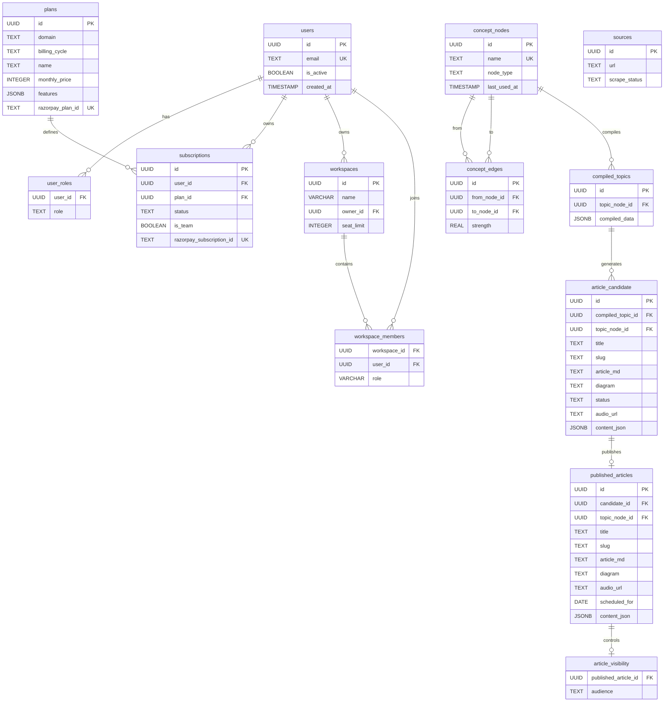

### ER Diagram Explanation

The Entity-Relationship diagram above represents LoopLearn's **relational-graph hybrid** database architecture. The schema can be understood through four logical groupings:

**User and Access Management (Top-Left Cluster)**: The `users` table is the central entity for identity management. Each user is identified by a UUID primary key and a unique email address. The `user_roles` table implements a one-to-many relationship with `users`, allowing a single user to hold a role such as `admin`, `editor`, or `viewer`. This is a separate table rather than a column on `users` because roles may need to be extended or audited independently.

**Subscription and Monetization (Left-Center Cluster)**: The `plans` table defines available subscription products, each tied to a specific domain (e.g., "Databases"), billing cycle (monthly, yearly), and price. Plans are linked to Razorpay via the `razorpay_plan_id` column. The `subscriptions` table connects users to plans, tracking the lifecycle state (`pending`, `active`, `cancelled`, `paused`) and team status (`is_team`). The `razorpay_subscription_id` column provides the foreign key back to Razorpay's system for webhook reconciliation.

**Workspace and Collaboration (Left-Bottom Cluster)**: The `workspaces` table enables team subscriptions. Each workspace has an `owner_id` referencing `users`, a `name`, and a `seat_limit`. The `workspace_members` junction table implements the many-to-many relationship between workspaces and users, with a `role` column distinguishing workspace admins from regular members. The composite primary key `(workspace_id, user_id)` prevents duplicate membership records.

**Knowledge Graph (Center Cluster)**: This is the most architecturally significant portion of the schema. The `concept_nodes` table stores all entities in the knowledge domain: domains (e.g., "System Design"), concepts (e.g., "Load Balancing"), and features (e.g., "Round Robin"). The `node_type` column classifies each node. The `concept_edges` table represents directed relationships between nodes, with a `strength` field (REAL, default 1.0) that increments via `ON CONFLICT DO UPDATE SET strength = concept_edges.strength + 1` each time an edge is re-inserted. The `UNIQUE(from_node_id, to_node_id)` constraint ensures no duplicate edges exist. This graph structure enables the topic picker to traverse from a domain node to its connected concepts, filter out already-used topics, and select from the remaining pool.

**Content Pipeline (Right Cluster)**: The content flows through a linear pipeline: `concept_nodes` → `compiled_topics` → `article_candidate` → `published_articles` → `article_visibility`. The `compiled_topics` table stores the raw JSON output from Gemini, linked to the `concept_nodes` entry for the topic. The `article_candidate` table stores the rendered article (markdown, diagram, audio URL) with a `status` field tracking its lifecycle (`pending`, `approved`, `rejected`). Upon approval (or auto-publish for premium), the candidate data is copied to `published_articles`, and the `article_visibility` table records whether the article is accessible to `public` (free users) or `subscriber` (paid users) audiences.

**Design Decision — UUIDs over Auto-Incrementing Integers**: All primary keys use UUIDs (`gen_random_uuid()`) rather than serial integers. This decision was made for three reasons: (1) global uniqueness eliminates collision risks if data is ever merged across environments (development, staging, production); (2) UUIDs prevent information leakage — sequential IDs reveal the total number of records and their creation order to external observers who can enumerate endpoints; (3) UUIDs are generated client-side or database-side without requiring a centralized sequence, which simplifies distributed architectures if the system scales horizontally in the future.

## 3.5 Flow Diagrams

### 3.5.1 Free Article Pipeline (GitHub Actions Cron — 8:00 PM IST)

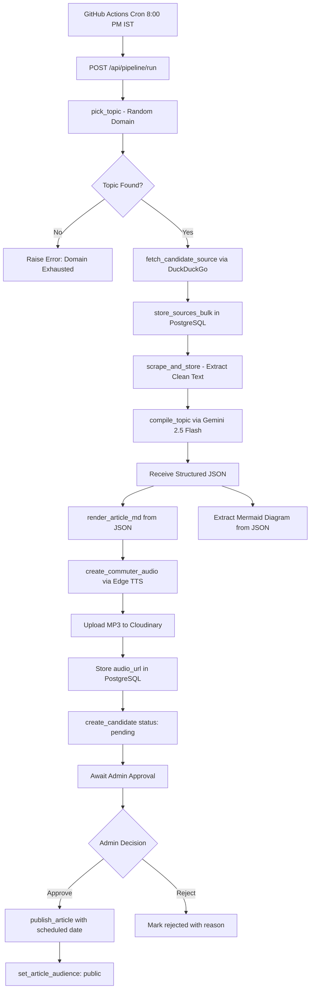

### Free Pipeline Flow Explanation

The Free Article Pipeline is the daily content generation workflow for unsubscribed users. It is triggered automatically by a GitHub Actions cron job at 8:00 PM IST (UTC 14:30) via the `daily-pipeline.yml` workflow file.

**Trigger and Authentication**: The workflow executes a `curl` command that sends an HTTP POST request to the backend's `/api/pipeline/run` endpoint. The request includes a Bearer token (`PIPELINE_TOKEN`) stored as a GitHub Actions secret. The backend's `@require_pipeline_secret` decorator validates this token against the environment variables `PIPELINE_SECRET`, `CRON_SECRET`, and `PIPELINE_TOKEN`.

**Topic Selection**: The `pick_topic()` function queries the knowledge graph to find an unused concept. It selects concept nodes that are connected to any domain via `concept_edges`, excluding topics that already exist in `published_articles` or `article_candidate`. The selection is randomized, ensuring variety across domains. If no unused topics are found for the randomly selected domain, the function falls back to the domain node itself as the topic.

**Source Discovery and Scraping**: Once a topic is selected, `fetch_candidate_source()` calls the DuckDuckGo search API with the topic name appended with "explained." Up to 20 source URLs are returned, stored in the `sources` table, and passed to the scraping service. The `scrape_and_store()` function attempts to extract clean text from each URL using Trafilatura (primary) or BeautifulSoup (fallback), applying minimum length thresholds (300 raw, 200 cleaned characters) to filter out low-quality sources.

**AI Compilation**: The scraped text and topic metadata are sent to Gemini 2.5 Flash via the `compile_topic()` function. The model returns structured JSON containing the article content, Mermaid diagram code, flashcards, and child topics. The `render_article_md()` function converts this JSON into a readable Markdown article.

**Audio Generation**: The Markdown text is stripped of formatting syntax and passed to Edge TTS, which generates an MP3 file with word-level timestamps. The file is uploaded to Cloudinary, and the returned CDN URL is stored alongside the article.

**Candidate Storage**: The final output is stored in the `article_candidate` table with `status = 'pending'`. The article is not visible to users until the Platform Admin reviews and approves it, at which point it is copied to `published_articles` with `audience = 'public'`.

### 3.5.2 Premium Article Pipeline (GitHub Actions Cron — 5:00 PM IST)

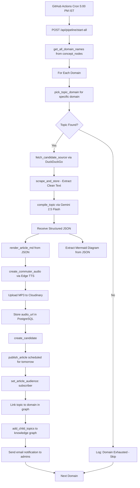

### Premium Pipeline Flow Explanation

The Premium Article Pipeline generates domain-specific content for subscribers across all available domains. It runs daily at 5:00 PM IST (UTC 11:30) via `premium-daily-pipeline.yml`.

The critical difference from the free pipeline is **scope and publication model**. While the free pipeline generates one article for one random domain and requires admin approval, the premium pipeline iterates through **all** domains in the `concept_nodes` table, generates an article for each, and **auto-publishes** them directly to `published_articles` with `audience = 'subscriber'` — bypassing the admin review queue.

For each domain, the pipeline calls `pick_topic_domain(domain_name)`, which constrains the topic selection to concepts connected to the specified domain. If the domain is exhausted (all concepts have been published or candidated), the pipeline logs the exhaustion and moves to the next domain without failing.

After compilation and audio generation, each article is immediately published with `scheduled_for` set to the next day's date. The `article_visibility` record is created with `audience = 'subscriber'`, ensuring the article is only accessible to users with an active subscription for that domain. Child topics returned by Gemini are inserted into the knowledge graph with edges to both the parent topic and the domain, ensuring future topic availability.

### 3.5.3 Knowledge Graph Child Topic Linking

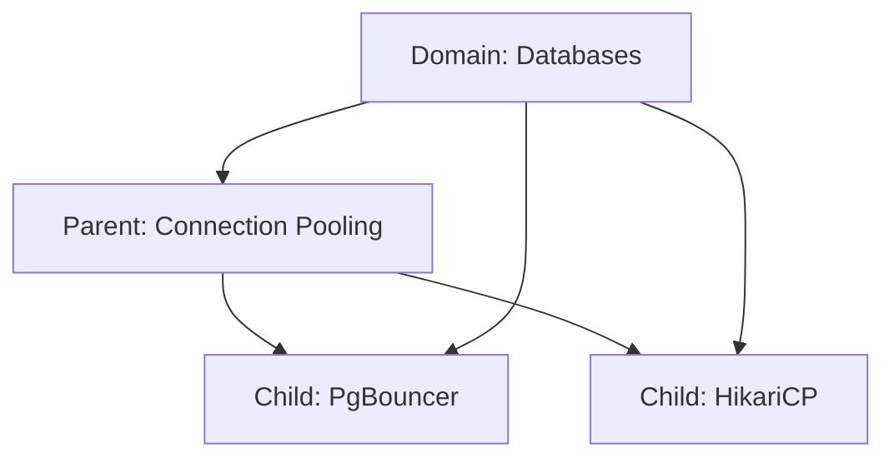

### Child Topic Linking Explanation

When the Gemini model compiles an article, it returns a `child_topics` array of related concepts. The `add_child_topics()` function processes this array by performing two operations per child concept:

1. **Insert Node**: Each child concept name is inserted into `concept_nodes` with `node_type = 'concept'` using the `insert_node()` function. The `ON CONFLICT (name) DO UPDATE` clause ensures that duplicate names are handled gracefully — if the concept already exists, its type is preserved (a domain is never downgraded to a concept).

2. **Create Edges**: Two edges are created for each child: one from the **parent topic** to the child (`Connection Pooling → PgBouncer`), and one from the **domain** to the child (`Databases → PgBouncer`). The second edge is critical: without it, the child concept would be orphaned from the domain and never selected by `pick_topic_domain()`, which traverses edges from the domain node. This dual-edge design was implemented to fix a domain exhaustion bug discovered during early testing, where child topics were unreachable from their parent domain.

## 3.6 Class Diagram

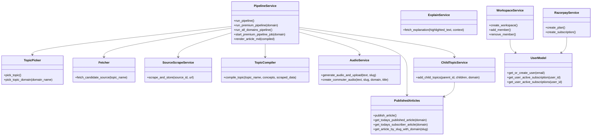

### Class Diagram Explanation

The class diagram represents the **service layer** of the LoopLearn backend. While LoopLearn's backend is implemented as Python modules with functions (rather than strict class-based OOP), the diagram models each service module as a class to illustrate the dependency relationships and public interfaces.

**PipelineService** is the central orchestrator. It coordinates the entire content generation workflow by invoking services in sequence: TopicPicker (select a topic) → Fetcher (discover sources) → SourceScrapeService (extract content) → TopicCompiler (AI structuring) → AudioService (audio synthesis) → PublishedArticles (publication) → ChildTopicService (graph expansion). The `run_pipeline()` method handles the free pipeline (single topic, candidate storage), while `run_all_domains_pipeline()` iterates through all domains for the premium pipeline.

**TopicPicker** exposes two methods: `pick_topic()` for the free pipeline (selects from any domain randomly) and `pick_topic_domain(domain_name)` for the premium pipeline (selects from a specific domain). Both methods query the knowledge graph, filter out already-used topics, and return a topic node with its ID and name.

**TopicCompiler** wraps the Gemini 2.5 Flash API call. Its `compile_topic()` method accepts the topic name, associated concept keywords, and scraped data, constructs the system prompt, sends the request with `response_mime_type="application/json"`, and returns the parsed JSON response. Retry logic (tenacity, 5 attempts, exponential backoff) is built into this method.

**AudioService** handles the Edge TTS synthesis and Cloudinary upload. The `create_commuter_audio()` method strips markdown from the input text, prepends a standardized audio introduction, streams through Edge TTS capturing word boundaries, writes the MP3 to a temporary file, uploads to Cloudinary, and returns the CDN URL and timestamps.

**ExplainService** wraps the GPT-4o-mini API call for the AI Tutor. It is independent from the pipeline — called on-demand from the `/api/explain` route when a subscriber highlights text in an article.

**ChildTopicService** manages knowledge graph expansion. After compilation, it receives the parent topic ID, child concept names, and domain name. For each child, it inserts a concept node and creates edges to both the parent topic and the domain.

**WorkspaceService** and **RazorpayService** are domain-specific services for team collaboration and payment processing respectively. Both depend on **UserModel** for user lookup and subscription verification.

## 3.7 Sequence Diagrams

### 3.7.1 Google OAuth Login Sequence

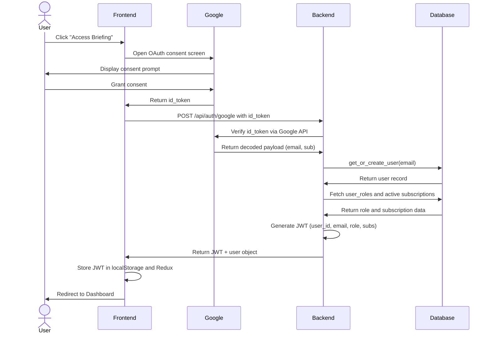

### OAuth Login Sequence Explanation

The OAuth login sequence illustrates the complete authentication flow from user interaction to session establishment. The sequence involves five participants and demonstrates the trust chain: the user authenticates with Google (a trusted third party), Google issues a cryptographically signed `id_token`, the backend independently verifies this token with Google's API (ensuring the frontend cannot forge authentication), and then issues its own JWT for subsequent API calls.

A critical design decision is that the backend **never** sees the user's Google password. The `id_token` contains only the user's email, Google user ID (`sub`), and token metadata. This separation of concerns means that LoopLearn's backend cannot be used to compromise Google accounts, and a breach of LoopLearn's database does not expose any credentials beyond hashed JWTs and email addresses.

The `get_or_create_user()` function uses an `INSERT ... ON CONFLICT (email) DO UPDATE` pattern, making the operation idempotent: first-time users are created, and returning users are simply retrieved. The JWT payload includes the user's role (from `user_roles`) and active subscription data, allowing the frontend to make authorization decisions (showing/hiding premium features) without additional API calls.

### 3.7.2 Free Pipeline Article Generation Sequence

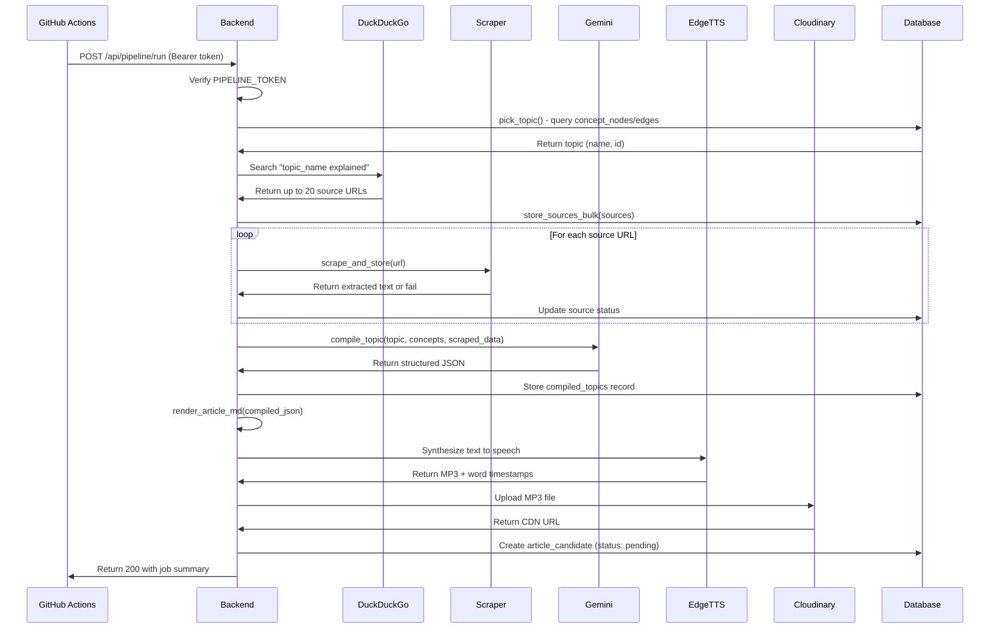

### Free Pipeline Sequence Explanation

This sequence diagram traces the complete data flow during a free pipeline execution. The key observation is the **linear, sequential nature** of the pipeline: each step depends on the output of the previous step, creating a pipeline where failure at any stage prevents subsequent stages from executing.

The scraping loop is the most variable portion of the sequence in terms of timing. Each URL requires an HTTP request, HTML download, and text extraction, with Trafilatura attempting intelligent content extraction before falling back to BeautifulSoup. Network latency, page size, and server response times vary across sources. The pipeline processes sources sequentially rather than in parallel to avoid overwhelming target servers with concurrent requests, which could result in rate limiting or IP blocking.

The Gemini API call is the single most latency-sensitive step. With a context window consuming the topic name, concept keywords, and the full text of all successfully scraped sources, the model typically takes 10-30 seconds to generate the structured JSON response. The tenacity retry logic (exponential backoff, 5 attempts) ensures resilience against transient failures, but a persistent API outage will cause the pipeline to fail after approximately 5 minutes of retries.

### 3.7.3 AI Tutor Explanation Sequence

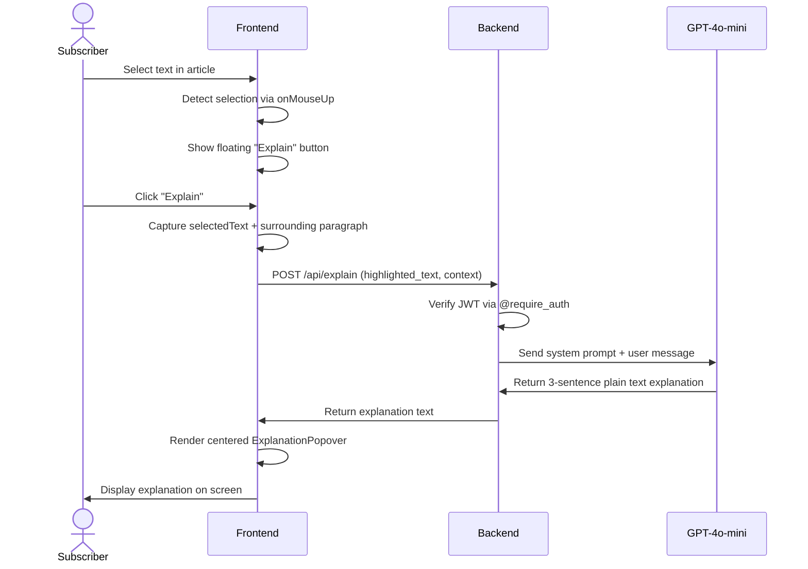

### AI Tutor Sequence Explanation

The AI Tutor sequence demonstrates the real-time interaction between a subscriber and the GPT-4o-mini model. The entire round-trip — from text selection to explanation display — must complete within approximately 2-3 seconds to provide a responsive user experience.

The frontend captures two pieces of information: the exact text the user highlighted (`highlighted_text`) and the surrounding paragraph (`context`). Sending both is essential because the same term can have different meanings in different contexts. For example, "pool" in a paragraph about database connections means "connection pool," while the same word in a paragraph about threading means "thread pool." The system prompt instructs GPT-4o-mini to "explain the highlighted text strictly based on the surrounding paragraph," ensuring contextually accurate responses.

The response is constrained to 3 sentences of plain text with no markdown formatting. This constraint serves two purposes: (1) it limits the model's generation time, keeping latency low, and (2) it ensures the response renders cleanly in the frontend's `ExplanationPopover` component without requiring a markdown parser.

### 3.7.4 Subscription Purchase Sequence

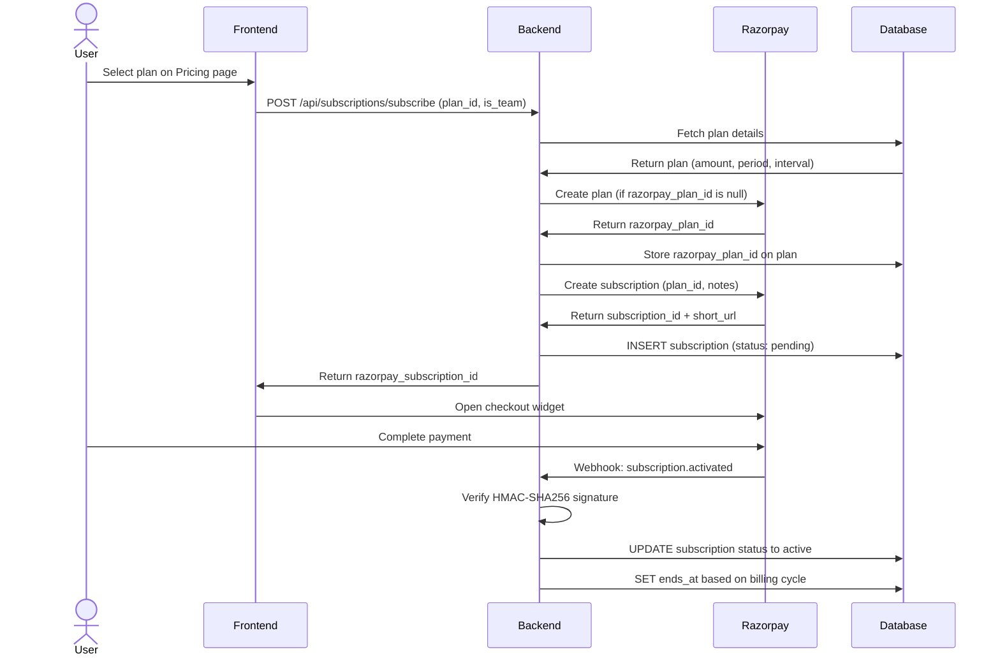

### Subscription Purchase Sequence Explanation

This sequence illustrates the complete subscription purchase flow, which spans three distinct systems: the LoopLearn frontend/backend, Razorpay's payment infrastructure, and the PostgreSQL database.

The Razorpay plan creation step includes a caching optimization: the backend first checks whether the `plans` table already has a `razorpay_plan_id` for the selected plan. If so, it skips plan creation and directly creates a subscription against the existing plan. This prevents duplicate plan creation in Razorpay's system and reduces API call latency.

The **webhook** step is the most critical part of the flow from a data consistency perspective. The Razorpay checkout widget runs entirely in the user's browser — the backend has no direct visibility into whether payment succeeded or failed. The only reliable signal is the webhook event that Razorpay sends asynchronously to the backend's `/api/subscriptions/webhook` endpoint. The HMAC-SHA256 signature verification ensures that this event is genuinely from Razorpay and has not been spoofed by a malicious actor. The backend then atomically updates the subscription status and sets the `ends_at` timestamp based on the billing cycle (monthly subscriptions receive a 30-day expiry, yearly subscriptions receive 365 days).

## 3.8 State Diagram

### Article Lifecycle State Machine

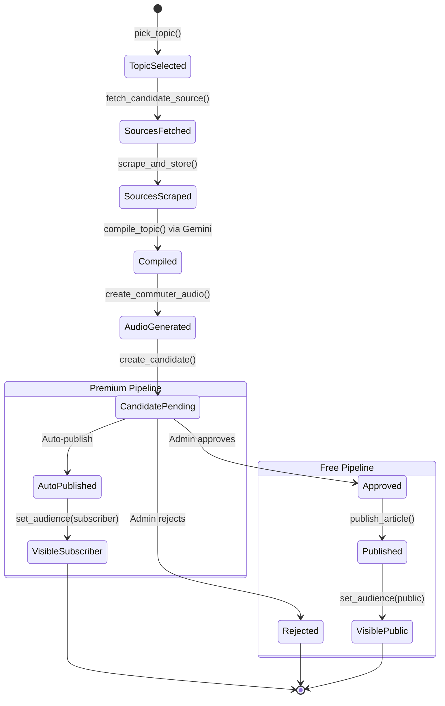

### State Diagram Explanation

The state diagram above models the lifecycle of an article from topic selection to final publication. Every article passes through a common pipeline sequence (TopicSelected → SourcesFetched → SourcesScraped → Compiled → AudioGenerated → CandidatePending), after which the lifecycle diverges based on the pipeline type.

**Common States (Pre-Fork)**: All articles begin when `pick_topic()` or `pick_topic_domain()` selects a concept from the knowledge graph, transitioning to **TopicSelected**. Source discovery via DuckDuckGo moves the state to **SourcesFetched**. Scraping the source URLs produces **SourcesScraped**. The Gemini compilation step produces the structured JSON (**Compiled**). Audio synthesis via Edge TTS with Cloudinary upload produces **AudioGenerated**. Finally, the article is stored in `article_candidate` as **CandidatePending**.

**Free Pipeline Fork**: For articles generated by the free pipeline (8:00 PM IST cron), the article remains in **CandidatePending** until the Platform Admin reviews it. The admin can transition the article to **Approved** (setting a `scheduled_for` date) or **Rejected** (storing a `rejection_reason`). Approved articles move to **Published** (inserted into `published_articles`) and then to **VisiblePublic** (the `article_visibility` record is set to `audience = 'public'`). Rejected articles reach a terminal state and are never published.

**Premium Pipeline Fork**: For articles generated by the premium pipeline (5:00 PM IST cron), the article moves directly from **CandidatePending** to **AutoPublished** without human review. The `article_visibility` record is set to `audience = 'subscriber'`, making the article accessible only to users with active subscriptions for the corresponding domain. This auto-publish behavior reflects the design trade-off: subscriber content targets a more specialized audience and is published daily without delay, while free content undergoes manual review to maintain quality standards for the broadest user base.

### Subscription Lifecycle State Machine

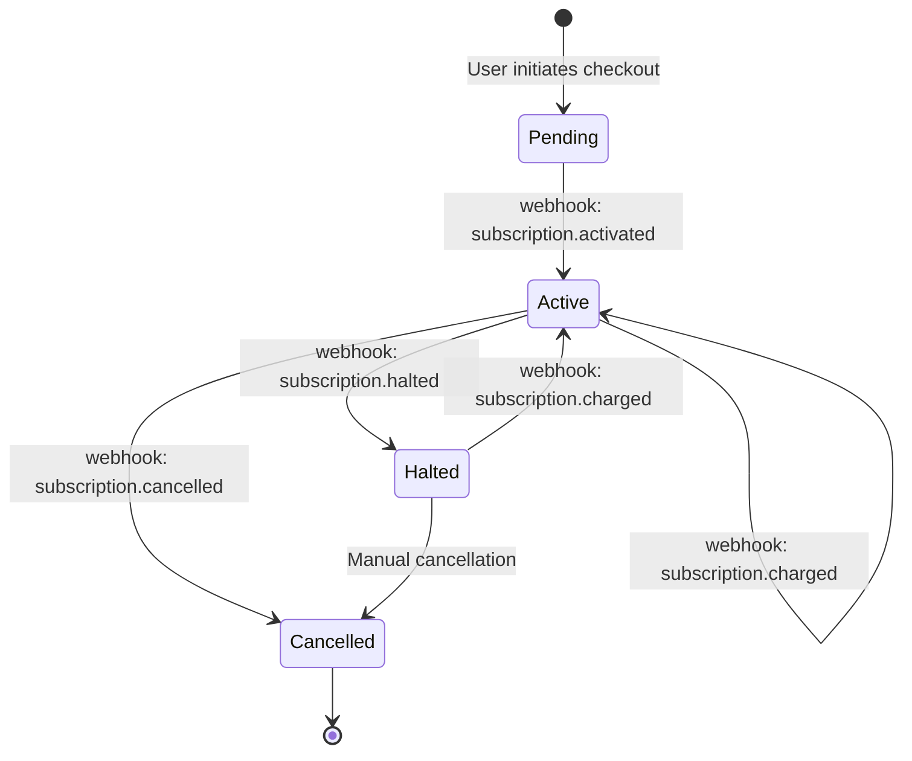

### Subscription Lifecycle Explanation

The subscription lifecycle is driven entirely by Razorpay webhook events. The LoopLearn backend is a passive receiver of state transitions — it does not poll Razorpay for status updates. Each webhook event triggers a specific database update:

- **Pending → Active**: The `subscription.activated` event fires when the user completes payment. The backend sets `status = 'active'` and calculates `ends_at` based on the plan's billing cycle.
- **Active → Active (Renewed)**: The `subscription.charged` event fires on each successful billing cycle. The backend extends `ends_at` by the billing period, and the subscription status remains `active`.
- **Active → Halted**: The `subscription.halted` event fires when a payment fails (insufficient funds, expired card). The subscription is paused; the user retains access until `ends_at`, but no new charges are attempted until the issue is resolved.
- **Active → Cancelled**: The `subscription.cancelled` event fires when the user or admin cancels the subscription. The backend sets `status = 'cancelled'`. The user retains access until `ends_at` but will not be charged again.
- **Halted → Active**: If a halted subscription's payment issue is resolved (e.g., user updates payment method), Razorpay fires a `subscription.charged` event, reactivating the subscription.

## 3.9 Menu Tree

```
LoopLearn Application
├── / (Home Page)
│   ├── Hero Section (Typing Animation)
│   ├── Feature Slideshow
│   ├── Noise vs Signal Comparison
│   ├── Target Audience Cards
│   ├── Close the Loop Protocol
│   ├── Stats Section
│   └── Access Briefing CTA → /login
│
├── /login (Login Page)
│   └── Google OAuth Button → Google Consent → /dashboard
│
├── /dashboard (Dashboard) [Auth Required]
│   ├── Today's Free Article Card → /todays
│   ├── Subscribed Domain Cards → /article/:slug
│   └── Settings Link → /settings
│
├── /todays (Today's Briefing) [Auth Required]
│   ├── Article Markdown Renderer
│   ├── Mermaid Diagram
│   └── (No Audio / No AI Tutor for free)
│
├── /article/:slug (Article Reader) [Subscriber Required]
│   ├── Article Markdown Renderer
│   ├── Mermaid Diagram
│   ├── Floating Audio Player (Commuter Mode)
│   ├── Text Selection → Explain Button → AI Tutor Popover
│   └── Flashcards Section
│
├── /pricing (Pricing Page) [Auth Required]
│   ├── Individual Plan Cards
│   ├── Team Plan Cards
│   └── Subscribe Button → Razorpay Checkout
│
├── /admin (Admin Panel) [Admin Role Required]
│   ├── Pipeline Trigger Section
│   │   ├── Run Free Pipeline Button
│   │   └── Run Premium Pipeline Button
│   └── Candidate Review Section
│       ├── Pending Articles List
│       ├── Article Preview (MD + Mermaid)
│       ├── Approve Button (with date picker)
│       └── Reject Button (with reason input)
│
├── /settings (Settings Page) [Auth Required]
│   ├── Profile Information
│   ├── Subscription Management
│   └── Workspace Management
│       ├── Create Workspace
│       ├── Invite Members
│       └── View Members
│
└── [Navbar] (Present on all pages)
    ├── Logo → /
    ├── Dashboard Link → /dashboard
    ├── Pricing Link → /pricing
    ├── Theme Toggle (Light/Dark)
    └── User Avatar → Logout
```

### Menu Tree Explanation

The menu tree represents the complete navigation structure of the LoopLearn frontend application. The tree is organized by route, with each route corresponding to a React component rendered by React Router 7.

**Public Routes**: The Home page (`/`) and Login page (`/login`) are accessible without authentication. These routes serve as the acquisition funnel — visitors discover LoopLearn, learn about the "Close the Loop" methodology, and authenticate via Google OAuth.

**Authenticated Routes**: The Dashboard (`/dashboard`), Today's Briefing (`/todays`), Pricing (`/pricing`), and Settings (`/settings`) pages require a valid JWT. The React Router configuration includes route guards that check the Redux auth state; if no valid JWT exists, the user is redirected to `/login`.

**Subscriber Routes**: The Article Reader (`/article/:slug`) requires both authentication and an active subscription (or workspace membership). The component checks the user's subscription status before rendering premium features (audio player, AI Tutor).

**Admin Routes**: The Admin Panel (`/admin`) is protected by a role check — only users with `role = 'admin'` in the `user_roles` table can access this page. The `@require_admin` decorator on the backend API endpoints provides server-side enforcement, while the frontend route guard provides immediate UI-level protection.

**Global Navigation**: The Navbar component is rendered on every page and provides consistent access to the Dashboard, Pricing, theme toggle, and user profile. The theme toggle persists the user's preference to `localStorage` and adjusts the root HTML element's class for Tailwind's dark mode variant.

---

# Chapter 4: Implementation

## 4.1 List of Tables with Attributes and Constraints

### Table 1: users

| Column | Type | Constraints |
|---|---|---|
| id | UUID | PRIMARY KEY, DEFAULT gen_random_uuid() |
| email | TEXT | NOT NULL, UNIQUE |
| is_active | BOOLEAN | DEFAULT true |
| created_at | TIMESTAMP | DEFAULT NOW() |

The `users` table is the central identity table. The UUID primary key is generated server-side using PostgreSQL's `gen_random_uuid()` function, which produces RFC 4122 v4 UUIDs. The `email` column has a UNIQUE constraint that serves dual purposes: it prevents duplicate account creation from the same Google account, and it enables efficient O(1) lookups during the `get_or_create_user()` call in the OAuth flow. The `is_active` flag supports soft-delete functionality — deactivating a user without removing their record preserves referential integrity with related tables (subscriptions, workspace memberships, article history).

### Table 2: user_roles

| Column | Type | Constraints |
|---|---|---|
| user_id | UUID | REFERENCES users(id) ON DELETE CASCADE |
| role | TEXT | NOT NULL |

The `user_roles` table implements a one-to-many relationship between users and roles. The `ON DELETE CASCADE` constraint ensures that deleting a user automatically removes their role assignments, preventing orphaned records. Separating roles into their own table (rather than a column on `users`) enables future extension to multi-role systems and simplifies auditing of role assignments.

### Table 3: plans

| Column | Type | Constraints |
|---|---|---|
| id | UUID | PRIMARY KEY, DEFAULT gen_random_uuid() |
| domain | TEXT | NOT NULL |
| billing_cycle | TEXT | NOT NULL |
| name | TEXT | NOT NULL |
| monthly_price | INTEGER | NOT NULL (stored in paise) |
| features | JSONB | DEFAULT '{}' |
| razorpay_plan_id | TEXT | UNIQUE (nullable) |

The `plans` table defines the subscription products. The `monthly_price` is stored in paise (1 INR = 100 paise) to avoid floating-point precision issues that arise when storing currency as decimal values. The `razorpay_plan_id` column is nullable because it is populated lazily: the first time a user subscribes to a plan, the backend creates the corresponding plan in Razorpay and stores the returned ID. The UNIQUE constraint prevents duplicate Razorpay plan creation. The `features` JSONB column stores plan-specific feature flags (e.g., `{"ai_tutor": true, "commuter_mode": true}`) without requiring schema changes for new features.

### Table 4: subscriptions

| Column | Type | Constraints |
|---|---|---|
| id | UUID | PRIMARY KEY, DEFAULT gen_random_uuid() |
| user_id | UUID | REFERENCES users(id) |
| plan_id | UUID | REFERENCES plans(id) |
| status | TEXT | DEFAULT 'pending' |
| started_at | TIMESTAMP | |
| ends_at | TIMESTAMP | |
| is_team | BOOLEAN | DEFAULT false |
| razorpay_subscription_id | TEXT | UNIQUE |
| created_at | TIMESTAMP | DEFAULT NOW() |

The `subscriptions` table tracks the lifecycle of each subscription. The `status` column transitions through states driven by Razorpay webhooks: `pending` → `active` → `cancelled`/`halted`. The `ends_at` timestamp is calculated by the webhook handler based on the plan's billing cycle (e.g., NOW() + 30 days for monthly). The `razorpay_subscription_id` UNIQUE constraint enables efficient webhook reconciliation — when Razorpay sends a webhook, the handler looks up the subscription by this ID. The `is_team` flag distinguishes individual subscriptions from team subscriptions, which have different pricing and enable workspace creation.

### Table 5: workspaces

| Column | Type | Constraints |
|---|---|---|
| id | UUID | PRIMARY KEY, DEFAULT gen_random_uuid() |
| name | VARCHAR(100) | NOT NULL |
| owner_id | UUID | REFERENCES users(id) |
| seat_limit | INTEGER | DEFAULT 5 |
| created_at | TIMESTAMP | DEFAULT NOW() |

The `workspaces` table enables team subscriptions. Each workspace has a single `owner_id` — the Team Admin who purchased the subscription. The `seat_limit` column caps the number of members who can be invited, defaulting to 5 (matching the 4x pricing model). The VARCHAR(100) constraint on `name` prevents excessively long workspace names that could break UI layouts.

### Table 6: workspace_members

| Column | Type | Constraints |
|---|---|---|
| workspace_id | UUID | REFERENCES workspaces(id) ON DELETE CASCADE |
| user_id | UUID | REFERENCES users(id) ON DELETE CASCADE |
| role | VARCHAR(20) | DEFAULT 'member' |
| joined_at | TIMESTAMP | DEFAULT NOW() |
| PRIMARY KEY | | (workspace_id, user_id) |

The `workspace_members` junction table implements the many-to-many relationship between workspaces and users. The composite primary key `(workspace_id, user_id)` prevents duplicate membership. The `ON DELETE CASCADE` on both foreign keys ensures clean removal: deleting a workspace removes all memberships, and deleting a user removes them from all workspaces. The `role` column distinguishes workspace admins (the owner) from regular members, enabling role-based access control within the workspace context.

### Table 7: concept_nodes

| Column | Type | Constraints |
|---|---|---|
| id | UUID | PRIMARY KEY, DEFAULT gen_random_uuid() |
| name | TEXT | UNIQUE, NOT NULL |
| node_type | TEXT | NOT NULL (values: 'domain', 'concept', 'feature') |
| last_used_at | TIMESTAMP | |
| created_at | TIMESTAMP | DEFAULT NOW() |

The `concept_nodes` table is one half of the knowledge graph implementation. The UNIQUE constraint on `name` prevents duplicate concept entries and enables the `ON CONFLICT (name) DO UPDATE` pattern used by the `insert_node()` function when adding child topics. The `node_type` column classifies nodes into three categories: `domain` (top-level engineering categories like "Databases"), `concept` (individual topics like "Connection Pooling"), and `feature` (specific tools or implementations like "PgBouncer"). The `last_used_at` timestamp records when a node was last selected by the topic picker, supporting anti-repeat logic.

### Table 8: concept_edges

| Column | Type | Constraints |
|---|---|---|
| id | UUID | PRIMARY KEY, DEFAULT gen_random_uuid() |
| from_node_id | UUID | REFERENCES concept_nodes(id) ON DELETE CASCADE |
| to_node_id | UUID | REFERENCES concept_nodes(id) ON DELETE CASCADE |
| strength | REAL | DEFAULT 1.0 |
| created_at | TIMESTAMP | DEFAULT NOW() |
| UNIQUE | | (from_node_id, to_node_id) |

The `concept_edges` table completes the knowledge graph by representing directed relationships between nodes. The UNIQUE constraint on `(from_node_id, to_node_id)` prevents duplicate edges and enables the `ON CONFLICT DO UPDATE SET strength = concept_edges.strength + 1` pattern, which atomically increments edge strength when a relationship is re-observed. The `strength` column (REAL type) starts at 1.0 and increases each time two concepts co-occur in scraped sources, providing a weighted indicator of relationship strength. The `ON DELETE CASCADE` on both foreign keys ensures that deleting a concept node automatically removes all its incoming and outgoing edges, maintaining graph integrity.

### Table 9: sources

| Column | Type | Constraints |
|---|---|---|
| id | UUID | PRIMARY KEY, DEFAULT gen_random_uuid() |
| topic_node_id | UUID | REFERENCES concept_nodes(id) |
| url | TEXT | NOT NULL |
| title | TEXT | |
| snippet | TEXT | |
| raw_content | TEXT | |
| clean_content | TEXT | |
| scrape_status | TEXT | DEFAULT 'pending' |
| created_at | TIMESTAMP | DEFAULT NOW() |

The `sources` table stores web sources discovered during the scraping phase. The `scrape_status` column tracks each source's progress: `pending` (discovered but not yet scraped), `completed` (successfully extracted), or `failed` (extraction failed or content below quality thresholds). The `raw_content` and `clean_content` columns store both the original extracted text and the cleaned version (whitespace normalized, HTML entities removed), enabling debugging and quality analysis. Sources that fail scraping are preserved with their failure status rather than deleted, providing an audit trail for pipeline debugging.

### Table 10: compiled_topics

| Column | Type | Constraints |
|---|---|---|
| id | UUID | PRIMARY KEY, DEFAULT gen_random_uuid() |
| topic_node_id | UUID | REFERENCES concept_nodes(id) |
| compiled_data | JSONB | NOT NULL |
| created_at | TIMESTAMP | DEFAULT NOW() |

The `compiled_topics` table stores the raw JSON output from Gemini 2.5 Flash. The `compiled_data` JSONB column contains the full structured response: `topic`, `intro_hook`, `what_is_it`, `practical_implementation`, `theory`, `flashcards`, `mermaid`, and `child_topics`. Storing this as JSONB (rather than TEXT) enables direct querying of JSON fields and GIN indexing if search functionality is added in the future.

### Table 11: article_candidate

| Column | Type | Constraints |
|---|---|---|
| id | UUID | PRIMARY KEY, DEFAULT gen_random_uuid() |
| compiled_topic_id | UUID | REFERENCES compiled_topics(id) |
| topic_node_id | UUID | REFERENCES concept_nodes(id) |
| title | TEXT | NOT NULL |
| slug | TEXT | UNIQUE, NOT NULL |
| article_md | TEXT | NOT NULL |
| diagram | TEXT | |
| status | TEXT | DEFAULT 'pending' |
| audio_url | TEXT | |
| content_json | JSONB | |
| rejection_reason | TEXT | |
| reviewed_at | TIMESTAMP | |
| scheduled_for | DATE | |
| created_at | TIMESTAMP | DEFAULT NOW() |

The `article_candidate` table serves as the staging area for generated articles. The `slug` column (UNIQUE) enables URL-safe article identification. The `status` column tracks the review lifecycle: `pending` (awaiting admin review), `approved` (admin approved, ready for publication), or `rejected` (admin rejected with `rejection_reason`). The `audio_url` column stores the Cloudinary CDN URL for the generated audio. The `content_json` JSONB column stores the structured article data including word-level audio timestamps. The `scheduled_for` DATE column is set by the admin during approval, determining when the article becomes visible to users.

### Table 12: published_articles

| Column | Type | Constraints |
|---|---|---|
| id | UUID | PRIMARY KEY, DEFAULT gen_random_uuid() |
| candidate_id | UUID | REFERENCES article_candidate(id) |
| topic_node_id | UUID | REFERENCES concept_nodes(id) |
| title | TEXT | NOT NULL |
| slug | TEXT | UNIQUE, NOT NULL |
| article_md | TEXT | NOT NULL |
| diagram | TEXT | |
| audio_url | TEXT | |
| scheduled_for | DATE | NOT NULL |
| content_json | JSONB | |
| created_at | TIMESTAMP | DEFAULT NOW() |

The `published_articles` table contains articles that are visible to users. Data is copied from `article_candidate` upon approval (free pipeline) or directly inserted during auto-publish (premium pipeline). The `candidate_id` foreign key maintains traceability back to the original candidate. The `scheduled_for` DATE column determines which article is served for a given day — queries filter by `scheduled_for = CURRENT_DATE` to return today's article. The `slug` UNIQUE constraint enables clean URL routing: `/article/connection-pooling-explained`.

### Table 13: article_visibility

| Column | Type | Constraints |
|---|---|---|
| published_article_id | UUID | REFERENCES published_articles(id) ON DELETE CASCADE |
| audience | TEXT | NOT NULL (values: 'public', 'subscriber') |
| domain | TEXT | |

The `article_visibility` table controls who can access each published article. The `audience` column determines the access level: `public` articles are accessible to all authenticated users (free tier), while `subscriber` articles require an active subscription for the corresponding domain. The `domain` column enables domain-specific article retrieval for subscribers. This table is separated from `published_articles` to maintain a clean separation between content storage and access control logic.

## 4.2 System Coding

### 4.2.1 Topic Selection Algorithm — pick_topic_domain()

The `pick_topic_domain()` function is the core graph traversal algorithm that selects an unpublished concept for article generation within a specific engineering domain.

```python
def pick_topic_domain(domain_name=None):
    conn = get_connection()
    try:
        cursor = conn.cursor()
        
        if domain_name:
            cursor.execute("""
                SELECT t.id, t.name, d.name
                FROM concept_nodes t
                INNER JOIN concept_edges e ON t.id = e.to_node_id
                INNER JOIN concept_nodes d ON e.from_node_id = d.id
                WHERE LOWER(TRIM(d.name)) = LOWER(TRIM(%s)) 
                  AND d.node_type = 'domain' 
                  AND t.node_type = 'concept'
                  AND t.id NOT IN (
                      SELECT topic_node_id 
                      FROM published_articles 
                      WHERE topic_node_id IS NOT NULL
                  )
                  AND t.id NOT IN (
                      SELECT topic_node_id
                      FROM article_candidate
                      WHERE topic_node_id IS NOT NULL
                  )
                ORDER BY RANDOM()
                LIMIT 1;
            """, (domain_name,))
            row = cursor.fetchone()
            
            if not row:
                cursor.execute("""
                    SELECT id, name, name 
                    FROM concept_nodes 
                    WHERE LOWER(TRIM(name)) = LOWER(TRIM(%s))
                      AND node_type = 'domain'
                      AND id NOT IN (
                          SELECT topic_node_id 
                          FROM published_articles 
                          WHERE topic_node_id IS NOT NULL
                      )
                    LIMIT 1;
                """, (domain_name,))
                row = cursor.fetchone()
                if not row:
                    return None
                    
        if row:
            actual_domain = row[2] if (len(row) > 2 and row[2]) else (domain_name or "General")
            return {
                "topic_node_id": row[0], 
                "topic_name": row[1],
                "domain": actual_domain
            }
        return None
    except Exception as e:
        return None
    finally:
        close_connection(conn)
```

**Line-by-Line Documentation**:

- **Lines 1-3**: The function accepts an optional `domain_name` parameter. When provided (premium pipeline), it constrains selection to that domain. When absent (free pipeline), it selects from any domain.
- **Lines 4-5**: A database connection is obtained using `get_connection()`, which includes tenacity retry logic (3 attempts, 2-second fixed wait) for transient connection failures.
- **Lines 8-32**: The primary SQL query performs a three-table JOIN: `concept_nodes` (as the topic candidate, aliased `t`) is joined to `concept_edges` (aliased `e`) to find nodes that are targets of edges, and then joined again to `concept_nodes` (as the domain, aliased `d`) to find from which domain node those edges originate. The WHERE clause applies four filters: (1) domain name match with case-insensitive, whitespace-trimmed comparison; (2) the source node must be a domain; (3) the target node must be a concept (not another domain or feature); (4) the concept must NOT already exist in `published_articles` or `article_candidate`, preventing re-selection of topics that have already been used. `ORDER BY RANDOM() LIMIT 1` selects one random qualifying concept.
- **Lines 34-44**: **Fallback logic**: If no connected concepts are found (domain exhausted of child topics), the function attempts to use the domain node itself as the topic. This serves as a bootstrap mechanism — when a new domain is added with no child concepts, the first article generated is about the domain itself, and the Gemini compilation produces child topics that are then linked to the domain for future selection.
- **Lines 46-53**: The selected topic is returned as a dictionary with `topic_node_id`, `topic_name`, and `domain` fields. The domain is resolved from the database rather than using the input parameter, ensuring accuracy even if the topic was found through a fallback path.

### 4.2.2 Gemini Topic Compilation — compile_topic()

The `compile_topic()` function orchestrates the Gemini 2.5 Flash API call that transforms scraped web content into a structured article JSON.

```python
@retry(
    stop=stop_after_attempt(5),
    wait=wait_exponential(multiplier=1, min=5, max=60),
    reraise=True
)
def compile_topic(topic_name: str, concepts: list[str], scraped_data: list[str] = None) -> dict:
    prompt = f"Topic: {topic_name}\nExtracted concepts: {', '.join(concepts)}"
    
    if scraped_data:
        prompt += "\n\nRelated Scraped Content:\n"
        for i, data in enumerate(scraped_data):
            prompt += f"--- Source {i+1} ---\n{data}\n"

    response = client.models.generate_content(
        model=MODEL_NAME,
        contents=prompt,
        config=types.GenerateContentConfig(
            system_instruction=SYSTEM_INSTRUCTIONS,
            response_mime_type="application/json",
            temperature=0.2
        )
    )

    try:
        return json.loads(response.text)
    except Exception as e:
        raise ValueError(f"Gemini returned invalid JSON: {response.text}") from e
```

**Line-by-Line Documentation**:

- **Lines 1-5**: The `@retry` decorator from the `tenacity` library implements exponential backoff retry logic. On failure, the function waits 5 seconds before the first retry, doubling the wait time on each subsequent attempt up to a maximum of 60 seconds, for a total of 5 attempts. The `reraise=True` parameter ensures that if all retries are exhausted, the original exception is raised to the caller rather than a generic `RetryError`.
- **Lines 6-7**: The function signature accepts three parameters: the topic name (string), a list of related concept keywords extracted from the knowledge graph, and an optional list of scraped text content from web sources.
- **Lines 8-12**: The user prompt is constructed by combining the topic name and concepts. If scraped data is available, it is appended as numbered sources (e.g., "--- Source 1 ---"), providing the Gemini model with factual content to structure.
- **Lines 14-22**: The Gemini API is called with three critical configuration parameters: `system_instruction` contains the full system prompt (defining the JSON schema, Mermaid formatting rules, and educational tone), `response_mime_type="application/json"` constrains the model's output to valid JSON, and `temperature=0.2` produces deterministic, factual output.
- **Lines 24-27**: The response text is parsed as JSON. If parsing fails (indicating the model produced malformed output despite the MIME type constraint), a `ValueError` is raised with the raw response text for debugging. This error triggers a retry via the `@retry` decorator.

### 4.2.3 Razorpay Webhook Handler — razorpay_webhook()

The webhook handler processes subscription lifecycle events from Razorpay, ensuring database consistency with the payment provider's state.

```python
@subscription_routes.post("/webhook")
def razorpay_webhook():
    body = request.data
    signature = request.headers.get("X-Razorpay-Signature", "")
    secret = os.getenv("RAZORPAY_WEBHOOK_SECRET")
    if secret:
        digest = hmac.new(secret.encode(), body, hashlib.sha256).hexdigest()
        if digest != signature:
            return jsonify({"error": "invalid signature"}), 400
    data = request.get_json(silent=True) or {}
    event = data.get("event")
    entity = (data.get("payload", {}).get("subscription", {}) or {}).get("entity", {}) or {}
    status = entity.get("status")
    rzp_sub_id = entity.get("id")
    notes = entity.get("notes", {}) or {}
    user_id = notes.get("user_id")
    plan_id = notes.get("plan_id")
    is_team_str = notes.get("is_team", "0")
    is_team = True if is_team_str == "1" else False
    
    conn = get_connection()
    try:
        cursor = conn.cursor()
        cursor.execute("SELECT billing_cycle FROM plans WHERE id = %s", (plan_id,))
        row = cursor.fetchone()
        cycle_raw = (row[0] if row else "monthly") or "monthly"
        
        if event in ("subscription.activated", "subscription.completed") or status in ("active", "authenticated"):
            cursor.execute("""
                UPDATE subscriptions
                SET status = 'active',
                    started_at = NOW(),
                    ends_at = NOW() + INTERVAL '%s',
                    is_team = %s
                WHERE razorpay_subscription_id = %s;
            """, (interval_days, is_team, rzp_sub_id))
            conn.commit()
        elif event in ("subscription.charged",):
            cursor.execute("""
                UPDATE subscriptions
                SET status = 'active',
                    ends_at = NOW() + INTERVAL '%s'
                WHERE razorpay_subscription_id = %s;
            """, (interval_days, rzp_sub_id))
            conn.commit()
        elif event in ("subscription.halted", "subscription.paused", "subscription.cancelled"):
            cursor.execute("""
                UPDATE subscriptions
                SET status = %s
                WHERE razorpay_subscription_id = %s;
            """, (status, rzp_sub_id))
            conn.commit()
        return jsonify({"ok": True})
    finally:
        close_connection(conn)
```

**Line-by-Line Documentation**:

- **Lines 1-2**: The webhook route is registered as a POST endpoint. No authentication decorator is applied because webhooks come from Razorpay's servers, not from authenticated users. Authentication is handled through HMAC signature verification instead.
- **Lines 3-9**: **HMAC Signature Verification**: The raw request body (`request.data`, bytes) and the `X-Razorpay-Signature` header are extracted. The HMAC-SHA256 digest is computed using the `RAZORPAY_WEBHOOK_SECRET` as the key and the raw body as the message. If the computed digest does not match the provided signature, the request is rejected with a 400 status. This prevents malicious actors from sending fake webhook events to manipulate subscription states.
- **Lines 10-19**: **Payload Extraction**: The webhook JSON payload is navigated through a deeply nested structure: `payload.subscription.entity` contains the subscription details. The `notes` dictionary (set during subscription creation) contains LoopLearn-specific metadata: `user_id`, `plan_id`, and `is_team`. The defensive chaining (`or {}`) prevents `KeyError` exceptions if any intermediate key is missing.
- **Lines 24-27**: **Billing Cycle Resolution**: The plan's billing cycle is fetched from PostgreSQL and mapped to an interval string (e.g., "30 days" for monthly). This determines the `ends_at` calculation.
- **Lines 28-37**: **Activation Event**: When a subscription is activated (first payment successful), the subscription record is updated with `status = 'active'`, `started_at = NOW()`, and `ends_at = NOW() + INTERVAL` based on the billing cycle. The `is_team` flag is set based on the metadata in the webhook payload.
- **Lines 38-45**: **Charge Event**: When a recurring charge succeeds, only `ends_at` is extended — `started_at` is preserved from the original activation.
- **Lines 46-53**: **Cancellation/Halt Events**: When a subscription is cancelled, halted, or paused, the `status` column is updated to reflect the event. The `ends_at` timestamp is not modified, allowing the user to retain access until their current billing period expires.

## 4.3 Screen Layouts and Report Layouts

### Screen 1: Home Page (/)

The Home page is the primary acquisition interface, implemented in `Home.tsx`. It comprises seven distinct sections rendered sequentially as the user scrolls.

**Hero Section**: Displays the LoopLearn logo, the typing animation ("Read. Visualize. Mastered."), and the primary call-to-action button ("Access Briefing"). The typing animation is implemented using a custom state machine: characters are appended to a display string at 100ms intervals, with a 1.5-second pause between words. After "Mastered." is completed, the cursor blinks indefinitely using a CSS animation. The animation sequence is managed through `useEffect` hooks with `setTimeout` chains.

**Feature Slideshow**: An auto-advancing carousel that cycles through three feature cards: "Structured Daily Learning," "AI-Powered Content," and "Commuter Mode Audio." Each card fades in and out using Framer Motion's `AnimatePresence` component with `mode="wait"`. The slideshow auto-advances every 4 seconds via a `setInterval` timer, with manual navigation dots below.

**Noise vs. Signal Comparison**: A two-column layout contrasting "The Noise" (information overload symptoms) with "The Signal" (LoopLearn's structured approach). Each column uses `motion.div` with staggered fade-in animations (`stagger: 0.1`) triggered when the section enters the viewport via Framer Motion's `whileInView` prop.

**Close the Loop Protocol**: Three horizontally aligned cards representing the Read → Visualize → Implement methodology. Each card reveals on scroll with a subtle upward slide and fade animation.

**API Calls**: None. The Home page is entirely static and requires no backend communication.

### Screen 2: Login Page (/login)

The Login page presents a centered card with the LoopLearn branding and a "Continue with Google" button. The component is implemented in `Login.tsx`.

**UI/UX Decisions**: The page uses a minimal design to reduce friction in the authentication flow. The Google OAuth button follows Material Design guidelines for Google Sign-In buttons (Google logo, "Continue with Google" text, rounded corners). The background matches the current theme (light/dark) with a subtle gradient.

**API Calls**: Clicking the button triggers the Google OAuth consent flow. Upon successful authentication, the frontend receives an `id_token` and sends a POST request to `GET /api/auth/google` with the token. The backend responds with a JWT and user object, which are stored in Redux (`authSlice`) and `localStorage`.

### Screen 3: Dashboard (/dashboard)

The Dashboard is the subscriber's primary interface, implemented in `Dashboard.tsx`. It displays domain cards for each active subscription.

**UI/UX Decisions**: Each domain card shows the domain name, today's article title (if available), and a preview snippet. Cards use a glass-morphism effect (`backdrop-blur-sm`, semi-transparent background) that adapts to the current theme. A skeleton loader (pulsing gray rectangles) is displayed while subscription data is being fetched, providing immediate visual feedback.

**API Calls**: On mount, the component calls `GET /api/subscriptions/me` with the JWT in the Authorization header. The backend returns the user's active subscriptions (including team subscriptions inherited through workspace membership) and today's articles for each subscribed domain. The response structure includes `subscription.plan.domain` and `article.title`, `article.slug` for each domain.

### Screen 4: Today's Briefing (/todays)

The Today's Briefing page serves the daily public article to free users, implemented in `Todays.tsx`.

**UI/UX Decisions**: The article is rendered using a Markdown renderer (`react-markdown` with `remark-gfm` for GitHub-Flavored Markdown support) that applies custom styling classes to headings, paragraphs, code blocks, and lists. Code blocks use the JetBrains Mono monospace font with syntax highlighting. The Mermaid diagram section uses `mermaid.render()` to convert the diagram code string into an inline SVG. The diagram is displayed within a bordered container with a "Diagram" header. Premium features (audio player, AI Tutor) are not rendered; a subtle upgrade banner is displayed instead.

**API Calls**: On mount, the component calls `GET /api/subscriptions/me/today` with JWT. The backend returns the public-audience article for today. If no article exists, the component displays a "No article available today" fallback message.

### Screen 5: Article Reader (/article/:slug)

The Article Reader is the full-featured reading experience for subscribers. It includes the complete article, Mermaid diagram, Commuter Mode audio player, and AI Tutor.

**UI/UX Decisions**: The article layout maximizes readability: a centered content column (max-width 768px), generous line height (1.75), and Inter font for body text. The Mermaid diagram is rendered inline within the article flow. The Floating Audio Player (`FloatingAudioPlayer.tsx`) appears as a fixed-position bar at the bottom of the screen with play/pause controls, a progress bar, and a time display. The AI Tutor is activated through the `TextSelectionExplainer.tsx` component: when the user selects text, a floating "Explain" button appears near the selection; clicking it sends the selection and context to the backend and displays the response in a centered popover (`ExplanationPopover.tsx`).

**API Calls**: Article content is fetched via `GET /api/articles/:slug`. The Explain feature calls `POST /api/explain` with `highlighted_text` and `context`. Audio is streamed directly from the Cloudinary CDN URL stored in the article's `audio_url` field.

### Screen 6: Pricing Page (/pricing)

The Pricing page displays available subscription plans, implemented in `Pricing.tsx`.

**UI/UX Decisions**: Plans are displayed as cards in a grid layout, organized by domain. Each card shows the domain name, billing cycle, price, and included features. The "Subscribe" button initiates the Razorpay checkout flow. Team plans are visually distinguished with a "Team" badge and display the per-seat price alongside the total team price.

**API Calls**: Plans are fetched via `GET /api/subscriptions/plans`. Subscribing calls `POST /api/subscriptions/subscribe` with the selected `plan_id` and optional `is_team` flag. The backend returns a `razorpay_subscription_id`, which the frontend passes to the Razorpay checkout widget.

### Screen 7: Admin Panel (/admin)

The Admin Panel provides content moderation and pipeline management capabilities, implemented in `Admin.tsx`.

**UI/UX Decisions**: The panel is divided into two sections. The Pipeline Trigger section displays buttons to run the free pipeline (single random domain) or the premium pipeline (all domains), with a loading spinner during execution and a success/error toast notification upon completion. The Candidate Review section lists pending articles with previews of the title, rendered Markdown content, and Mermaid diagram. Each candidate has Approve (with date picker for `scheduled_for`) and Reject (with reason text input) buttons.

**API Calls**: Pipeline triggers call `POST /api/pipeline/run` or `POST /api/pipeline/start-all`. Pending candidates are fetched via `GET /api/pipeline/candidate`. Approval calls `POST /api/pipeline/candidate/:id/approve` with `scheduled_for` date. Rejection calls `POST /api/pipeline/candidate/:id/reject` with `rejection_reason`. Pipeline status is polled via `GET /api/pipeline/status/:job_id`.

---

# Chapter 5: Analysis, Related Work Done

## Technical Challenges and Post-Mortems

### Challenge 1: Knowledge Graph Connectivity — Orphaned Child Nodes

**Problem Description**: During early testing of the premium pipeline, it was observed that certain domains would become "exhausted" (0 available topics) despite having dozens of concepts in the `concept_nodes` table. The `pick_topic_domain()` function would return `None` for domains that clearly had concepts associated with them.

**Root Cause Analysis**: The root cause was traced to the child topic linking mechanism. When the Gemini model compiled an article for a topic (e.g., "Connection Pooling" under the "Databases" domain), it returned a `child_topics` array (e.g., ["PgBouncer", "HikariCP", "Connection Pool Sizing"]). The original `add_child_topics()` implementation created edges only from the **parent topic** to each child (`Connection Pooling → PgBouncer`). It did **not** create edges from the **domain** to the child. The `pick_topic_domain()` function's SQL query joins `concept_edges` where `from_node_id = domain_id`, so child concepts without a direct edge from the domain were invisible to the topic picker.

**Resolution**: The fix required modifying `add_child_topics()` to create **two edges** per child concept: one from the parent topic to the child (preserving the hierarchical relationship) and one from the domain to the child (ensuring discoverability by the topic picker). Additionally, a one-time migration script was run to retroactively create domain-to-child edges for all existing child concepts that lacked them. This involved querying the graph to find concepts that were reachable from a domain through intermediate parent topics but had no direct edge to the domain, and inserting the missing edges.

**Post-Mortem Findings**: This bug highlighted a fundamental challenge in implicit graph modeling: the assumption that transitive reachability (domain → parent → child) is equivalent to direct accessibility (domain → child) does not hold when the query layer only examines direct edges. The fix ensures that the graph model explicitly represents all relationships that the query layer depends on, even if this introduces redundant edges (a child is linked to both its parent and its grandparent domain). The trade-off is slightly more storage for edges versus reliable topic selection.

### Challenge 2: Mermaid Diagram Syntax Errors

**Problem Description**: Approximately 15-20% of AI-generated Mermaid diagrams failed to render in the frontend's Mermaid.js parser. The errors were caused by invalid characters in node labels: parentheses, brackets, apostrophes, and colons would break Mermaid's parsing grammar.

**Root Cause Analysis**: Mermaid.js uses a grammar-based parser where certain characters have syntactic meaning. Parentheses define node shapes (`(Round)`, `{Diamond}`), brackets define other shapes, and special characters within labels confuse the tokenizer. The Gemini model, while generally producing valid Mermaid syntax, occasionally included terms like "O(n)" (Big-O notation), "TCP/IP" (slashes), or "client's" (apostrophes) within node labels.

**Resolution**: The resolution was implemented through **prompt engineering** rather than post-processing. The Gemini system prompt was updated to include explicit Mermaid formatting rules: (1) all node labels must be wrapped in double quotes; (2) node IDs must be simple alphanumeric strings (e.g., `A`, `B1`, `node1`); (3) special characters (parentheses, brackets, apostrophes, colons, slashes) are prohibited within labels; (4) labels must not contain HTML tags. This reduced the error rate from approximately 20% to below 2%.

A frontend fallback was also implemented: if Mermaid.js throws a parsing error, the diagram section displays a "Diagram could not be rendered" message rather than a blank space or JavaScript error, ensuring graceful degradation.

### Challenge 3: Multi-Model AI Orchestration Timeouts

**Problem Description**: The premium pipeline, which sequentially processes all domains (approximately 9 domains at the time of this writing), occasionally timed out during execution. The GitHub Actions workflow has a maximum execution time of 6 hours, but the Render backend's HTTP request timeout is 270 seconds (4.5 minutes). The pipeline was timing out at the HTTP level before completing all domains.

**Root Cause Analysis**: Each domain's pipeline involves multiple API calls with variable latency: DuckDuckGo search (1-3 seconds), web scraping (5-15 seconds per URL, 10-20 URLs), Gemini compilation (10-30 seconds with potential retries), Edge TTS synthesis (5-10 seconds), and Cloudinary upload (2-5 seconds). For a single domain, the total processing time ranges from 30 seconds (best case) to 3+ minutes (worst case with retries). With 9 domains processed sequentially, the worst-case total exceeds 30 minutes.

**Resolution**: The solution was to implement **background job execution**. Instead of processing the pipeline synchronously within the HTTP request, the backend starts the pipeline in a background thread and immediately returns a `job_id` with a 202 Accepted status. The GitHub Actions workflow's `curl` command receives the `job_id` instantly, and the pipeline continues running in the background. The backend stores job status (including per-domain progress, success/failure counts, and error messages) in memory, accessible via a `GET /api/pipeline/status/:job_id` polling endpoint.

This architecture ensures that the HTTP request always completes within seconds, while the pipeline runs for as long as necessary. The trade-off is that error handling becomes asynchronous — if a domain fails, the failure is recorded in the job status rather than returned as an HTTP error.

### Challenge 4: DuckDuckGo Rate Limiting and Source Quality

**Problem Description**: During high-frequency pipeline testing, DuckDuckGo's API began returning empty results or HTTP 429 (Too Many Requests) errors. Additionally, some scraped sources were blog posts with fewer than 200 words of substantive content, resulting in low-quality Gemini compilations.

**Root Cause Analysis**: DuckDuckGo's API is rate-limited (no published rate limit documentation, empirically observed at approximately 30-50 queries per minute). Rapid sequential pipeline runs (e.g., testing all 9 domains in quick succession) would exhaust this limit. Source quality issues were caused by pages that passed URL-level filtering but contained primarily advertisements, navigation menus, or paywall content.

**Resolution**: Rate limiting was addressed by adding delays between DuckDuckGo queries (2-second sleep between searches) and implementing retry logic specific to 429 responses. Source quality was addressed through the two-tier filtering system: Trafilatura's boilerplate removal eliminates non-content HTML, and the post-scrape quality filter rejects sources with fewer than 300 raw characters or 200 clean characters. Additionally, the search query was refined from the bare topic name to "[topic name] explained," which tends to surface tutorial-style articles with more substantive content.

### Challenge 5: Theme Transition Frame Drops on Mobile

**Problem Description**: On Android devices with lower-end GPUs, toggling between light and dark themes caused visible frame drops and visual stuttering, particularly when Framer Motion animations were active.

**Root Cause Analysis**: The theme toggle modifies a CSS class on the root HTML element, triggering a cascade of style recalculations across every visible element (background colors, text colors, border colors, shadow colors). When this full-page repaint coincided with active Framer Motion animations (which also manipulate element styles for transform and opacity), the combined GPU workload exceeded the frame budget (16.67ms for 60fps), causing dropped frames.

**Resolution**: A custom `useMediaQuery` hook was implemented to detect mobile viewports (width < 768px). On mobile devices, animation parameters are adjusted: durations are increased from 0.3s to 0.6s (reducing per-frame style changes), stagger delays are reduced (spreading the animation load), and some decorative animations are disabled entirely. This ensures smooth 60fps performance on mid-range mobile devices while preserving the full animation experience on desktop.

---

# Chapter 6: Conclusion and Future Work

## 6.1 Conclusion

LoopLearn was conceived to address a specific problem in modern software engineering education: the gap between abundant information and effective knowledge acquisition. By constraining content delivery to one structured article per domain per day, the platform provides a sustainable alternative to the firehose of articles, videos, and newsletters that characterize the current developer education landscape.

The system successfully implements all components of the "Close the Loop" methodology: structured reading (Gemini-compiled articles with theory, implementation, and trade-offs), visualization (auto-generated Mermaid diagrams), and active recall (flashcards and contextual AI explanations). The multi-model AI orchestration — Gemini 2.5 Flash for content structuring, GPT-4o-mini for real-time explanations, and Edge TTS for audio synthesis — demonstrates that effective AI integration in educational platforms requires specialized models for specialized tasks rather than a single general-purpose model.

The relational-graph hybrid database model proved to be an effective approach for managing the knowledge domain. By implementing the graph structure within PostgreSQL (rather than adopting a dedicated graph database like Neo4j), the system maintains a single transactional database for all operations while benefiting from graph traversal capabilities for topic selection. The anti-repeat algorithm, which excludes already-published and already-candidated concepts from the selection pool, ensures that subscribers receive fresh content daily without manual curation.

The dual-pipeline architecture — a free pipeline with admin approval and a premium pipeline with auto-publishing — balances content quality control with delivery consistency. Free users receive manually reviewed content, ensuring quality standards for the platform's broadest audience. Subscribers receive daily content automatically, ensuring that the subscription's value proposition (daily domain-specific learning) is met without dependency on admin availability.

From a technical perspective, the project demonstrates that a full-stack application with AI orchestration, payment processing, team collaboration, and content delivery can be implemented with a compact technology stack (Python/Flask, React/Vite, PostgreSQL, GitHub Actions) without requiring complex infrastructure such as message queues, container orchestration, or microservice architectures. The deployment on managed platforms (Render for backend, Vercel for frontend, Neon for database, Cloudinary for media) eliminates infrastructure management overhead and enables a single developer to operate the system.

### Important Conclusions (Point Form)

- The "Close the Loop" methodology (Read → Visualize → Implement) effectively addresses passive consumption by integrating active recall mechanisms directly into the content delivery format.
- Multi-model AI orchestration (Gemini 2.5 Flash + GPT-4o-mini + Edge TTS) is more effective than relying on a single general-purpose model, as each model is optimized for its specific task — content structuring, real-time explanation, and audio synthesis respectively.
- A relational-graph hybrid database within PostgreSQL successfully replaces the need for a dedicated graph database (Neo4j) for knowledge domain modeling, reducing infrastructure complexity while maintaining graph traversal capabilities.
- The knowledge graph-based topic selection algorithm with anti-repeat filtering ensures non-redundant, domain-specific content delivery across all subscribed domains.
- The dual-pipeline architecture (admin-reviewed free pipeline + auto-published premium pipeline) balances content quality control with daily delivery consistency.
- Constraining content to one topic per day per domain, rooted in the spacing effect [2], produces a sustainable learning habit compared to binge-consumption models.
- Prompt engineering proved to be the most effective solution for AI output quality issues (Mermaid diagram syntax errors), reducing rendering failures from ~20% to below 2%.
- Background job execution with asynchronous status tracking resolved HTTP timeout limitations for long-running multi-domain pipeline operations.
- Team workspaces with inherited subscription access enable shared learning experiences across engineering teams, addressing the knowledge fragmentation problem in organizations.
- The compact technology stack (Python/Flask, React/Vite, PostgreSQL, GitHub Actions) deployed on managed platforms (Render, Vercel, Neon, Cloudinary) demonstrates that a single developer can build and operate a production-grade AI-powered SaaS application without complex infrastructure.

## 6.2 Future Work

The following items define the work planned for the next semester and future iterations of the project:

- **Spaced Repetition Engine (SM-2 Algorithm)**: Implement a spaced repetition system that schedules review of previously read articles based on the learner's retention performance using the SM-2 algorithm [1], with a new `user_article_reviews` table tracking easiness factor, review intervals, and next review dates.
- **Collaborative Knowledge Paths**: Allow subscribers and team admins to create custom learning paths — ordered sequences of articles across domains following a specific curriculum (e.g., "Databases → APIs → System Design → DevOps").
- **Horizontal Scaling of Pipeline Execution**: Transition from single-threaded background jobs to a Redis-backed job queue (Celery or RQ) for parallel domain processing, enabling fault isolation and scaling beyond 20+ domains.
- **Offline Mode PWA**: Convert the React frontend into a Progressive Web App with service worker caching, enabling offline article reading and audio playback for the most recent 7 days of content per subscribed domain.
- **Analytics Dashboard**: Build a subscriber-facing analytics dashboard visualizing learning progress — articles read per domain, streak tracking, knowledge graph coverage percentage, and time spent per article.

### Detailed Description of Key Future Work Items

### Spaced Repetition Engine (SM-2 Algorithm)

The most impactful planned enhancement is a spaced repetition system (SRS) that schedules review of previously read articles based on the learner's retention performance. The implementation would use the **SM-2 algorithm**, originally developed by Piotr Wozniak for SuperMemo [1].

The SM-2 algorithm operates on individual flashcards (or, in LoopLearn's case, articles) and adjusts the review interval based on the learner's self-reported quality of recall:

```
EF' = EF + (0.1 - (5 - q) * (0.08 + (5 - q) * 0.02))
```

Where:
- `EF` is the Easiness Factor (initially 2.5, minimum 1.3)
- `q` is the quality of recall (0-5 scale, where 0 = complete blackout and 5 = perfect recall)
- `EF'` is the updated Easiness Factor

The review interval is calculated as:
- After 1st review: 1 day
- After 2nd review: 6 days
- After nth review: `I(n) = I(n-1) × EF`

**Database Schema Changes**: A new table `user_article_reviews` would be required:

| Column | Type | Description |
|---|---|---|
| id | UUID | PRIMARY KEY |
| user_id | UUID | REFERENCES users(id) |
| article_id | UUID | REFERENCES published_articles(id) |
| easiness_factor | REAL | DEFAULT 2.5 |
| interval_days | INTEGER | DEFAULT 1 |
| repetition_count | INTEGER | DEFAULT 0 |
| next_review_at | DATE | Calculated from SM-2 |
| last_quality | INTEGER | 0-5 scale |
| created_at | TIMESTAMP | DEFAULT NOW() |
| updated_at | TIMESTAMP | DEFAULT NOW() |

The Dashboard would be extended with a "Review Queue" section that displays articles due for review (where `next_review_at <= CURRENT_DATE`). After reviewing, the user rates their recall quality, and the backend recalculates `easiness_factor`, `interval_days`, and `next_review_at`.

### Collaborative Knowledge Paths

A planned feature that would allow subscribers or team admins to create custom "learning paths" — ordered sequences of articles across domains that follow a specific curriculum. For example, a "Backend Mastery" path might sequence articles from "Databases → APIs → System Design → DevOps" in a pedagogically ordered progression. This would require a new `learning_paths` table with ordered article references and a path progress tracker per user.

### Horizontal Scaling of Pipeline Execution

The current pipeline runs as a single background thread on a single Render instance. For scaling beyond 20+ domains, the architecture would need to transition to an event-driven model: each domain's pipeline would be enqueued as a separate task in a Redis-backed job queue (using Celery or RQ), processed by worker containers, and tracked through a centralized job status store. This would enable parallel processing of domains and fault isolation (a failure in one domain's pipeline would not affect others).

### Offline Mode PWA

Converting the React frontend into a Progressive Web App (PWA) with service worker caching would enable offline article reading. Articles and audio files would be cached locally during online access, allowing subscribers to read and listen during airplane mode or spotty connectivity. The service worker would cache the most recent 7 days of articles per subscribed domain, providing a week of offline content.

### Analytics Dashboard

A subscriber-facing analytics dashboard that visualizes learning progress: articles read per domain, streak tracking (consecutive days of reading), knowledge graph coverage (percentage of available concepts in a domain that the user has read), and time spent per article. This data would be collected through frontend event tracking (article open, article complete, audio play, flashcard interaction) and stored in an `analytics_events` table.

## 6.3 References

[1] P. Wozniak, "SuperMemo: The Algorithm SM-2," SuperMemo World, 1990. Available: https://super-memory.com/english/ol/sm2.htm

[2] H. Ebbinghaus, "Über das Gedächtnis: Untersuchungen zur experimentellen Psychologie" (Memory: A Contribution to Experimental Psychology), Leipzig: Duncker & Humblot, 1885.

[3] R. E. Mayer, "Multimedia Learning," 2nd ed. Cambridge University Press, 2009.

[4] A. Paivio, "Imagery and Verbal Processes," New York: Holt, Rinehart, and Winston, 1971.

[5] G. A. Miller, "The Magical Number Seven, Plus or Minus Two: Some Limits on Our Capacity for Processing Information," Psychological Review, vol. 63, no. 2, pp. 81–97, 1956.

[6] H. L. Roediger III and A. C. Butler, "The Critical Role of Retrieval Practice in Long-Term Retention," Trends in Cognitive Sciences, vol. 15, no. 1, pp. 20–27, 2011.

[7] Stack Overflow, "2024 Developer Survey Results," 2024. Available: https://survey.stackoverflow.co/2024

[8] A. Ronacher, "Flask Documentation," Pallets Projects, 2024. Available: https://flask.palletsprojects.com/

[9] Meta Platforms, "React Documentation," 2024. Available: https://react.dev/

[10] E. You, "Vite Documentation," 2024. Available: https://vitejs.dev/

[11] Tailwind Labs, "Tailwind CSS Documentation," 2024. Available: https://tailwindcss.com/docs

[12] Google, "Gemini API Documentation," 2025. Available: https://ai.google.dev/docs

[13] Microsoft, "Edge TTS — Python Package," PyPI, 2024. Available: https://pypi.org/project/edge-tts/

[14] Razorpay, "Subscriptions API Documentation," 2024. Available: https://razorpay.com/docs/api/subscriptions/

[15] Neon, "Neon Serverless Postgres Documentation," 2024. Available: https://neon.tech/docs

[16] GitHub, "GitHub Actions Documentation," 2024. Available: https://docs.github.com/en/actions

[17] Cloudinary, "Cloudinary Documentation — Upload API," 2024. Available: https://cloudinary.com/documentation/upload_images

[18] Knut Sveidqvist, "Mermaid.js Documentation," 2024. Available: https://mermaid.js.org/

[19] Adrien Barbaresi, "Trafilatura: A Web Scraping Library and Command-Line Tool for Text Discovery and Extraction," Proceedings of the 59th Annual Meeting of the Association for Computational Linguistics: System Demonstrations, pp. 122–131, 2021.

[20] L. Richardson, "BeautifulSoup Documentation," 2024. Available: https://www.crummy.com/software/BeautifulSoup/

[21] Resend, "Resend API Documentation," 2024. Available: https://resend.com/docs

[22] A. Terekhov, "Framer Motion Documentation," 2024. Available: https://www.framer.com/motion/

---

# Appendix A: Topic Selection Algorithm — Complete Implementation

The following is the complete implementation of the knowledge graph-based topic selection algorithm used by LoopLearn's content generation pipeline. This algorithm traverses the `concept_nodes` and `concept_edges` tables to select an unpublished concept within a specified engineering domain.

## A.1 pick_topic_domain() — Domain-Specific Topic Selection

```python
def pick_topic_domain(domain_name=None):
    """
    Selects an unpublished concept from the knowledge graph for a specific domain.
    Uses graph traversal: domain -> concept_edges -> concept_nodes.
    Excludes topics already in published_articles or article_candidate.
    Falls back to the domain node itself if all child concepts are exhausted.
    """
    conn = get_connection()
    try:
        cursor = conn.cursor()
        
        if domain_name:
            # Primary query: find an unused concept connected to this domain
            cursor.execute("""
                SELECT t.id, t.name, d.name
                FROM concept_nodes t
                INNER JOIN concept_edges e ON t.id = e.to_node_id
                INNER JOIN concept_nodes d ON e.from_node_id = d.id
                WHERE LOWER(TRIM(d.name)) = LOWER(TRIM(%s)) 
                  AND d.node_type = 'domain' 
                  AND t.node_type = 'concept'
                  AND t.id NOT IN (
                      SELECT topic_node_id 
                      FROM published_articles 
                      WHERE topic_node_id IS NOT NULL
                  )
                  AND t.id NOT IN (
                      SELECT topic_node_id
                      FROM article_candidate
                      WHERE topic_node_id IS NOT NULL
                  )
                ORDER BY RANDOM()
                LIMIT 1;
            """, (domain_name,))
            row = cursor.fetchone()
            
            if not row:
                # Fallback: use the domain node itself as the topic
                cursor.execute("""
                    SELECT id, name, name 
                    FROM concept_nodes 
                    WHERE LOWER(TRIM(name)) = LOWER(TRIM(%s))
                      AND node_type = 'domain'
                      AND id NOT IN (
                          SELECT topic_node_id 
                          FROM published_articles 
                          WHERE topic_node_id IS NOT NULL
                      )
                    LIMIT 1;
                """, (domain_name,))
                row = cursor.fetchone()
                if not row:
                    return None
                    
        if row:
            actual_domain = row[2] if (len(row) > 2 and row[2]) else (domain_name or "General")
            return {
                "topic_node_id": row[0], 
                "topic_name": row[1],
                "domain": actual_domain
            }
        return None
    except Exception as e:
        return None
    finally:
        close_connection(conn)
```

## A.2 add_child_topics() — Knowledge Graph Expansion

```python
def add_child_topics(parent_topic_id, child_names, domain_name):
    """
    Inserts child concepts returned by Gemini into the knowledge graph.
    Creates two edges per child:
      1. parent_topic -> child (hierarchical relationship)
      2. domain -> child (ensures discoverability by pick_topic_domain)
    Uses ON CONFLICT to handle duplicate nodes and increment edge strength.
    """
    conn = get_connection()
    try:
        cursor = conn.cursor()
        
        # Resolve domain node ID
        cursor.execute(
            "SELECT id FROM concept_nodes WHERE LOWER(TRIM(name)) = LOWER(TRIM(%s)) AND node_type = 'domain'",
            (domain_name,)
        )
        domain_row = cursor.fetchone()
        if not domain_row:
            return
        domain_id = domain_row[0]
        
        for child_name in child_names:
            # Insert child node (or update if exists)
            child_id = insert_node(child_name, 'concept')
            if not child_id:
                continue
            
            # Edge 1: parent topic -> child
            cursor.execute("""
                INSERT INTO concept_edges (from_node_id, to_node_id)
                VALUES (%s, %s)
                ON CONFLICT (from_node_id, to_node_id)
                DO UPDATE SET strength = concept_edges.strength + 1;
            """, (parent_topic_id, child_id))
            
            # Edge 2: domain -> child (critical for discoverability)
            cursor.execute("""
                INSERT INTO concept_edges (from_node_id, to_node_id)
                VALUES (%s, %s)
                ON CONFLICT (from_node_id, to_node_id)
                DO UPDATE SET strength = concept_edges.strength + 1;
            """, (domain_id, child_id))
        
        conn.commit()
    except Exception as e:
        conn.rollback()
    finally:
        close_connection(conn)
```

## A.3 insert_node() — Idempotent Node Insertion

```python
def insert_node(name, node_type='concept'):
    """
    Inserts a concept node into the knowledge graph.
    Uses ON CONFLICT (name) DO UPDATE to handle duplicates.
    Preserves existing node_type if the node already exists
    (prevents downgrading a 'domain' to a 'concept').
    Returns the node's UUID.
    """
    conn = get_connection()
    try:
        cursor = conn.cursor()
        cursor.execute("""
            INSERT INTO concept_nodes (name, node_type)
            VALUES (%s, %s)
            ON CONFLICT (name) DO UPDATE
            SET node_type = CASE
                WHEN concept_nodes.node_type = 'domain' THEN 'domain'
                ELSE EXCLUDED.node_type
            END
            RETURNING id;
        """, (name, node_type))
        row = cursor.fetchone()
        conn.commit()
        return row[0] if row else None
    except Exception as e:
        conn.rollback()
        return None
    finally:
        close_connection(conn)
```
