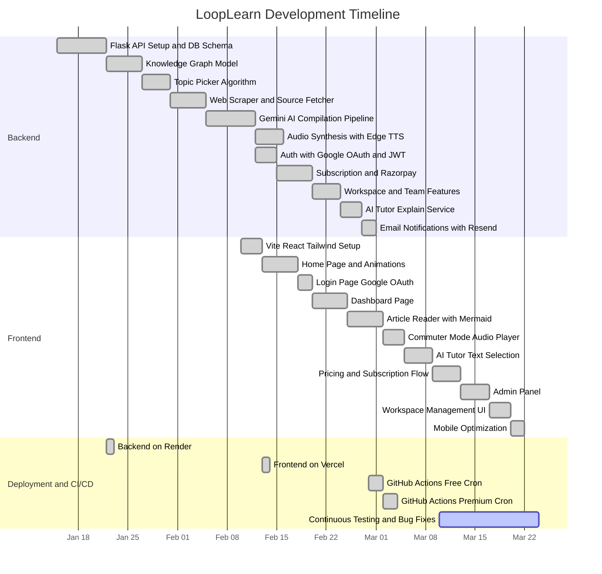

# LoopLearn — Project Blackbook

> **Project Title**: LoopLearn – AI-Assisted Daily Technical Briefing Platform  
> **Prepared By**: Pradnyesh Bhalekar  
> **Date**: March 2026

---

## Table of Contents

1. [Chapter 1: Introduction](#chapter-1-introduction)
   - 1.1 Introduction
   - 1.2 Description
   - 1.3 Stakeholders
2. [Chapter 2: Literature Survey](#chapter-2-literature-survey)
   - 2.1 Description of Existing System
   - 2.2 Limitations of Present System
3. [Chapter 3: Methodology](#chapter-3-methodology)
   - 2.3 Gantt Chart (Timeline)
   - 3.1 Technologies Used and their Description
   - 3.2 Event Table
   - 3.3 Use Case Diagram and Basic Scenarios & Use Case Description
   - 3.4 Entity-Relationship Diagram
   - 3.5 Flow Diagram
   - 3.6 Class Diagram
   - 3.7 Sequence Diagram
   - 3.8 State Diagram
   - 3.9 Menu Tree
4. [Chapter 4: Implementation](#chapter-4-implementation)
   - 4.1 List of Tables with Attributes and Constraints
   - 4.2 System Coding
   - 4.3 Screen Layouts and Report Layouts
5. [Chapter 5: Analysis, Related Work Done](#chapter-5-analysis-related-work-done)
6. [Chapter 6: Conclusion and Future Work](#chapter-6-conclusion-and-future-work)
   - 6.1 Conclusion
   - 6.2 Future Work
   - 6.3 References

---

# Chapter 1: Introduction

## 1.1 Introduction

### The Information Overload Problem in Modern Software Engineering

The contemporary software engineering profession is characterized by a paradox: the abundance of educational resources has not proportionally improved practitioner expertise. According to Stack Overflow's 2024 Developer Survey, over 90% of developers rely on self-directed online learning, yet a substantial majority report difficulty staying current with evolving technologies. The sheer volume of available content — spanning blog posts, video tutorials, online courses, newsletters, conference talks, documentation updates, and social media threads — has created an environment where the challenge is no longer access to information, but rather the effective processing and retention of it.

This phenomenon, broadly termed *information overload*, manifests in several observable patterns within the engineering community. Engineers subscribe to multiple newsletters (TLDR, Bytes, Hacker Newsletter), follow aggregation platforms (Daily.dev, Hacker News), and queue video tutorials (YouTube, Udemy) — yet consistently report feeling behind on industry trends. The root cause is structural: these platforms optimize for engagement metrics (click-through rates, watch time, page views) rather than knowledge retention. A video tutorial watched at 2x speed generates the same revenue as one watched attentively, yet the learning outcomes differ dramatically.

The cognitive load imposed by this content ecosystem is compounded by the breadth of modern software engineering itself. A backend developer is expected to maintain working knowledge across databases (relational and NoSQL), distributed systems, API design, containerization, cloud infrastructure, security practices, and observability tooling. Each of these domains evolves independently, generating its own stream of new tools, patterns, and best practices. Without a structured system to manage this knowledge intake, engineers default to reactive learning — studying a technology only when a project demands it — which produces fragmented, shallow understanding.

Furthermore, the format of most available content encourages passive consumption. Reading a blog post about Kubernetes networking or watching a video about database sharding creates an illusion of understanding without genuine knowledge transfer. The learner can follow the logic as it is presented but cannot reconstruct it independently, a phenomenon psychologists term the *illusion of competence*. This gap between perceived and actual understanding only becomes apparent when the engineer attempts to implement the concept in a production system and discovers critical gaps.

### The "Close the Loop" Methodology

LoopLearn is built upon a pedagogical framework called **"Close the Loop"**, which draws from established principles in cognitive science and instructional design. The methodology is structured around three sequential phases of engagement with each technical concept:

**Phase 1 — Read (Comprehension)**: The learner encounters a structured article that introduces a technical concept through a multi-layered format: an introductory hook that establishes relevance, followed by a clear technical explanation, practical implementation examples with line-by-line breakdowns, and trade-off analysis comparing alternative approaches. This structured format ensures that the concept is presented with sufficient context to ground initial understanding.

**Phase 2 — Visualize (Mental Model Construction)**: Each article is accompanied by an auto-generated Mermaid diagram — typically an architecture flowchart, sequence diagram, or system interaction diagram. Visualization serves a specific cognitive function: it forces the learner to map abstract concepts onto spatial relationships. Research in multimedia learning (Mayer, 2009) demonstrates that combining textual and visual representations significantly improves information retention compared to text alone, because the learner constructs dual mental representations that reinforce each other.

**Phase 3 — Implement (Active Recall and Application)**: The article includes practical implementation artifacts (code snippets, configuration files, CLI commands) with explanatory breakdowns, flashcards for active recall, and common anti-patterns with consequences. This phase transitions the learner from passive reception to active engagement. The testing effect — the finding that attempting to retrieve information from memory strengthens long-term retention more effectively than re-reading — is the core principle at work.

The rationale for constraining content to **one topic per day** is rooted in the spacing effect (Ebbinghaus, 1885), which demonstrates that distributed practice over time produces stronger long-term retention than massed practice. By presenting a single concept daily, LoopLearn avoids the cognitive overload associated with binge learning while building a consistent habit of structured knowledge acquisition. Over the course of a month, a subscriber receiving content across a domain such as "System Design" accumulates 30 deep-dive articles, each reinforcing and extending the knowledge graph built by previous readings.

This approach stands in contrast to the prevailing model of self-directed learning, where engineers spend hours on a weekend consuming tutorials and then retain little of the material by the following week. LoopLearn's design assumes that sustainable learning requires both structural constraints (one topic, one format, one time per day) and active engagement mechanisms (flashcards, diagrams, case studies) to overcome the natural decay of memory.

## 1.2 Description

LoopLearn is a full-stack web application composed of four distinct architectural tiers: a React-based frontend, a Flask-based backend API, an AI orchestration layer, and a relational-graph hybrid database. Each tier is designed to operate independently while maintaining well-defined interfaces with adjacent tiers.

### Frontend (React / TypeScript / Vite)

The frontend is a single-page application built with React 19, TypeScript, and bundled using Vite 7.2. It serves as the user-facing interface for all platform interactions: landing page presentation, authentication, article reading, audio playback, subscription management, and administrative operations.

The application employs a component-based architecture with clear separation between presentational and container components. Global state management is handled by Redux Toolkit, specifically for authentication state (JWT tokens, user roles, subscription status), while local component state manages UI concerns such as theme toggling, animation states, and form inputs. Client-side routing is managed by React Router 7, with route-level protection ensuring that subscriber-only and admin-only routes are inaccessible to unauthorized users.

The design system is built on Tailwind CSS 4 with custom theme tokens for both light and dark modes. Typography uses Inter (sans-serif) for body content and JetBrains Mono (monospace) for code snippets. Animations are powered by Framer Motion, with adaptive durations based on a custom `useMediaQuery` hook that detects mobile devices and increases animation durations to prevent frame drops on lower-powered hardware.

### Backend (Python / Flask)

The backend is a Python 3.12 REST API built with Flask 3.1.2, deployed on Render as a Gunicorn-managed WSGI application. It follows a layered architecture: routes (HTTP request handling and response formatting), services (business logic), and models (database access using raw SQL via psycopg2).

The routing layer is organized into Blueprint modules, each handling a specific resource: authentication, subscriptions, pipelines, articles, workspaces, and explanations. Authentication is implemented through Google OAuth 2.0 for identity verification, with JWT tokens issued by the backend for subsequent authenticated requests. Authorization is enforced through Python decorators (`@require_auth`, `@require_admin`, `@require_pipeline_secret`) that validate JWT claims and user roles before route handler execution.

The service layer encapsulates all business logic, including the content generation pipeline, topic selection algorithms, web scraping, AI model invocation, audio synthesis, and email notifications. This separation ensures that route handlers remain thin and testable, delegating complex operations to dedicated service modules.

### AI Orchestration Layer

The AI orchestration layer is the distinguishing technical feature of LoopLearn. It coordinates three distinct AI services, each serving a specific function within the platform:

**Google Gemini 2.5 Flash** serves as the primary content structuring engine. It receives a topic name, associated concept keywords, and scraped web content as input. Its system prompt defines a strict JSON output schema that includes structured fields: `intro_hook`, `what_is_it`, `why_is_it_important`, `practical_implementation` (with code and line-by-line breakdown), `theory` (with key principles and trade-offs), `case_study`, `flashcards`, `mermaid` (diagram code), and `child_topics`. The model's response is configured with `response_mime_type="application/json"` to enforce structured output, and a temperature of 0.2 to minimize creative deviation. Retry logic with exponential backoff (up to 5 attempts) ensures resilience against transient API failures.

It is important to note that Gemini does not generate content from scratch. It structures and compiles the scraped web content into a standardized format. The scraped data provides the factual foundation, while Gemini organizes this information into the predefined schema, adds relevant case studies and flashcards, and generates Mermaid diagram code representing the architectural relationships within the topic.

**GPT-4o-mini** (accessed via the GitHub Models API) powers the AI Tutor feature. When a subscriber highlights text within an article, the selected text and its surrounding paragraph are sent to GPT-4o-mini with a system prompt that constrains the output to a maximum of three sentences of plain text. The model is instructed to explain the highlighted term strictly in the context of the surrounding paragraph, avoiding generic dictionary definitions. A low temperature (0.2) ensures consistent, factual responses.

**Microsoft Edge TTS** handles audio synthesis. The `create_commuter_audio` function strips markdown syntax from article content, prepends a standardized introduction (including the domain name and topic title), and streams the text through Edge TTS using the `en-US-AriaNeural` voice. During streaming, the service captures word-level boundary events (word text, offset in 100-nanosecond units, duration) to generate precise timestamps that enable the frontend to synchronize text highlighting with audio playback. The generated MP3 file is uploaded to Cloudinary, and the resulting CDN URL is stored in PostgreSQL alongside the article record.

### Relational-Graph Hybrid Database

The database layer uses PostgreSQL 16, hosted on Neon's serverless platform, and combines traditional relational tables with a graph data model implemented through two tables: `concept_nodes` and `concept_edges`.

The relational component manages structured, transactional data: user accounts, subscription billing states, workspace memberships, article content, and audit trails (review timestamps, rejection reasons). These tables enforce referential integrity through foreign key constraints and use UUIDs as primary keys rather than auto-incrementing integers. UUIDs are preferred because they are globally unique, eliminating collision risks across distributed systems or data migrations, and they prevent information leakage (sequential IDs reveal record counts and creation order to external observers).

The graph component models the engineering knowledge domain. Each node in `concept_nodes` has a `node_type` field that classifies it as either a `domain` (e.g., "Databases", "System Design"), a `concept` (e.g., "Connection Pooling", "CAP Theorem"), or a `feature` (e.g., "PgBouncer", "HikariCP"). Edges in `concept_edges` represent relationships between nodes, with a `strength` field (REAL, default 1.0) that increments each time the relationship is reinforced — for example, when the same two concepts appear together in multiple scraped sources. The `UNIQUE(from_node_id, to_node_id)` constraint prevents duplicate edges, while the `ON CONFLICT ... DO UPDATE` pattern atomically increments strength on re-insertion.

This hybrid design enables the topic selection algorithm to traverse the graph from domain nodes to their connected concepts, filter out already-published and already-candidated topics, and select from the remaining pool with random weighting influenced by edge strength. The result is a topic selection process that is both non-repetitive and bias-aware, favoring concepts with stronger empirical connections to their parent domains.

The number of domains is not fixed. Any number of domains can be added at any time by inserting a new `concept_nodes` record with `node_type = 'domain'`. The system's topic selection, article generation, and subscription pipelines dynamically discover available domains by querying the `concept_nodes` table.

## 1.3 Stakeholders

### Free Users (Unsubscribed Registered Users)

Free users represent the largest segment of LoopLearn's user base. These are software engineers, computer science students, and technology enthusiasts who create an account through Google OAuth but have not purchased a subscription plan.

**Pain Points**: Free users face the same information overload problem described in Section 1.1. They lack a structured daily learning routine, and most of their technical reading is reactive — driven by immediate project needs rather than systematic knowledge building. They may be early-career engineers who have completed their formal education but find that the breadth of modern software engineering exceeds what was covered in their degree programs.

**User Journey**: A free user discovers LoopLearn through search, social media, or word of mouth. They visit the landing page, which presents the platform's value proposition through an animated feature slideshow and the three-step "Close the Loop" methodology. Upon clicking "Access Briefing," they are redirected to the Google OAuth login page. After authentication, they are directed to the Dashboard, where they can access a single daily article. This article is drawn from the public pool — it is not domain-specific, and the domain is determined by whichever article the free pipeline generated that day.

**Technical Value**: Free users receive a structured Markdown article with headings, code examples, and a Mermaid diagram. However, they do not have access to the Commuter Mode audio player or the AI Tutor text-explanation feature. The free tier serves as a demonstration of the platform's structured learning format, providing enough value to establish the daily reading habit while incentivizing subscription for the full experience.

### Subscribers (Individual Paid Users)

Subscribers are software engineers who have purchased a domain-specific subscription plan through Razorpay. Each subscription is tied to a specific engineering domain (e.g., "Databases", "System Design", "Backend Engineering"), and the subscriber receives a daily article exclusively within that domain.

**Pain Points**: Subscribers are typically mid-level or senior engineers who have identified specific knowledge gaps in their expertise. A backend developer who is strong in API design but weak in database internals might subscribe to the "Databases" domain to systematically build that competency. Their primary frustration with existing learning platforms is inconsistency — blog post quality varies wildly, and there is no guarantee that tomorrow's content will be relevant to the same domain they are trying to deepen.

**User Journey**: After logging in, the subscriber sees their Dashboard populated with cards representing their subscribed domains. Each card displays the title and preview of today's article for that domain. Clicking a card navigates to the full article reader, where the subscriber has access to the complete suite of premium features: the rendered Markdown article with all sections (theory, implementation, trade-offs, case study, flashcards), the Mermaid architecture diagram, the Commuter Mode floating audio player (which streams from a Cloudinary CDN URL stored in PostgreSQL), and the AI Tutor (highlighting any text triggers a GPT-4o-mini explanation in a centered popover).

**Technical Value**: Subscribers receive domain-specific articles that are auto-published daily at 5:00 PM IST via the premium GitHub Actions cron job. These articles are generated from scraped web sources specific to the subscribed domain, compiled through the full Gemini pipeline, and include audio synthesis. The subscriber's article is set to `audience = 'subscriber'` in the `article_visibility` table, ensuring it is not accessible to free users. Over time, the knowledge graph's anti-repeat algorithm ensures that the subscriber encounters every concept within their domain without redundancy.

### Team Admins (Workspace Owners)

Team Admins are a distinct identity from Platform Admins. A Team Admin is any software developer, engineering lead, or team manager who wishes to provide structured daily learning for their team. They are not moderators of the platform — they are users who have purchased a team subscription and manage a workspace.

**Pain Points**: Engineering leads responsible for onboarding junior developers or upskilling a team often struggle to find a consistent, structured learning resource that can be shared across the team. Assigning individual blog posts or video courses results in inconsistent coverage, and tracking whether team members have actually engaged with the material is impractical. Team Admins need a turnkey solution: subscribe once, invite team members, and everyone receives the same daily briefing for the chosen domain.

**User Journey**: A Team Admin navigates to the Pricing page and selects a domain plan with the "Team" option. Team subscriptions are priced at 4x the individual rate, which covers a default seat limit of 5 members. After completing payment through Razorpay, the Team Admin creates a workspace from their Dashboard, gives it a name, and invites team members by email. Invited members who accept the invitation are added to the `workspace_members` table with `role = 'member'`, and they inherit access to the subscribed domain's premium articles without needing their own individual subscription.

**Technical Value**: The workspace model enables a single subscription payment to cover multiple users. The system verifies team membership at article access time by checking `workspace_members` and resolving the workspace owner's active team subscription via a JOIN through the `workspaces` and `subscriptions` tables. The `seat_limit` field on the `workspaces` table provides a configurable cap on team size, defaulting to 5.

### Platform Admin (Content Moderator)

The Platform Admin is the individual responsible for reviewing AI-generated content before it reaches free users. This role is specifically focused on two operations: reviewing candidate articles and optionally triggering pipeline runs manually.

**Pain Points**: AI-structured content, while generally high quality, can occasionally produce output that requires human review. Mermaid diagram syntax may contain invalid characters despite strict prompt engineering. Scraped source content may introduce inaccuracies if the source itself contains outdated information. The Platform Admin serves as a quality gate to ensure that published content meets the platform's standards.

**User Journey**: The Platform Admin accesses the Admin Panel, which is protected by the `@require_admin` decorator verifying that the authenticated user's role in `user_roles` is 'admin'. The panel displays two primary sections: a Pipeline Trigger section (with buttons to run the free pipeline for a single random domain or the premium pipeline for all domains) and a Candidate Review section. The candidate queue shows all articles with `status = 'pending'`, each displaying a preview of the title, generated article, and Mermaid diagram. The Admin can approve an article (setting a `scheduled_for` date and moving it to `published_articles`) or reject it (providing a `rejection_reason`).

**Technical Value**: The Admin's review is primarily relevant to the free pipeline. The free pipeline (triggered by the GitHub Actions cron at 8:00 PM IST) generates exactly one article and stores it as a candidate with `status = 'pending'`. The article is not visible to users until the Admin approves it. In contrast, the premium pipeline (5:00 PM IST) auto-publishes content directly to `published_articles` with `audience = 'subscriber'`, bypassing the approval queue. This design reflects a deliberate trade-off: free content, which is visible to the widest audience, receives manual review, while subscriber content, which serves a more invested user base, is published automatically to ensure daily consistency.

---

# Chapter 2: Literature Survey

## 2.1 Description of Existing System

### YouTube and Udemy

YouTube and Udemy represent the dominant platforms for video-based technical education. YouTube operates on an advertising-supported model where creators publish content freely, and revenue is generated through pre-roll, mid-roll, and display advertisements. Udemy operates on a marketplace model where instructors create courses and sell them at variable price points, with the platform taking a commission on each sale.

**Architecture**: YouTube's content delivery infrastructure is built on Google's proprietary CDN, serving billions of hours of video daily across a globally distributed network of edge servers. Content is transcoded into multiple resolutions and adaptive bitrate profiles upon upload, enabling smooth playback across varying network conditions. Udemy's architecture follows a more traditional SaaS pattern: a monolithic web application (reportedly built on Django in its early years) with a PostgreSQL database, backed by AWS infrastructure for media storage (S3) and delivery (CloudFront).

**User Flow**: On YouTube, a developer searching for "Kubernetes networking tutorial" receives a ranked list of results influenced by the platform's recommendation algorithm, which optimizes for watch time and click-through rate. The user selects a video, watches it (often at 1.5x or 2x speed), and may leave a comment or subscribe to the channel. There is no structured follow-up: no quiz, no flashcard, no practical exercise. The next recommended video may be on an entirely unrelated topic, driven by the algorithm's assessment of what will maximize continued engagement.

On Udemy, the user flow is more structured: courses are organized into sections and lectures, with occasional quizzes. However, courses range from 2 hours to 60+ hours in length, and completion rates are notoriously low. The user purchases a course, watches the first few lectures with enthusiasm, and often abandons it as competing priorities intervene.

**Target Audience**: Both platforms serve a broad audience, from absolute beginners to advanced practitioners. This breadth is a strength in terms of market reach but a weakness in terms of content calibration. A video titled "Advanced System Design" may spend its first 20 minutes covering fundamentals that an experienced engineer would skip, creating frustration and encouraging further speed-up of playback.

**Fundamental Limitation for LoopLearn's Use Case**: These platforms are primarily designed for engagement and long-form consumption. The content format (video) requires dedicated screen time and sustained attention. There is no mechanism for daily micro-learning, no knowledge graph tracking what the user has already covered, and no structured format that separates theory from implementation from active recall.

### Medium and Dev.to

Medium and Dev.to are the leading platforms for written technical content created by the developer community. Medium operates on a freemium model with a membership program that unlocks access to paywalled articles and compensates authors based on reading time. Dev.to is an open-source, community-driven platform that is entirely free, funded primarily by sponsorships and its parent company, Forem.

**Architecture**: Medium's technical architecture has evolved significantly since its founding. It originally ran on a Node.js backend, later migrated to a microservices architecture using Go and GraphQL. The platform uses a custom rich-text editor that stores content in a proprietary format, renders it server-side, and delivers it with aggressive caching. Dev.to is built on Ruby on Rails with a PostgreSQL database, deployed on AWS infrastructure, and uses Preact for its frontend to minimize JavaScript bundle size.

**User Flow**: On Medium, a developer discovers an article through Google Search, social media sharing, or Medium's internal recommendation engine ("Daily Digest" emails). The article may be behind a paywall, requiring a $5/month membership. If the user is not a member, they can read a limited number of free articles per month. The reading experience is clean and focused, but there is no structured follow-up — no diagram, no flashcard, no implementation exercise. The next article recommended by the platform may be from an entirely different domain (politics, self-help, technology), depending on the user's browsing history.

On Dev.to, the user flow is similar but entirely free. Articles are tagged by topic, and the platform surfaces content through a combination of recency, reactions, and algorithmic ranking. The community features (comments, bookmarks, series) encourage engagement, but the content quality is highly inconsistent. A search for "load balancing" may return articles ranging from a well-researched deep-dive to a superficial overview rephrased from documentation.

**Target Audience**: Both platforms target developers at all levels, with content quality acting as the primary differentiator rather than platform curation. Medium's paywall model incentivizes authors to write longer articles (since compensation is based on reading time), which can inflate content without proportional value. Dev.to's open model incentivizes volume — frequent posting increases visibility — which can dilute the average quality of technical content.

**Fundamental Limitation**: Neither platform provides structured, daily, domain-specific content delivery. Users must self-curate, and there is no mechanism to track what topics have been covered or to prevent redundant reading across articles from different authors covering the same subject.

### Daily.dev and TLDR Newsletter

Daily.dev is a browser-based content aggregation platform that surfaces developer-relevant articles from hundreds of sources. TLDR is an email newsletter that delivers a daily summary of links to technology news and articles. Both operate on a curation model rather than original content creation.

**Architecture**: Daily.dev runs as a browser extension and progressive web application that aggregates content from configured sources (blogs, documentation sites, tech news sites) using RSS feeds and web crawlers. It applies ranking algorithms that consider factors such as source reputation, engagement metrics, and topic relevance. The backend is built on Node.js with a PostgreSQL database, deployed on Google Cloud. TLDR operates primarily as an email-delivery platform, with editorial staff manually curating links daily and distributing them through email service providers.

**User Flow**: A Daily.dev user opens their browser to a personalized feed of aggregated articles. Each item shows a title, source, and engagement metrics. Clicking an item opens the original source article in a new tab. The user potentially reads the article (or, more commonly, skims the title and moves on), and returns to the feed. The experience optimizes for breadth: the user is exposed to a high volume of titles across domains, but depth on any individual topic is limited to whatever the original source provides.

TLDR subscribers receive a daily email with 5-10 linked items organized under categories (web development, DevOps, science, miscellaneous). Each item includes a brief 2-3 sentence summary. The user clicks through to the original article for full content.

**Target Audience**: Both platforms target working developers who want to stay informed about industry trends without spending significant time on content discovery. They serve the "I want to know what's happening" need rather than the "I want to deeply understand this topic" need.

**Fundamental Limitation**: These platforms are aggregators, not educators. They solve the content discovery problem but not the content absorption problem. A user who reads 10 Daily.dev titles per morning has been exposed to 10 topics but has deeply understood none of them. There is no structured format, no active recall mechanism, and no audio option for hands-free consumption.

### LeetCode and HackerRank

LeetCode and HackerRank are the dominant platforms for algorithmic problem-solving practice, primarily used for technical interview preparation. LeetCode operates on a freemium model (free access to a subset of problems, premium for full access and company-specific question sets), while HackerRank offers both individual practice and enterprise hiring solutions.

**Architecture**: LeetCode's architecture must support real-time code compilation and execution across multiple languages. The platform uses a microservices backend (reportedly built on Java/Spring) with sandboxed code execution environments (likely Docker containers or similar isolation) that compile and run user-submitted code against test cases. Results are returned within seconds, requiring efficient queue management and resource allocation. HackerRank employs a similar architecture with containerized code execution, extended to support additional assessment types (multiple choice, system design drawings, front-end challenges).

**User Flow**: A LeetCode user navigates to the problem list, filters by topic (arrays, trees, dynamic programming, etc.) and difficulty (Easy, Medium, Hard), selects a problem, reads the description and constraints, and writes a solution in their preferred language. The platform runs the solution against test cases and reports pass/fail status, execution time, and memory usage. The user may then view community solutions and explanations.

**Target Audience**: These platforms primarily serve engineers preparing for coding interviews at technology companies. The problems are designed to test algorithmic thinking and data structure manipulation, which are specific competencies assessed in the hiring process. They do not address the broader set of engineering knowledge required for daily work — system design, database management, API architecture, DevOps practices, security, and observability.

**Fundamental Limitation**: LeetCode and HackerRank occupy a narrow niche within engineering education. An engineer who can efficiently implement a balanced binary search tree may still lack the knowledge to design a database schema, configure a Kubernetes deployment, or debug a distributed system's consistency issue. LoopLearn addresses the broader set of engineering domains that these platforms do not cover.

## 2.2 Limitations of Present System

### Limitation 1: Volume Over Depth

The prevailing model in developer education is to maximize content volume — more articles, more videos, more courses — under the assumption that greater availability leads to better learning outcomes. This assumption is not supported by evidence from educational psychology. The capacity of working memory is limited (Miller, 1956, estimated approximately 7 ± 2 items), and information transfer from working memory to long-term memory requires focused attention, elaboration, and spaced practice.

Platforms that deliver 50+ articles per day (Daily.dev), 20+ video recommendations per session (YouTube), or courses spanning 40+ hours (Udemy) overwhelm working memory and encourage shallow processing. The learner skims, bookmarks, and moves on — accumulating a growing backlog of "content to review" that is never actually reviewed. LoopLearn addresses this by constraining delivery to one topic per day per domain, ensuring that the learner's attention is focused on a single concept with sufficient depth to support transfer to long-term memory.

### Limitation 2: Manual Topic Selection and Discovery Burden

On existing platforms, the learner is entirely responsible for deciding what to learn next. This requires metacognitive skill — the ability to accurately assess one's own knowledge gaps — which is itself a skill that develops with experience. Junior engineers, who stand to benefit most from structured learning, are least equipped to identify their knowledge gaps.

Furthermore, the content discovery process on aggregation platforms is influenced by popularity biases. Articles on trending topics (the latest JavaScript framework, a high-profile system outage) receive disproportionate visibility, while foundational topics (operating system memory management, database indexing strategies) are underrepresented in algorithmic feeds. LoopLearn eliminates the discovery burden entirely through its knowledge graph, which maintains a comprehensive map of engineering concepts and systematically selects underrepresented topics.

### Limitation 3: Absence of Architectural Visualization

Software architecture is inherently spatial: services communicate across networks, data flows through pipelines, state machines transition between states. Yet the dominant medium for technical content — text — is linear. A written description of a microservice architecture requires the reader to mentally construct the spatial arrangement of components, their connections, and data flow directions.

Research in multimedia learning (Mayer, 2009) demonstrates that presenting information through both verbal and visual channels simultaneously produces significantly better learning outcomes than either channel alone. This is the basis of the Dual Coding Theory (Paivio, 1971), which posits that information processed through both verbal and visual cognitive subsystems is stored more durably. Despite this evidence, fewer than 10% of technical blog posts include architectural diagrams, and those that do typically use static images that cannot be dynamically generated or adapted to the specific topic being discussed. LoopLearn addresses this by including a Mermaid diagram in every article, generated from the compiled JSON and rendered interactively in the browser.

### Limitation 4: Limited Audio Support for Passive Learning Contexts

A significant portion of an engineer's day is spent in contexts where reading is impractical: commuting (driving, public transit), exercising, cooking, or performing routine tasks. Podcasts serve this niche to some extent, but technical podcasts typically cover broad industry topics in a conversational format rather than providing structured, concept-by-concept educational content. There is no existing platform that synthesizes a structured audio narration of an individual technical concept — complete with an introduction, explanation, and key takeaways — and delivers it alongside the written article.

LoopLearn's Commuter Mode addresses this gap through neural text-to-speech synthesis (Edge TTS), which converts article content into natural-sounding audio with word-level timestamp synchronization. The audio URL is stored in PostgreSQL alongside the article record, ensuring persistence and efficient CDN delivery through Cloudinary.

### Limitation 5: No Team Learning Infrastructure

Engineering teams rarely share structured learning experiences. Individual engineers consume content independently, leading to fragmented knowledge across the team. An engineer who has deeply studied database sharding cannot easily transfer that knowledge to a colleague who has focused on API gateway patterns. The lack of shared vocabulary and shared conceptual foundations makes team-level technical discussions less productive.

Existing platforms do not support team-level subscriptions with shared content delivery. An engineering lead who wants their team of five to study the same system design topic each day has no platform that supports this use case. LoopLearn's workspace model addresses this directly: a Team Admin creates a workspace, purchases a team subscription, and invites members. All members receive the same daily article for the subscribed domain, creating shared context for team discussions and knowledge transfer.

### Limitation 6: Passive Consumption Without Active Recall Mechanisms

The majority of technical content is designed for one-time consumption: read the article, watch the video, close the tab. There is no mechanism to test whether the learner actually retained the information. Active recall — the process of retrieving information from memory without re-reading the source — is one of the most robust findings in learning science (Roediger & Butler, 2011). Flashcards, practice tests, and retrieval exercises produce significantly stronger long-term retention than repeated reading.

LoopLearn integrates active recall mechanisms directly into each article: flashcards (question-answer pairs), trade-off comparison tables (forcing the learner to reason about pros and cons of alternative approaches), and anti-pattern analysis (requiring the learner to identify why a common mistake leads to specific consequences). These components are not separate exercises — they are part of the structured JSON compiled by Gemini and rendered within the same article interface.

---

# Chapter 3: Methodology

## 2.3 Gantt Chart (Timeline)

### Phase Breakdown

**Phase 1 — Backend Foundation (Jan 15 – Feb 7)**: Development began with the Flask API skeleton, PostgreSQL schema design, and basic CRUD operations. The knowledge graph model (`concept_nodes` and `concept_edges`) was implemented early to serve as the foundation for topic selection. The topic picker algorithm was developed and tested against seeded domain data. The web scraper and source fetcher were implemented using DuckDuckGo search and BeautifulSoup/Trafilatura, with quality filtering based on minimum content length thresholds. The Gemini AI compilation pipeline was the longest single task in this phase, requiring extensive prompt engineering to achieve consistent structured JSON output. Audio synthesis via Edge TTS and Cloudinary upload were added as the final pipeline stage. Google OAuth and JWT authentication were implemented in parallel with the audio service.

**Phase 2 — Monetization and Collaboration (Feb 7 – Feb 20)**: Razorpay integration required implementing plan creation, subscription creation, and webhook handling for lifecycle events (activation, charging, cancellation). The webhook endpoint includes HMAC signature verification to prevent spoofed requests. The workspace model was designed and implemented, enabling team subscriptions with seat limits. The AI Tutor (GPT-4o-mini) was added as a subscriber-only feature. Email notifications via Resend were configured for admin alerts and pipeline reports.

**Phase 3 — Frontend Development (Feb 10 – Mar 10)**: The Vite + React + Tailwind project was scaffolded and deployed to Vercel early, enabling continuous preview deployments. Pages were built iteratively: Home (landing), Login (OAuth), Dashboard (subscribed domains), Article Reader (Markdown + Mermaid + Audio), Pricing (Razorpay checkout), and Admin Panel (pipeline trigger + candidate review). Mobile optimization — including the custom `useMediaQuery` hook for adaptive animation durations — was one of the final frontend tasks.

**Phase 4 — CI/CD and Deployment (Continuous)**: Both the backend (Render) and frontend (Vercel) were deployed early in the development cycle and updated continuously. The two GitHub Actions cron workflows were configured in late February: `daily-pipeline.yml` (free pipeline, 8:00 PM IST) and `premium-daily-pipeline.yml` (all-domains premium pipeline, 5:00 PM IST). Testing and bug fixing have been ongoing since March 10.
