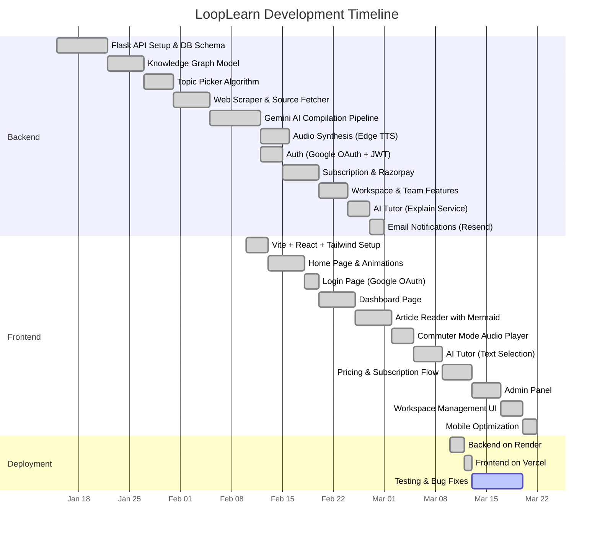
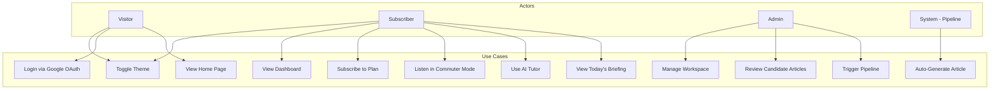
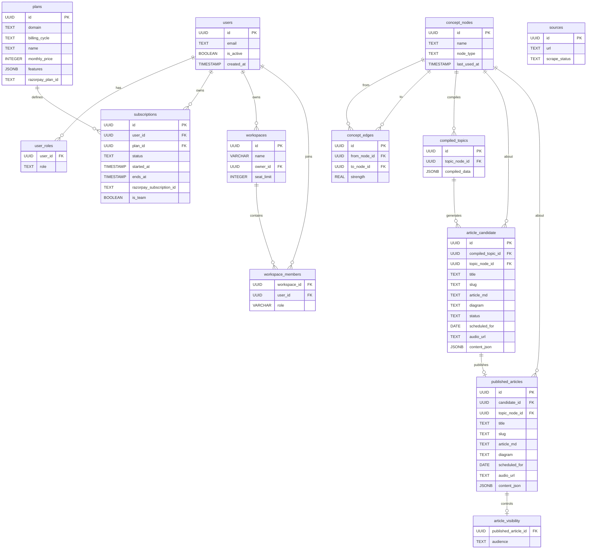
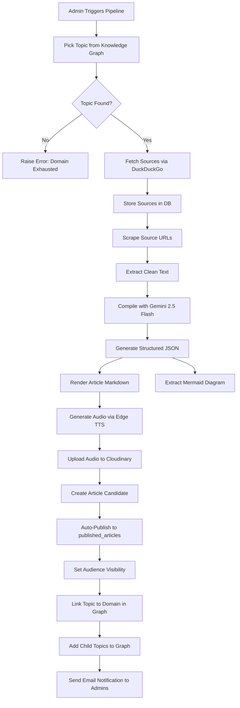
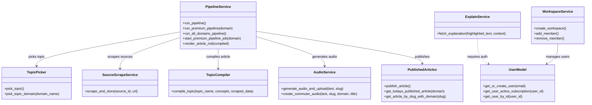
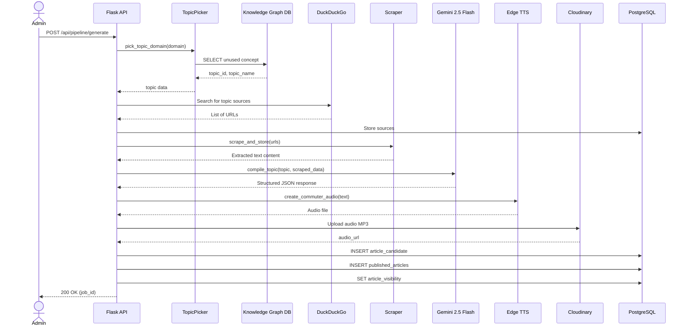
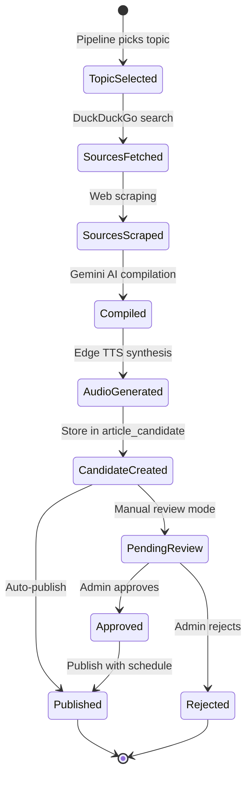

# LoopLearn — Project Blackbook

> **Project Title**: LoopLearn – AI-Powered Daily Technical Briefing Platform
> **Prepared By**: Pradnyesh Bhalekar
> **Date**: March 2026

---

## Table of Contents

1. [Chapter 1: Introduction](#chapter-1-introduction)
2. [Chapter 2: Literature Survey](#chapter-2-literature-survey)
3. [Chapter 3: Methodology](#chapter-3-methodology)
4. [Chapter 4: Implementation](#chapter-4-implementation)
5. [Chapter 5: Analysis & Related Work](#chapter-5-analysis--related-work)
6. [Chapter 6: Conclusion & Future Work](#chapter-6-conclusion--future-work)

---

# Chapter 1: Introduction

## 1.1 Introduction

The modern software engineering landscape suffers from a critical problem: **information overload**. Engineers are inundated with tutorials, blog posts, newsletters, and social media content that optimizes for engagement, not retention. Studies show that passive consumption of technical content leads to less than 10% knowledge retention after 48 hours.

**LoopLearn** is an AI-powered platform that delivers **one high-signal technical briefing per day** across 9 core engineering domains. Every 24 hours, the system autonomously selects a topic, scrapes authoritative sources from the web, compiles a structured article using Google's Gemini 2.5 Flash model, generates an architectural diagram, synthesizes a neural audio narration for commuter-mode listening, and publishes the content to subscribers.

The platform is built around a **"Close the Loop"** philosophy — read, visualize, implement — designed to maximize retention through structured, spaced exposure.

## 1.2 Description

LoopLearn is a full-stack web application consisting of:

- **Backend**: A Python Flask REST API that manages a knowledge graph of engineering concepts, runs an autonomous AI content generation pipeline, handles user authentication (Google OAuth), subscription management (Razorpay), and workspace collaboration features.
- **Frontend**: A React (TypeScript) single-page application built with Vite, featuring a premium dark/light theme UI with Framer Motion animations, an interactive AI Tutor (text-selection explainer), and a Commuter Mode audio player.
- **Database**: PostgreSQL (hosted on Neon), with a graph-based data model (concept nodes and edges) for intelligent topic selection.
- **AI Stack**: Google Gemini 2.5 Flash for article compilation, GPT-4o-mini (via GitHub Models) for the AI Tutor, and Microsoft Edge TTS for audio synthesis.

## 1.3 Stakeholders

| Stakeholder | Role | Interest |
|---|---|---|
| **Software Engineers** | Primary users | Consume daily briefings to stay current on system design, databases, security, etc. |
| **Engineering Managers / Architects** | Team subscription owners | Onboard junior developers via team workspaces |
| **Admin / Editor** | Content moderator | Manage pipeline runs, approve/reject AI-generated candidates |
| **Platform Owner** | Business stakeholder | Revenue via subscription plans (Razorpay integration) |

---

# Chapter 2: Literature Survey

## 2.1 Description of Existing System

Current approaches to continuous engineering education include:

| Platform | Model | Weakness |
|---|---|---|
| **YouTube / Udemy** | Long-form video courses | Optimized for watch-time, not retention. Leads to "tutorial hell." |
| **Medium / Dev.to** | User-generated blog posts | Inconsistent quality, no structured learning path, no spaced repetition. |
| **Daily.dev / TLDR Newsletter** | Aggregated links / summaries | Shallow coverage. Links to external content. No deep structured learning. |
| **LeetCode / HackerRank** | Problem-solving practice | Focused on DSA interview prep, not system design or architectural knowledge. |
| **O'Reilly / Manning** | Technical books | Static content, long commitment, no daily habit loop. |

## 2.2 Limitations of Present System

1. **Volume Over Depth**: Existing platforms deliver high volume of content but fail to provide structured, deep-dive coverage of individual topics.
2. **No Adaptive Topic Selection**: Users must manually choose what to learn. There is no intelligent system that tracks coverage across engineering domains and avoids repetition.
3. **No Architectural Visualization**: Most text-based platforms lack auto-generated architectural diagrams that help engineers build mental models.
4. **No Audio Mode**: Engineers commuting or exercising have no way to consume structured technical content in audio form with the same fidelity as written content.
5. **No Team Learning Infrastructure**: There is no platform that allows engineering managers to provision structured daily learning for their entire team.
6. **Passive Consumption**: Content is consumed passively with no mechanism for active recall (flashcards, trade-off analysis, etc.).

---

# Chapter 3: Methodology

## 3.1 Gantt Chart (Timeline)



## 3.2 Technologies Used and their Description

### Backend Stack

| Technology | Version | Purpose |
|---|---|---|
| **Python** | 3.12+ | Core backend language |
| **Flask** | 3.1.2 | Lightweight REST API framework |
| **PostgreSQL (Neon)** | 16 | Cloud-hosted relational database |
| **psycopg2** | 2.9.11 | PostgreSQL adapter for Python |
| **Google Gemini** (genai SDK) | 2.5 Flash | AI-powered article compilation |
| **GPT-4o-mini** (via GitHub Models) | — | AI Tutor (text explanation) |
| **Edge TTS** | — | Neural text-to-speech audio synthesis |
| **Cloudinary** | — | Cloud storage for generated audio files |
| **Razorpay** | — | Payment gateway for subscriptions |
| **Resend** | 2.23.0 | Transactional email notifications |
| **BeautifulSoup / Trafilatura** | 4.14.3 / 2.0.0 | Web scraping and content extraction |
| **DuckDuckGo Search (ddgs)** | — | Finding authoritative sources for topics |
| **Gunicorn** | 25.0.1 | Production WSGI server |

### Frontend Stack

| Technology | Version | Purpose |
|---|---|---|
| **React** | 19.2.0 | UI library |
| **TypeScript** | 5.9.3 | Type-safe JavaScript |
| **Vite** | 7.2.4 | Build tool and dev server |
| **Tailwind CSS** | 4.2.1 | Utility-first CSS framework |
| **Framer Motion** | 12.34.3 | Animation library |
| **Redux Toolkit** | 2.11.2 | Global state management |
| **React Router** | 7.13.0 | Client-side routing |
| **Mermaid.js** | 11.12.3 | Rendering architectural diagrams |
| **Axios** | 1.13.5 | HTTP client for API calls |
| **Lucide React** | 0.575.0 | Icon library |

### Fonts

| Font | Type | Usage |
|---|---|---|
| **Inter** (400–900) | Sans-serif | Primary UI typeface |
| **JetBrains Mono** (400–700) | Monospace | Code snippets, labels, technical accents |

## 3.3 Event Table

| Event | Trigger | Actor | Response |
|---|---|---|---|
| User visits Home | URL navigation | Visitor | Render landing page with animations |
| User clicks "Access Briefing" | Button click | Visitor | Redirect to Google OAuth login |
| Google OAuth callback | OAuth redirect | System | Create/fetch user, issue JWT token |
| User views Today's Briefing | Page load | Subscriber | Fetch article by domain & subscription |
| User highlights text | Text selection | Subscriber | Invoke AI Tutor explanation (GPT-4o-mini) |
| User toggles Commuter Mode | Button click | Subscriber | Stream audio from Cloudinary |
| Admin triggers pipeline | Admin panel button | Admin | Start background pipeline job for a domain |
| Pipeline picks topic | Scheduled / manual | System | Query knowledge graph for unused topic |
| Pipeline scrapes sources | Automated | System | Fetch & scrape web sources via DuckDuckGo |
| Pipeline compiles article | Automated | System | Call Gemini 2.5 Flash with scraped data |
| Pipeline generates audio | Automated | System | Synthesize via Edge TTS, upload to Cloudinary |
| Pipeline publishes article | Automated | System | Insert into published_articles, set visibility |
| User subscribes to plan | Pricing page | User | Create Razorpay subscription |
| Razorpay webhook fires | Payment event | Razorpay | Activate/cancel subscription in DB |
| Admin creates workspace | Admin panel | Admin | Create workspace, add team members |

## 3.4 Use Case Diagram and Basic Scenarios



### Use Case Descriptions

| Use Case | Actor | Precondition | Postcondition |
|---|---|---|---|
| **View Today's Briefing** | Subscriber | User is logged in with active subscription | Article, diagram, and audio player are rendered for the subscribed domain |
| **Use AI Tutor** | Subscriber | User is reading an article | Highlighted text is sent to GPT-4o-mini; contextual explanation appears in a popover |
| **Trigger Pipeline** | Admin | Admin is authenticated | Background job starts; topic is picked, sources scraped, article compiled, audio generated, and article published |
| **Subscribe to Plan** | User | User is logged in | Razorpay checkout opens; on success, subscription is activated in DB |

## 3.5 Entity-Relationship Diagram



## 3.6 Flow Diagram (Content Generation Pipeline)



## 3.7 Class Diagram (Backend Services)



## 3.8 Sequence Diagram (Article Generation)



## 3.9 State Diagram (Article Lifecycle)



## 3.10 Menu Tree

```
LoopLearn
├── Home Page (/) ── Landing, hero, features slideshow, CTA
│   ├── #why ── The Noise vs The Signal section
│   ├── #who ── Target audience cards
│   └── #how ── The Protocol (3-step flow)
│
├── Login (/login) ── Google OAuth sign-in
│
├── Dashboard (/dashboard) ── User's subscribed domains & articles
│
├── Today's Briefing (/todays) ── Daily article reader
│   ├── Article Content (Markdown rendered)
│   ├── Mermaid Diagram (pinch-to-zoom)
│   ├── AI Tutor (text selection → explanation popover)
│   └── Commuter Mode (floating audio player)
│
├── Pricing (/pricing) ── Subscription plans & Razorpay checkout
│
├── Subscription Success (/subscription-success)
│
├── Admin Panel (/admin) [Admin only]
│   ├── Pipeline Trigger (per-domain / all-domains)
│   ├── Candidate Review (approve / reject / schedule)
│   └── Workspace Management
│
└── Navbar (Global)
    ├── Theme Toggle (Light / Dark)
    ├── Navigation Links
    └── Logout
```

---

# Chapter 4: Implementation

## 4.1 List of Tables with Attributes and Constraints

### 1. `users`
| Column | Type | Constraints |
|---|---|---|
| id | UUID | PRIMARY KEY, DEFAULT gen_random_uuid() |
| email | TEXT | UNIQUE, NOT NULL |
| is_active | BOOLEAN | DEFAULT TRUE |
| created_at | TIMESTAMP | DEFAULT NOW() |

### 2. `user_roles`
| Column | Type | Constraints |
|---|---|---|
| user_id | UUID | PRIMARY KEY, REFERENCES users(id) ON DELETE CASCADE |
| role | TEXT | NOT NULL, CHECK IN ('admin', 'editor', 'viewer') |

### 3. `plans`
| Column | Type | Constraints |
|---|---|---|
| id | UUID | PRIMARY KEY |
| domain | TEXT | — |
| billing_cycle | TEXT | — |
| name | TEXT | — |
| monthly_price | INTEGER | — |
| features | JSONB | — |
| razorpay_plan_id | TEXT | UNIQUE |

### 4. `subscriptions`
| Column | Type | Constraints |
|---|---|---|
| id | UUID | PRIMARY KEY |
| user_id | UUID | REFERENCES users(id) |
| plan_id | UUID | REFERENCES plans(id) |
| status | TEXT | CHECK IN ('active', 'paused', 'cancelled', 'pending') |
| started_at | TIMESTAMP | DEFAULT NOW() |
| ends_at | TIMESTAMP | — |
| razorpay_subscription_id | TEXT | UNIQUE |
| is_team | BOOLEAN | DEFAULT FALSE |

### 5. `concept_nodes`
| Column | Type | Constraints |
|---|---|---|
| id | UUID | PRIMARY KEY |
| name | TEXT | UNIQUE, NOT NULL |
| node_type | TEXT | CHECK IN ('domain', 'concept', 'feature') |
| last_used_at | TIMESTAMP | NULL |
| created_at | TIMESTAMP | DEFAULT NOW() |

### 6. `concept_edges`
| Column | Type | Constraints |
|---|---|---|
| id | UUID | PRIMARY KEY |
| from_node_id | UUID | REFERENCES concept_nodes(id) ON DELETE CASCADE |
| to_node_id | UUID | REFERENCES concept_nodes(id) ON DELETE CASCADE |
| strength | REAL | DEFAULT 1.0 |
| UNIQUE | — | (from_node_id, to_node_id) |

### 7. `sources`
| Column | Type | Constraints |
|---|---|---|
| id | UUID | PRIMARY KEY |
| url | TEXT | — |
| scrape_status | TEXT | — |

### 8. `compiled_topics`
| Column | Type | Constraints |
|---|---|---|
| id | UUID | PRIMARY KEY |
| topic_node_id | UUID | REFERENCES concept_nodes(id) |
| compiled_data | JSONB | — |

### 9. `article_candidate`
| Column | Type | Constraints |
|---|---|---|
| id | UUID | PRIMARY KEY |
| compiled_topic_id | UUID | REFERENCES compiled_topics(id) |
| topic_node_id | UUID | REFERENCES concept_nodes(id) |
| title | TEXT | NOT NULL |
| slug | TEXT | NOT NULL |
| article_md | TEXT | NOT NULL |
| diagram | TEXT | — |
| status | TEXT | CHECK IN ('pending', 'approved', 'rejected'), DEFAULT 'pending' |
| scheduled_for | DATE | — |
| audio_url | TEXT | — |
| content_json | JSONB | — |

### 10. `published_articles`
| Column | Type | Constraints |
|---|---|---|
| id | UUID | PRIMARY KEY |
| candidate_id | UUID | REFERENCES article_candidate(id) |
| topic_node_id | UUID | REFERENCES concept_nodes(id), NOT NULL |
| title | TEXT | NOT NULL |
| slug | TEXT | NOT NULL |
| article_md | TEXT | NOT NULL |
| diagram | TEXT | — |
| published_at | TIMESTAMP | DEFAULT NOW() |
| scheduled_for | DATE | NOT NULL |
| audio_url | TEXT | — |
| content_json | JSONB | — |

### 11. `article_visibility`
| Column | Type | Constraints |
|---|---|---|
| published_article_id | UUID | PRIMARY KEY, REFERENCES published_articles(id) |
| audience | TEXT | CHECK IN ('public', 'subscriber') |

### 12. `workspaces`
| Column | Type | Constraints |
|---|---|---|
| id | UUID | PRIMARY KEY |
| name | VARCHAR(255) | NOT NULL |
| owner_id | UUID | REFERENCES users(id) |
| seat_limit | INTEGER | DEFAULT 5 |

### 13. `workspace_members`
| Column | Type | Constraints |
|---|---|---|
| workspace_id | UUID | REFERENCES workspaces(id) ON DELETE CASCADE |
| user_id | UUID | REFERENCES users(id) |
| role | VARCHAR(20) | CHECK IN ('admin', 'member'), DEFAULT 'member' |
| PRIMARY KEY | — | (workspace_id, user_id) |

## 4.2 System Coding

### Backend Architecture
```
daily/
├── run.py                      # Flask app entry point, route registration, CORS
├── requirements.txt            # Python dependencies
├── seed_plans.py               # Seed subscription plans into DB
├── app/
│   ├── config/
│   │   └── db.py               # PostgreSQL connection management
│   ├── models/                 # Database layer (raw SQL with psycopg2)
│   │   ├── schema.py           # DB initialization (all table creation)
│   │   ├── graph.py            # Knowledge graph (concept_nodes, concept_edges)
│   │   ├── user.py             # Users, roles, subscriptions
│   │   ├── workspace.py        # Workspaces, workspace_members
│   │   ├── published_articles.py  # Published articles CRUD
│   │   ├── article_candidate.py   # Candidate articles (pending review)
│   │   ├── sources.py          # Web sources
│   │   └── ...
│   ├── routes/                 # REST API endpoints
│   │   ├── auth_routes.py      # Google OAuth + JWT
│   │   ├── pipeline_routes.py  # Trigger pipeline jobs
│   │   ├── subscription_routes.py # Plans, subscriptions, Razorpay webhooks
│   │   ├── public_article_routes.py # Public article access
│   │   ├── explain_routes.py   # AI Tutor endpoint
│   │   ├── workspace_routes.py # Workspace management
│   │   └── ...
│   ├── services/               # Business logic
│   │   ├── pipeline_service.py  # Core pipeline orchestration
│   │   ├── pick_topic.py       # Topic selection algorithm
│   │   ├── topic_compiler.py   # Gemini AI article compilation
│   │   ├── audio_service.py    # Edge TTS + Cloudinary
│   │   ├── explain_service.py  # AI Tutor (GPT-4o-mini)
│   │   ├── scraper.py          # Web content extraction
│   │   └── ...
│   └── utils/
│       └── email_utils.py      # Helper utilities
```

### Frontend Architecture
```
looplearn/
├── index.html                  # Entry point (Google Fonts, OAuth script)
├── vite.config.ts              # Vite build configuration
├── src/
│   ├── main.tsx                # React root (Provider, ThemeProvider, Router)
│   ├── index.css               # Global styles, Tailwind config, theme tokens
│   ├── context/
│   │   └── ThemeContext.tsx     # Light/dark theme state
│   ├── hooks/
│   │   └── useMediaQuery.ts    # Mobile detection hook
│   ├── api/                    # API layer (Axios)
│   │   ├── axios.ts            # Base Axios instance
│   │   ├── subscription.ts     # Subscription API calls
│   │   ├── explain.ts          # AI Tutor API calls
│   │   └── workspace.ts        # Workspace API calls
│   ├── features/               # Redux slices
│   │   └── auth/authSlice.ts   # Authentication state
│   ├── pages/
│   │   ├── Home.tsx            # Landing page (hero, features, protocol)
│   │   ├── Login.tsx           # Google OAuth login
│   │   ├── Dashboard.tsx       # User dashboard
│   │   ├── Todays.tsx          # Daily briefing reader
│   │   ├── SubscribedArticle.tsx # Full article view
│   │   ├── Pricing.tsx         # Subscription plans
│   │   ├── Admin.tsx           # Admin panel
│   │   └── ...
│   ├── components/
│   │   ├── layout/Navbar.tsx   # Global navigation
│   │   ├── layout/Footer.tsx   # Global footer
│   │   ├── article/TextSelectionExplainer.tsx  # AI Tutor
│   │   ├── AudioPlayer.tsx     # Commuter mode player
│   │   └── skeletons/          # Loading skeleton components
│   └── routes/
│       └── router.tsx          # Route definitions
```

## 4.3 Screen Layouts

| Screen | Route | Description |
|---|---|---|
| **Home** | `/` | Landing page with typing animation, feature slideshow, protocol steps, and CTA |
| **Login** | `/login` | Google OAuth sign-in with premium dark/light theme |
| **Dashboard** | `/dashboard` | Shows subscribed domains, today's articles per domain, subscription status |
| **Today's Briefing** | `/todays` | Full article reader with markdown rendering, Mermaid diagram, audio player |
| **Pricing** | `/pricing` | Subscription plan cards with Razorpay checkout integration |
| **Admin** | `/admin` | Pipeline trigger buttons, candidate article queue, workspace management |

### Key API Endpoints

| Method | Endpoint | Description |
|---|---|---|
| `POST` | `/api/auth/google` | Google OAuth token verification |
| `GET` | `/api/subscriptions/today` | Get today's article for subscribed domain |
| `GET` | `/api/articles/:slug` | Get article by slug |
| `POST` | `/api/pipeline/generate` | Trigger pipeline for a domain |
| `POST` | `/api/pipeline/generate-all` | Trigger pipeline for all domains |
| `GET` | `/api/pipeline/job/:id` | Check pipeline job status |
| `POST` | `/api/explain` | AI Tutor text explanation |
| `POST` | `/api/subscriptions/create` | Create Razorpay subscription |
| `POST` | `/api/subscriptions/webhook` | Razorpay webhook handler |
| `POST` | `/api/workspaces` | Create workspace |
| `POST` | `/api/workspaces/:id/members` | Add member to workspace |

---

# Chapter 5: Analysis & Related Work

## Comparison with Existing Solutions

| Feature | LoopLearn | Daily.dev | Medium | YouTube |
|---|---|---|---|---|
| AI-generated structured content | ✅ | ❌ | ❌ | ❌ |
| Knowledge graph topic selection | ✅ | ❌ | ❌ | ❌ |
| Auto-generated architecture diagrams | ✅ | ❌ | ❌ | ❌ |
| Neural audio synthesis | ✅ | ❌ | ❌ | ✅ (manual) |
| In-context AI Tutor | ✅ | ❌ | ❌ | ❌ |
| Team workspaces | ✅ | ❌ | ❌ | ❌ |
| Anti-repeat topic algorithm | ✅ | ❌ | ❌ | ❌ |
| One topic/day philosophy | ✅ | ❌ | ❌ | ❌ |
| Flashcards & trade-off analysis | ✅ | ❌ | ❌ | ❌ |

## Technical Challenges Solved

1. **Mermaid Diagram Parsing**: Gemini sometimes generates invalid Mermaid syntax. Solved by enforcing strict label formatting rules in the system prompt.
2. **Domain Exhaustion**: When all topics in a domain are published, the system gracefully falls back to the domain node itself for bootstrapping.
3. **Mobile Performance**: Framer Motion animations caused lag on Android devices during theme transitions. Solved by detecting mobile via `useMediaQuery` and increasing animation durations.
4. **Case-Insensitive Domain Matching**: Prevented duplicate domains (e.g., "APIs" vs "Apis") through standardized name processing.

---

# Chapter 6: Conclusion & Future Work

## 6.1 Conclusion

LoopLearn successfully demonstrates that AI can be leveraged to create a fully autonomous technical education platform. The system:

- Generates **high-quality, structured articles** daily across 9 engineering domains using Google Gemini 2.5 Flash.
- Maintains a **knowledge graph** that ensures intelligent, non-repetitive topic selection.
- Provides **multimodal learning** through text, diagrams, and audio.
- Offers an **in-context AI Tutor** that explains complex terms without breaking reading flow.
- Supports **team learning** through workspace-based subscriptions.
- Delivers a **premium frontend experience** with smooth animations, dark/light themes, and mobile optimization.

## 6.2 Future Work

1. **Spaced Repetition Engine**: Implement an SM-2 based spaced repetition system that resurfaces previously read topics as quizzes.
2. **Personalized Learning Paths**: Use user reading history and quiz performance to dynamically adjust topic selection priority.
3. **Interactive Code Playgrounds**: Embed runnable code snippets directly within articles.
4. **Mobile App (React Native)**: Native mobile experience with offline reading and push notification reminders.
5. **Community Features**: Allow users to discuss articles, share notes, and rate content quality.
6. **Multi-Language Support**: Translate articles into regional languages using AI translation APIs.
7. **Analytics Dashboard**: Provide engineering managers with team learning metrics and engagement analytics.

## 6.3 References

1. Google Gemini API Documentation – https://ai.google.dev/docs
2. Flask Documentation – https://flask.palletsprojects.com/
3. React Documentation – https://react.dev/
4. Tailwind CSS Documentation – https://tailwindcss.com/docs
5. Framer Motion Documentation – https://www.framer.com/motion/
6. Mermaid.js Documentation – https://mermaid.js.org/
7. Edge TTS (Microsoft) – https://github.com/rany2/edge-tts
8. Razorpay API Documentation – https://razorpay.com/docs/api/
9. Cloudinary Documentation – https://cloudinary.com/documentation
10. PostgreSQL Documentation – https://www.postgresql.org/docs/
11. Redux Toolkit Documentation – https://redux-toolkit.js.org/
